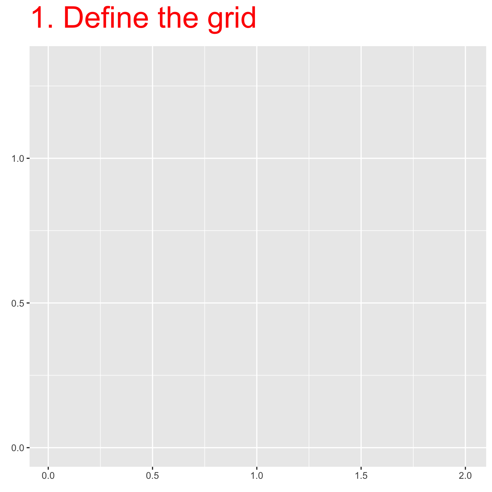

## INLA and latent Gaussian models

The Integrated Nested Laplace Approximation (INLA) is a fast and accurate Bayesian approximation method for the albeit wide class of Latent Gaussian Models (LGMs). This includes GLMs, GLMMs,GAM-like models and a wide range of spatial and spatiotemporal models.

Models of this type can be written a

$$
\begin{aligned}
\mathbf{y} \mid \mathbf{u}, \theta 
&\sim \prod_i \pi(y_i \mid \eta_i, \theta), \\[6pt]
\boldsymbol{\eta} 
&= A_1 \mathbf{u}_1 + A_2 \mathbf{u}_2 + \dots + A_k \mathbf{u}_k, \\[6pt]
\mathbf{u} \mid \theta 
&\sim \mathcal{N}\big(\mathbf{0}, \mathbf{Q}^{-1}(\theta)\big), \\[6pt]
\theta 
&\sim \pi(\theta).
\end{aligned}
$$

The first step in defining a LGM within the Bayesian framework is to identify a distribution for the observed data $\mathbf{y} = (y_1, \dots, y_n)$ where typically the mean $\mathbb{E}(y_i) = \mu_i$ of each observation $y_i$ is linked to a linear predictor $\eta_i$ through an appropriate link function $g(\cdot)$. The additive linear predictor $\eta_i$ can be defined by covariates (i.e., fixed effects) and different types of random effects:

$$
\eta_i = \alpha + \sum_{j=1}^{P} \beta_j x_{ij} + \sum_{k=1}^{L} f_{k}(z_{ik})  \qquad i = 1, \dots, n.
$$

Here, $\alpha$ is the intercept, $\beta_j$, $j = 1, \dots, P$, are coefficients of $P$ covariates, and the functions $f\_{k}(\cot)$ can take different forms such as smooth and nonlinear effects of covariates, time trends and seasonal effects, random intercept and slopes as well as temporal or spatial random effects. We denote the vector of all latent effects as $\mathbf{u}$ and its is assumed to be Gaussian Markov random field (GMRF). This GMRF will have a zero mean and precision matrix $\mathbf{Q}(\theta)$ which consists of sums of the precision matrices of the fixed effects and the other model components. Furthermore, $\theta$ represents a vector of hypeparameters that control the behavior of the latent components and the likelihood of observations ($p~(\mathbf{y} \mid \mathbf{u},~ \theta)$), which we assume are conditionally independent given the latent field $\mathbf{u}$.

The core idea behind the INLA approach is that, rather than estimating the joint posterior distribution of the model parameters $p(\mathbf{u},\theta|\mathbf{y})$, we focus on individual posterior marginals of the model parameters ($p(u_i|\mathbf{y}$ and $p(\theta_j \mid \mathbf{y}$)). This is achieved thanks to the computational properties of GMRF and the Laplace approximation for multidimensional integration.

::: callout-definition
## Definition: Gaussian Markov Random Field (GMRF)

A random variable $\mathbf{u}$ is said to be a **Gaussian Markov random field (GMRF)** with respect to a graph $G$, with vertices $\{1,2,\dots,n\}$ and edges $E$, mean vector $\boldsymbol{\mu}$, and precision matrix $\mathbf{Q}$, if its probability distribution is

$$
\pi(\mathbf{u})
=
|\mathbf{Q}|^{1/2}(2\pi)^{-n/2}
\exp\left\{
-\frac{1}{2}
(\mathbf{u}-\boldsymbol{\mu})^{\top}
\mathbf{Q}
(\mathbf{u}-\boldsymbol{\mu})
\right\},
$$

and the precision matrix satisfies the Markov property

$$
Q_{ij} \neq 0
\;\Longleftrightarrow\;
\{i,j\} \in E.
$$

That is, conditional independence between $u_i$ and $u_j$ corresponds to zeros in the precision matrix.
:::

## INLA in a nutshell

We are interested in estimating the posterior marginals $p(u_i|\mathbf{y})$. We could compute this by integrating out all the other components in the model i.e., $p(u_i \mid \mathbf{y}) = \int p(\mathbf{u}\mid \theta) d \mathbf{u}_{-i}$. However, this might not be computationally efficient as the latent filed $\mathbf{u}$ can be very high dimensional. Instead we can compute the posterior marginals by considering that

$$
p(u_i \mid \mathbf{y}) = \int \color{orange}{ p(u_i\mid \theta,\mathbf{y})} ~\color{purple}{p(\theta\mid \mathbf{y})} d \theta
$$ 
This possible because the size of $\theta$ is typically small and thus, easier to integrate (this is not a too restrictive assumption since most likelihoods and latent effects will typically depend on a small number of hyperparemeters). This means that, in order to compute the marginal posteriors $p(u_i \mid \mathbf{y})$, we need to approximate:

1.  The posterior of hyperparameters $\color{orange}{p(\theta \mid \mathbf{y})}$
2.  The posterior of the latent field $\color{purple}{p(u_i\mid \theta,\mathbf{y})}$

### Approximating the posterior of hyperparameters

To build an approximation to $p(\theta \mid \mathbf{y})$ we can use definition of conditional probability where, conditional on the observations $\mathbf{y}$

$$
\begin{aligned}
p(\mathbf{u}~,\theta\mid \mathbf{y}) &= p(\mathbf{u}\mid\mathbf{y},\theta)~p(\theta\mid \mathbf{y}) \\
\Rightarrow p(\theta \mid \mathbf{y}) &= \dfrac{\color{tomato}{p(\mathbf{u}~,\theta \mid \mathbf{y})}}{p(\mathbf{u} \mid \mathbf{y},\theta)}
\end{aligned}
$$

Applying Bayes rules we get that $\color{tomato}{p(\mathbf{u}~,\theta \mid \mathbf{y})} = \frac{p(y \mid \mathbf{u}, \theta)\,p(\mathbf{u}, \theta)} {p(y)}$

$$
\begin{aligned}
p(\mathbf{u}~,\theta\mid \mathbf{y}) &=
\color{tomato}{\frac{p(y \mid \mathbf{u}, \theta)\,
      p(\mathbf{u}, \theta)}
     {p(y)}} \frac{1}{p(\mathbf{u} \mid \theta, \mathbf{y})} ~~\color{grey}{\text{Factorization of the joint prior} ~~p(\mathbf{u},\theta)=p(\mathbf{u}\mid \theta)p(\theta)}\\
&=
\frac{p(y \mid \mathbf{u}, \theta)\,
      p(\mathbf{u} \mid \theta)\,
      p(\theta)}
     {p(y)} \frac{1}{p(\mathbf{u} \mid \theta, \mathbf{y})} \\
&\propto \dfrac{p(\mathbf{y}\mid \mathbf{u},\theta)p(\mathbf{u}\mid \theta)p(\theta)}{p(\mathbf{u}\mid \theta, \mathbf{y})}
\end{aligned}
$$

Where

-   $p(\mathbf{y}\mid \mathbf{u},\theta)$ is the likelihood function which we know
-   $p(\mathbf{u}\mid \theta) = N(0,Q^{-1})$ is the Gaussian prior for the latent field which we also know
-   $p(\theta)$ is a non-Gaussian prior for the hyperameters (also known)
-   $p(\mathbf{u}\mid \theta, \mathbf{y})$ the non-Gaussian density for the full condition of the latent effects ... which we DON't know

In practice we approximate $p(\mathbf{u}\mid \theta, \mathbf{y})$ with a Gaussian distribution $p_G(\mathbf{u}\mid \theta, \mathbf{y})$. How? we use the Laplace method.

::: callout-note
## Laplace approximation

The Laplace approximation is an old technique for the approximation of integrals. Suppose the following integral that we want to approximate as $n \to \infty$:

$$
 I_n = \int_x \exp(n f(x))\,dx,
$$

We represent $f(x)$ by means of a Taylor series expansion evaluated at a point $x_0$in which $f(x)$ has its maximum so that

$$
\begin{aligned}
f(x) &\approx f(x_0) + \cancelto{0}{f'(x_0)(x-x_0)} + \frac{1}{2}f''(x_0)(x-x_0)^2 \\
\Rightarrow I_n &\approx \exp\left\{n f(x_0)\right\} \underbrace{\int_x\exp\left\{\frac{n}{2} (x-x_0)^2f''(x_0) \right\}dx}_{\text{Gaussian Kernell}}\\
\therefore \tilde{I}_n &= \exp(n f(x_0))
 \sqrt{\frac{2\pi}{-n f''(x_0)}}
\end{aligned}
$$ Considering $nf(x)$ as the sum of log-likelihoods and $x$ as the unknown parameter, then we can apply Laplace method to approximate it by evaluating the Taylor series expansion at $x_0$.
:::

The full conditional we want to approximate is given by

$$
\begin{aligned}
p(\mathbf{u}\mid \theta, \mathbf{y}) &\propto \pi(\mathbf{u} \mid \theta)\,\pi(\mathbf{y} \mid \mathbf{u}, \theta) \\
&\propto
\exp\!\left(
-\frac{1}{2}\mathbf{u}^\top \mathbf{Q} \mathbf{u}
+
\sum_i \log \pi(y_i \mid \eta_i, \theta)
\right).
\end{aligned}
$$

We can take the second-order Taylor series expansion for the log density $\log p(y_i\mid \eta_i,\theta)$.

Recall that by letting $c=-f''(x_0)\,;b=cx_0$ the second-order Taylor series expansion for $f(x)$ evaluated at its maximum $x_0$ is:

$$
\begin{aligned}
f(x)&\approx f(x_0) +\tfrac12f''(x_0)(x-x_0)^2 \\
&\approx f(x_0)+\tfrac12f''(x_0) (x^2 -2x_0x +x_0^2)   \\
&\approx\underbrace{\bigl[f(x_0)+\tfrac12f''(x_0)x_0^2\bigr]}_{\text{constant } a}+ \underbrace{\bigl[-f''(x_0)x_0\bigr]}_{b}x+\tfrac12\underbrace{f''(x_0)}_{-c}x^2 \qquad\color{grey}{\text{setting }  c=-f''(x_0),\;b=cx_0}\\
&\approx a+bx-\tfrac12cx^2.
\end{aligned}
$$

Thus the second order Taylor expansion for the log density yields to

$$
\begin{aligned}
p(\mathbf{u}\mid \theta, \mathbf{y}) &\propto \exp\!\left\{
-\frac{1}{2}\mathbf{u}^\top \mathbf{Q} \mathbf{u}
+
\sum_i ( a_i + b_i \eta_i - \frac{1}{2}c_i \eta_i^2)
\right\}.\\
&\approx \exp\left\{ \frac{1}{2}\mathbf{u}^\intercal \tilde{Q}\mathbf{u} + \tilde{\mathbf{u}}\right\}
\end{aligned}
$$ 

In short, we approximate $p(\mathbf{u}\theta,\mathbf{y})$ with a Gaussian $N(\tilde{Q}\tilde{\mathbf{b}},\tilde{Q})$ with $\tilde{Q}= Q + \begin{bmatrix}\text{diag}(\mathbf{c}) &0\\0&0 \end{bmatrix}$ and $\tilde{\mathbf{b}} = [\mathbf{b}~ 0]^\intercal$

-   $\mathbf{b}$: Contains the first derivatives of the log-likelihood w.r.t. each $\eta_i$, evaluated at the expansion point (i.e. the mode).

-   $\mathbf{c}$: Contains the negative second derivatives (observed Fisher information) of the log-likelihood w.r.t. each $\eta_i$.

 Thus, the approximation of the joint posterior of the hyperparameters is given by:

$$
\begin{aligned}
p(\theta\mid \mathbf{y}) &\propto \dfrac{p(\mathbf{y}\mid \mathbf{u},\theta)p(\mathbf{u}\mid \theta)p(\theta)}{p(\mathbf{u}\mid \theta, \mathbf{y})} \\
 &\approx
\left.
\frac{
p(\mathbf{y} \mid \mathbf{u},\theta)\,
p(\mathbf{u} \mid \theta)\,
p(\theta)
}{
p_G(\mathbf{u} \mid \mathbf{y},\theta)
}
\right|_{u=u^*(\theta)}.
\end{aligned}
$$

where $p_G(\mathbf{u} \mid \mathbf{y},\theta))$ is the Gaussian approximation – based the Laplace method - of $p(\mathbf{u}\mid \theta, \mathbf{y})$ and $u^*(\theta)$ is the mode for a given $\theta$. This Gaussian approximation will be exact as $n \to \infty$.

Different optimization techniques like Newton-type methods can be used to find the mode $\tilde{p}(\theta\mid \mathbf{y})$ and then exploring $\tilde{p}(\theta\mid \mathbf{y})$ to find grid point for numerical integration. @fig-approx_1 illustrates the numerical integration approach to compute $p(\theta\mid \mathbf{y})$ for a regular grid series of points $\theta_k, k = 1,\ldots,K$

{#fig-approx_1 fig-align="center" width="250"}

Now we just need to approximate $p(u_i\mid \theta\mathbf{y})$, but unfortunately we cannot use the marginals from the preivous Gaussian approximation $p_G(\mathbf{u} \mid \mathbf{y},\theta)$ directly as there can be errors in the location and/or errors due to the lack of skewness.

### Approximating the posterior for the latent field

There are two ways of approximating the marginals for the latent fields. The first one is by simply using the Gaussian approximation and computing the posterior conditional distributions $p(u_i\mid \theta,\mathbf{y})$ directly as marginals of $p_G(\mathbf{u} \mid \mathbf{y},\theta)$ i.e.,

$$
\tilde{p}(u_i\mid \theta,\mathbf{y})=N(u_i;\mu_i(\theta),\sigma_i^2(\theta))
$$ 

with mean $\mu_i(\theta)$ and variance $\sigma^2_i(\theta)$. However, while computationally cost effective, this approximation is generally not very good specially for non-Gaussian likelihoods due to errors in the location and /or lack of skewness.

Thus, a different approach is to write the vector of hyperparameters $\mathbf{u} = \{u_i,\mathbf{u}_{-i}\}$ and use the Laplace approximation again for:

$$
\begin{aligned}
p(u_i \mid \boldsymbol{\psi}, \mathbf{y}) &= \frac{p(\{u_i,\mathbf{u}_{-i}\} \mid \theta, \mathbf{y})}{p(\mathbf{u}_{-i}\mid u_i, \theta, \mathbf{y})} \\
&= \frac{p(\mathbf{u}, \theta \mid \mathbf{y})}{p(\theta \mid \mathbf{y})} \cdot \frac{1}{p(\mathbf{u}_{-i} \mid u_i, \theta, \mathbf{y})}\\
&\propto \frac{p(\mathbf{u}, \theta \mid \mathbf{y})}{p(\mathbf{u}_{-i} \mid u_i, \theta, \mathbf{y})} \\
&\left.\approx \frac{p(\mathbf{u}, \theta \mid \mathbf{y})}{\widetilde{p}(\mathbf{u}_{-i} \mid u_i, \theta, \mathbf{y})} \right|_{\mathbf{u}_{-i}=\mathbf{u}^*_{-i}(u_i,\theta)}=:\tilde{p}(u_i\mid\theta,\mathbf{y}).
\end{aligned}
$$

where $\widetilde{p}(\mathbf{u}_{-i} \mid u_i, \theta, \mathbf{y})$ is the Laplace Gaussian approximation to $p(\mathbf{u}_{-i} \mid u_i, \theta, \mathbf{y})$ and $\mathbf{u}_{-i}^*(u_i, \theta)$ is its mode.

This nested extra Laplace approximation step (an hence the Integrated *Nested Laplace* Approximation name) is sufficiently accurate but computationally more expensive that the simpler Gaussian strategy. Thus, Variational Bayes techniques have been used to improve the mean of the GMRF approximation instead (see @van2021new). This correction is computationally efficient and achieves accuracy for the mean similar to a full integrated nested Laplace approximation.

From this improved GMRF approximation we can then compute the marginals $p_G^*(u_i \mid \mathbf{y},\theta)$ to obtain:

$$
\tilde{p}(u_i\mid\mathbf{y}) = \sum_k p_G^*(u_i \mid \mathbf{y},\theta) \tilde{p}(\theta\mid\mathbf{y})w_k
$$

