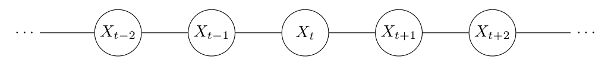

```{r setup}
# #| include: false

knitr::opts_chunk$set(echo = FALSE,
                      message=FALSE,
                      warning=FALSE,
                      strip.white=TRUE,
                      prompt=FALSE,
                      fig.align="center",
                       out.width = "60%")

library(knitr)    # For knitting document and include_graphics function
library(ggplot2)  # For plotting
library(png)
library(tidyverse)
library(INLA)
library(BAS)
library(patchwork)
library(DAAG)
library(inlabru)
library(fmesher)
library(cowplot) # needs install.packages("magick") to draw images

```

# Temporal models and smoothing

## Motivation {.smaller}

Data are often observed in time, and time dependence is often expected.

```{r}
#| fig-width: 8
#| fig-height: 6
#| fig-align: center
lakes = as.data.frame(greatLakes ) %>% mutate(year = 1918:2009)
lakes %>%
  pivot_longer(-year) %>%
  ggplot() + geom_point(aes(year, value ))+
  facet_wrap(.~name,scales = "free" ) + xlab("") + ylab("")
```

. . .

-   Observations are correlated in time

## Motivation {auto-animate="true"}

1.  Smoothing of the time effect

```{r}
lakes = as.data.frame(greatLakes ) %>% mutate(year = 1918:2009)

cmp = ~ -1 + Intercept(1) + time(year, model = "rw2",
                                 scale.model = T,
                                 hyper = list(prec = list(prior = "pc.prec", param = c(1, 0.01))))

lik = bru_obs(formula = Erie~.,
              data = lakes)
out = bru(cmp, lik)
pred = predict(out, lakes, ~ Intercept + time)

pred %>% ggplot() +
  geom_point(data = lakes, aes(year, Erie)) + ylab("") + xlab("")
```

## What is our goal? {auto-animate="true"}

1.  Smoothing of the time effect

```{r}

pred %>% ggplot() + geom_line(aes(year, mean)) +
  geom_ribbon(aes(year, ymin = q0.025, ymax = q0.975), alpha = 0.4 ) +
  geom_point(data = lakes, aes(year, Erie)) + ylab("") + xlab("")
```

. . .

**Note:** We can use the same model to smooth covariate effects!

## What is our goal? {auto-animate="true"}

1.  Smoothing of the time effect

2.  Prediction

```{r}


question <- readPNG("figures/question.png", native = TRUE)


p1 = pred %>% ggplot() + geom_line(aes(year, mean)) +
  geom_ribbon(aes(year, ymin = q0.025, ymax = q0.975), alpha = 0.4 ) +
  geom_point(data = lakes, aes(year, Erie)) + ylab("") + xlab("") + xlim(1919,2030)
ggdraw() +  draw_plot(p1) + draw_image(question, scale = .4, y = 0.15, x=0.35)

```

. . .

We can "predict" any unobserved data, not only future data, e.g. gaps in the data etc.

## Modelling time with INLA {auto-animate="true"}

Time can be indexed over a

-   Discrete domain (e.g., years)

-   Continuous domain

## Modelling time with INLA {auto-animate="true"}

Time can be indexed over a

-   Discrete domain (e.g., years)

    -   Main models: RW1, RW2 and AR1

    -   **Note:** RW1 and RW2 are also used for smoothing covariates

-   Continuous domain

    -   Here we use the so-called SPDE-approach (more on this later)

# Discrete time modelling

## Example - Height of Lake Erie in time

```{r}


lakes %>% ggplot() + geom_point(aes(year, Erie)) +
  ylab("m") + xlab("Year")


if(0)
{
cmp = ~ Intercept(1)+year(year, model = "linear") + time(time, model = "rw2")
lik = bru_obs(formula = y~.,
              family = "gaussian",
              data = df)

fit = bru(cmp, lik)

preds = predict(fit, df, ~Intercept+year + time)


cmp2 = ~ Intercept(1)+year(year, model = "linear") + seas(month, model = "rw2", cyclic = T)
lik2 = bru_obs(formula = y~.,
              family = "gaussian",
              data = df)

fit2 = bru(cmp2, lik2)


preds2 = predict(fit2, df, ~Intercept+year + seas)


ppreds = rbind(cbind(preds, model = 1),
               cbind(preds2, model = 2))
ppreds %>%
  filter(!is.na(y)) %>%
  ggplot() + geom_line(aes(time, mean, group = model, color = factor(model))) +
   geom_ribbon(aes(time, ymin = q0.025, ymax = q0.975, group = model, fill = factor(model) ), alpha =  0.5)

}

```

**Goal** we want understand the pattern and predict into the future

## Random Walk models {.smaller}

Random walk models encourage the mean of the linear predictor to vary gradually over time.

. . .

They do this by assuming that, on average, the time effect at each point is the mean of the effect at the neighbouring points.

```{r}
# Example random walk data
dd <- data.frame(
  time = 0:6,
  y = (-3:3)/2 # example path
)

# Define a normal distribution at time = 3
dens <- data.frame(y = seq(-3, 3, length.out = 200))
dens$density <- dnorm(dens$y, mean = 0, sd = .2)

# scale density so it looks like a vertical shape at x = 3
scale_factor <- 0.5
dens$x <- 3 + dens$density * scale_factor

ggplot(dd, aes(time, y)) +
  # grey background


  # points
  geom_point(size = 2) +

  # connecting line between neighbors t=2 and t=4
  geom_line(data = dd %>% filter(time %in% c(2,4)), aes(time, y), color = "black") +

  # normal density "red blob"
  geom_polygon(data = dens,
               aes(x, y), fill = "red", alpha = 0.8) +

  # predicted mean point
  geom_point(aes(x = 3, y = 0), color = "blue", size = 3) +
  ylim(-2,2) +
  # labels
  labs(title = "First Order Random Walk",
       x = "Time",
       y = "Mean Response")

```

. . .

-   Random Walk of order 1 (RW1) we take the two nearest neighbours

-   Random Walk of order 2 (RW2) we take the four nearest neighbours

## Random walks of order 1 {auto-animate="true"}

**Idea:** $\longrightarrow\ u_t = \text{mean}(u_{t-1} , u_{t+1}) + \text{Gaussian error with precision  } \tau$

. . .

**Definition**

$$
  \pi(\mathbf{u} \mid \tau) \propto
  \exp\!\left(
     -\frac{\tau}{2} \sum_{t=1}^{T-1} (u_{t+1} - u_t)^2
  \right) = \exp\!\left(-\tfrac{1}{2} \, \mathbf{u}^{\top} \mathbf{Q}\ \mathbf{u}\right)
$$

$$
    \mathbf{Q} = \tau
    \begin{bmatrix}
      1 & -1 &  &        &        &   \\
      -1 & 2 & -1 &        &        &   \\
         &    & \ddots & \ddots & \ddots &   \\
         &    &        & -1     & 2 & -1 \\
         &    &        &        & -1 & 1
    \end{bmatrix}
$$

## Random walks of order 1 {auto-animate="true"}

**Idea:** $\longrightarrow\ u_t = \text{mean}(u_{t-1} , u_{t+1}) + \text{Gaussian error with precision  } \tau$

**Definition**

$$
  \pi(\mathbf{u} \mid \tau) \propto
  \exp\!\left(
     -\frac{\tau}{2} \sum_{t=1}^{T-1} (u_{t+1} - u_t)^2
  \right) = \exp\!\left(-\tfrac{1}{2} \, \mathbf{u}^{\top} \mathbf{Q}\ \mathbf{u}\right)
$$

Important things to understand (not just for RW1 mdoels!):

1.  **The (sparse) precision matrix**
2.  Role of the precision parameter $\tau$ and prior distribution
3.  RW as intrinsic model

## The precision matrix and GMRF {.smaller}

(A more theoretical interlude :books: :thinking:)

We have talked about the **precision** matrix $\mathbf{Q}$ but...

-   what is it?
-   why we will keep talking about it?
-   What does it have to do the GMRF (and what are they)?
  

. . .

Let's start at the beginning :smiley:

A **Gaussian distribution** $\mathbf{u}\sim\mathcal{N}(0,\Sigma)$ is controlled by:

—  The mean vector $\mu$, which we have set equal to 0. This is the centre of the distribution
—  The matrix $\Sigma$ describes all pairwise covariances $\Sigma_{ij} = \text{Cov}(u_i, u_j)$

Formally

$$
\pi(\mathbf{u}) = \frac{1}{2\pi|\Sigma|^{1/2}}\exp\left\{-\frac{1}{2}\mathbf{u}^T\Sigma^{-1}\mathbf{u}\right\}
$$


The **precision matrix** is inverse of the **covariance matrix**

$$
\mathbf{Q} = \mathbf{\Sigma}^{-1}
$$

## The Gaussian distribution

| Advantages :smile::+1: | Disadvantages :pensive::-1: |
|----------------------------------------|--------------------------------|
| **mostly theoretical** | **mostly computational** |
| Analytically tractable. | $\Sigma$ usually is large and **dense** |
| We have a good understanding of its properties. | Computations scale as $\mathcal{O}(n^3)$ |
| Basically, it’s easy to do the theory | Not feasible for large problems |

. . .

We need to reduce the computational burden !

This can be done by using **sparse** matrices, ie matrices where a  lot of entries are exactly zero!!


## Two possible options

So...which matrix should be sparse? :thinking:

$$
\mathcal{u}\sim\mathcal{N}(0,\Sigma)
$$

1.  Force the *covariance* matrix $\Sigma$ to be sparse

2.  Force the *precision* matrix $\Sigma^{-1}$ to be sparse

## Two possible options {auto-animate="true"}

$$
\mathcal{u}\sim\mathcal{N}(0,\Sigma)
$$

1.  Force the *covariance* matrix $\Sigma$ to be sparse

    -   $\Sigma_{ij} = \text{Cov}(u_i, u_j)$ : Covariance between $u_i$ and $u_j$
    -   $\Sigma_{ij} = 0$ $\longrightarrow$ $u_i$ and $u_j$ are *independent*
    -   A sparse covariance matrix implies that many elements of $\mathbf{u}$ are mutually independent.....is this desirable?

2.  Force the *precision* matrix $\mathbf{Q} = \Sigma^{-1}$ to be sparse

## Two possible options {auto-animate="true"}

$$
\mathcal{u}\sim\mathcal{N}(0,\Sigma)
$$

1.  Force the *covariance* matrix $\Sigma$ to be sparse

    -   $\Sigma_{ij} = \text{Cov}(u_i, u_j)$ : Covariance between $u_i$ and $u_j$
    -   $\Sigma_{ij} = 0$ $\longrightarrow$ $u_i$ and $u_j$ are *independent*
    -   A sparse covariance matrix implies that many elements of $\mathbf{u}$ are mutually independent.....is this desirable?

2.  Force the *precision* matrix $\mathbf{Q} = \Sigma^{-1}$ to be sparse

    -   What does $Q_{ij}$ represents?
    -   What does a sparse precision matrix implies?


## What does $Q_{ij}$ represents?

$Q_{ij}$ is an element of the precision matrix 

It represents the strength of _conditional dependence_ between variables $i$ and $j$

- $Q_{ij}= 0$ variables $i$ and $j$ are _conditionally_ independent _given_ all other variables.

- $Q_{ij}\neq 0$ variables $i$ and $j$  are conditionally dependent.

It is useful to represent the conditional independence structure through a graph



## Conditional independence and the precision matrix

::: {style="font-size:54px"}
**Theorem**: $u_i\perp u_j|\mathbf{u}_{-ij}\Longleftrightarrow Q{ij} =0$
:::

This is the key property! :smiley:

## (Informal) definition of a GMRF {.smaller}

::: {style="font-size:34px"}
A **GMRF** is a Gaussian distribution where the non-zero elements of the precision matrix are defined by the graph structure.
:::

. . .

In the RW1 example the precision matrix is tridiagonal since each variable is connected only to its predecessor and successor.

$$
\mathbf{Q} = \tau \begin{bmatrix}
1& -1 & 0  & 0 &\dots& 0 \\
-1 & 2& -1  & 0 & \dots& 0 \\
0 & -1 & 2 &-1 &  \dots& 0 \\
0 & 0 & -1 &2 & \dots & \dots \\
\dots& \dots& \dots& \dots& \dots& \dots& \\
0 &0 & 0 & \dots  & -1& 1\\
\end{bmatrix}
$$


## GMRF and INLA

-   Every component of the *latent Gaussian* field $\mathbf{u}$ in an INLA model is always a GMRF!!
-   We will see how the idea of GMRF expands also for continuously indexed processes (SPDE approach)

## Random walks of order 1 {auto-animate="true"}

**Idea:** $\longrightarrow\ u_t = \text{mean}(u_{t-1} , u_{t+1}) + \text{Gaussian error with precision  } \tau$

**Definition**

$$
  \pi(\mathbf{u} \mid \tau) \propto
  \exp\!\left(
     -\frac{\tau}{2} \sum_{t=1}^{T-1} (u_{t+1} - u_t)^2
  \right) = \exp\!\left(-\tfrac{1}{2} \, \mathbf{u}^{\top} \mathbf{Q}\ \mathbf{u}\right)
$$

Important things to understand (not just for RW1 mdoels!):

1.  The (sparse) precision matrix
2.  **Role of the precision parameter $\tau$ and prior distribution**
3.  RW as intrinsic model


## What is the role of the precision parameter? {.smaller}

-   $\tau$ says how much $u_t$ can vary around its mean

    -   Small $\tau$ $\rightarrow$ large variation $\rightarrow$ less smooth effect
    -   Large $\tau$ $\rightarrow$ small variation $\rightarrow$ smoother effect

. . .

```{r}
#| fig-align: center
#| out-width: 60%

cmp = ~ -1 +  time(year, model = "rw2", constr = FALSE,
                            hyper = list(prec = list(initial = 0, fixed = T)))
cmp2 = ~ -1 +  time(year, model = "rw2", constr = FALSE,
                            hyper = list(prec = list(initial = 20, fixed = T)))


lik = bru_obs(formula = Erie~.,
              data = lakes)
out = bru(cmp, lik)
out2=bru(cmp2, lik)
ggplot() + geom_point(data = lakes, aes(year, Erie)) +
  geom_line(data= out$summary.random$time, aes(ID, mean, color = "small precision")) +
  geom_line(data= out2$summary.random$time, aes(ID, mean, color = "large precision")) +
  ylab("") + xlab("") + theme(legend.title = element_blank())

```

. . .

We need to set a *prior distribution* for $\tau$.

A common option is the so called *PC-priors*

## Penalized Complexity (PC) priors {auto-animate="true"}

-   PC priors are easily available in `inlabru` for many model parameters

. . .

-   They are built with two principles in mind:

    1.  The prior **discourages overdispersion** by penalizing deviation from a *base model*

::::: columns
::: {.column width="60%"}
```{r precs}
#| out-width: 100%
cmp = ~ -1 +  time(year, model = "rw2", constr = FALSE,
                            hyper = list(prec = list(initial = 10, fixed = T)))
cmp2 = ~ -1 +  time(year, model = "rw2", constr = FALSE,
                            hyper = list(prec = list(initial = 20, fixed = T)))


lik = bru_obs(formula = Erie~.,
              data = lakes)
out = bru(cmp, lik)
out2=bru(cmp2, lik)
ggplot() + geom_point(data = lakes, aes(year, Erie)) +
  geom_line(data= out$summary.random$time, aes(ID, mean, color = "small precision")) +
  geom_line(data= out2$summary.random$time, aes(ID, mean, color = "large precision")) +
  ylab("") + xlab("") + theme(legend.title = element_blank(), legend.position = "none")

```
:::

::: {.column width="40%"}
-   A line is the *base model*

-   We want to penalize more complex models
:::
:::::

## Penalized Complexity (PC) priors {auto-animate="true"}

-   PC prior are easily available in `inlabru` for many model parameters

-   They are built with two principle in mind:

    1.  The prior **discourages overdispersion** by penalizing deviation from a *base model*
    2.  **User-defined** scaling

::::: columns
::: {.column width="50%"}
$$
\begin{eqnarray}
\sigma = \sqrt{1/\tau} \\
\text{Prob}(\sigma>U) = \alpha;\\ \qquad U>0, \ \alpha \in (0,1)
\end{eqnarray}
$$
:::

::: {.column width="50%"}
-   $U$ an upper limit for the standard deviation and $\alpha$ a small probability.

-   $U$ a likely value for the standard deviation and $\alpha=0.5$.
:::
:::::

## Example

::::: columns
::: {.column width="50%"}
**The Model**

$$
\begin{aligned}
y_i|\eta_i, \sigma^2 & \sim \mathcal{N}(\eta_i,\sigma^2)\\
\eta_i & = \beta_0 + f(t_i)\\
f(t_1),f(t_2),\dots,f(t_n) &\sim \text{RW2}(\tau)
\end{aligned}
$$
:::

::: {.column width="50%"}
```{r}
#| echo: false
#| out-width: 100%

lakes %>% ggplot() + geom_point(aes(year, Erie)) + xlab("") + ylab("")

```
:::
:::::

::::: columns
::: {.column width="60%"}
**The code**

```{r}
#| echo: true
#| eval: false
#| warning: false
#| message: false

cmp = ~ Intercept(1) +
  time(year, model = "rw1",
       hyper = list(prec =
                      list(prior = "pc.prec",
                           param = c(0.5, 0.5))))
```
:::

::: {.column width="40%"}
```{r}
#| fig-align: center
#| out-width: 100%
#| eval: true

cmp0 = ~ -1 +  time(year, model = "rw2", constr = FALSE,
                   scale.model = TRUE,
                    hyper = list(prec = list(prior = "pc.prec", param = c(0.3,0.5))))
lik = bru_obs(formula = Erie~.,
              data = lakes)
out_pc0 = bru(cmp0, lik)


prior = data.frame(x = seq(0,9,0.01),
                   y = INLA::inla.pc.dprec(seq(0,9,0.01),
                                           u  = 0.3, alpha = 0.5))
posterior = inla.tmarginal(function(x)1/sqrt(x),
                           out_pc0$marginals.hyperpar$`Precision for time`)

ggplot() + geom_line(data = prior, aes(x,y, color = "prior")) +
  geom_line(data = posterior, aes(x,y, color = "posterior"))

```
:::
:::::


## Random walks of order 1 {auto-animate="true"}

**Idea:** $\longrightarrow\ u_t = \text{mean}(u_{t-1} , u_{t+1}) + \text{Gaussian error with precision  } \tau$

**Definition**

$$
  \pi(\mathbf{u} \mid \tau) \propto
  \exp\!\left(
     -\frac{\tau}{2} \sum_{t=1}^{T-1} (u_{t+1} - u_t)^2
  \right) = \exp\!\left(-\tfrac{1}{2} \, \mathbf{u}^{\top} \mathbf{Q}\ \mathbf{u}\right)
$$

Important things to understand (not just for RW1 models!):

1.  The (sparse) precision matrix
2.  Role of the precision parameter $\tau$ and prior distribution
3.  **RW as intrinsic model**


## RW as intrinsic models {.smaller}

RW1 defines *differences*, not *absolute levels*:

-   Only the *changes* between neighbouring terms are modelled.

-   Mathematically, $$
    (u_1,\dots,u_n)\text{ and }(u_1+a,\dots,u_n+a)
    $$ produce identical likelihoods — they’re indistinguishable.

. . .

::::: columns
::: {.column width="50%"}
This means:

-   If $u_t\sim\text{RW}1$ then $$
    \begin{aligned}
    \eta_t & = \beta_0 + u_t \\
    & =(\beta_0+k) + (u_t-k) \\
    & =    \beta_0^* + u_t^*
    \end{aligned}
    $$

so parameters are not well-defined.
:::

::: {.column width="50%"}
**Solution:**

-   Sum to zero constraint $\sum_{i = 1}^n u_i = 0$
-   This is included in the model by default
:::
:::::

## RW as intrinsic models {.smaller}

```{r}
#| echo: true
cmp1 = ~ Intercept(1) + time(year, model = "rw1", constr = TRUE)
cmp2 = ~ Intercept(1) + time(year, model = "rw1", constr = FALSE)
lik = bru_obs(formula = Erie~.,
              data = lakes)

fit1 = bru(cmp1,lik)
fit2 = bru(cmp2,lik)
```

```{r}
print("FIT1 - Intercept")
round(fit1$summary.fixed,3)
print("FIT2 - Intercept")
round(fit2$summary.fixed,3)

print("FIT1 - RW1 effect")
round(fit1$summary.random$time[c(1:2),],3)
print("FIT2 - RW1 effect")
round(fit2$summary.random$time[c(1:2),],3)

```

## Random walks of order 2

-   Just like RW1, but now we consider 4 neighbours instead of 2

$$
u_t = \text{mean}(u_{t-2} ,u_{t-1} , u_{t+1}, u_{t+2} ) + \text{some Gaussian error with precision  } \tau
$$

-   RW2 are smoother than RW1

-   The precision has the same role as for RW1

## Example {.smaller}

::::: columns
::: {.column width="60%"}
```{r}
#| echo: true
cmp1 = ~ Intercept(1) +
  time(year, model = "rw1",
       scale.model = T,
       hyper = list(prec =
                      list(prior = "pc.prec",
                           param = c(0.3,0.5))))

cmp2 = ~ Intercept(1) +
  time(year, model = "rw2",
       scale.model = T,
       hyper = list(prec =
                      list(prior = "pc.prec",
                           param = c(0.3,0.5))))


lik = bru_obs(formula = Erie~ .,
              data = lakes)

fit1 = bru(cmp1, lik)
fit2 = bru(cmp2, lik)


```
:::

::: {.column width="40%"}
```{r}
#| echo: false
#| out-width: 100%
pred1 = predict(fit1, lakes, ~ Intercept + time)
pred2 = predict(fit2, lakes, ~ Intercept + time)

ggplot()+ geom_line(data = pred1, aes(year, mean, color = "rw1")) +
  geom_line(data = pred2, aes(year, mean, color = "rw2")) + ylab("") + xlab("") +
  theme(legend.title = element_blank(), legend.position = "bottom")

```

**NOTE:** the `scale.model = TRUE` option scales the $\mathbf{Q}$ matrix so the precision parameter has the same interpretation in both models.
:::
:::::

## RW models as smoothers for covariates {.smaller}

-   RW models are discrete models

-   Covariates are often recorded as continuous values

-   The function `inla.group()` will bin covariate values into groups (default 25 groups)

> `inla.group(x, n = 25, method = c("cut", "quantile"))`

-   Two ways to bin

    -   `cut` (default) splits the data using equal length intervals
    -   `quantile` uses equi-distant quantiles in the probability space.

## RW models as smoothers for covariates - Example

::::: columns
::: {.column width="50%"}
The data are derived from an anthropometric study of 892 females under 50 years in three Gambian villages in West Africa.

`Age` - Age of respondent (continuous)

`triceps` - Triceps skinfold thickness.

```{r}
triceps = read_csv("Data/triceps.csv")
triceps$age_group = inla.group(triceps$age, n = 30)

# Description
# The data are derived from an anthropometric study of 892 females under 50 years in three Gambian villages in West Africa.
#
# Format
# A data frame with 892 observations on the following 3 variables:
#
# age Age of respondents.
# lntriceps Log of the triceps skinfold thickness.
# triceps Triceps skinfold thickness.
```
:::

::: {.column width="50%"}
```{r}
#| eval: true
#| out-width: 100%

triceps %>% ggplot() + geom_point(aes(age, triceps, color = "original") ) +
  geom_point(aes(age_group, triceps, color = "grouped")) + theme(legend.title =  element_blank())

```
:::
:::::

```{r}
#| echo: true
#| eval: false
triceps$age_group = inla.group(triceps$age, n = 30)
```

## Model fit and results

```{r}
#| echo: true
cmp = ~ Intercept(1) + cov(age_group, model = "rw2", scale.model =T)
lik = bru_obs(formula = triceps ~.,
              data = triceps)

fit = bru(cmp, lik)
pred = predict(fit, triceps, ~ Intercept + cov)
```

```{r}

pred %>% ggplot() +
  geom_point(aes(age, triceps), alpha = 0.4)+ geom_line(aes(age_group, mean), color = "red") +
  geom_ribbon(aes(age_group, ymin = q0.025, ymax = q0.975), alpha = 0.5, fill = "red")

```

## Summary RW (1 and 2) models

-   Latent effects suitable for smoothing and modelling temporal data.

-   One hyperparameter: the precision $\tau$

    -   Use PC prior for $\tau$

-   It is an *intrinsic* model

    -   The precision matrix $\mathbf{Q}$ is rank deficient

    -   A sum-to-zero constraint is added to make the model identifiable!

-   RW2 models are smoother than RW1

## Auto Regressive Models of order 1 (AR1)

**Definition**

$$
u_t = \phi u_{t-i} + \epsilon_t; \qquad \phi\in(-1,1), \ \epsilon_t\sim\mathcal{N}(0,\tau^{-1})
$$

$$
\pi(\mathbf{u}|\tau)\propto\exp\left(-\frac{\tau}{2}\mathbf{u}^T\mathbf{Q}\mathbf{u}\right)
$$

with

$$
    \mathbf{Q} =
    \begin{bmatrix}
      1 & -\phi &  &        &        &   \\
      -\phi & (1+\phi^2) & -\phi &        &        &   \\
         &    & \ddots & \ddots & \ddots &   \\
         &    &        & -\phi     & (1+\phi^2) & -\phi \\
         &    &        &        & -\phi & 1
    \end{bmatrix}
$$

## AR1: Hyperparameters and prior {.smaller auto-animate="true"}

The AR1 model has two parameters

-   The precision $\tau$
-   The autocorrelation (or persistence) parameter $\phi\in(0,1)$

## AR1: Hyperparameters and prior {.smaller auto-animate="true"}

The AR1 model has two parameters

-   The precision $\tau$

    -   PC prior as before - Baseline $\tau=0$ `pc.prec` $$
        \text{Prob}(\sigma > u) = \alpha
        $$

-   The autocorrelation (or persistence) parameter \$\phi\in(-1,1)

    -   Two choices of PC priors

::::: columns
::: {.column width="50%"}
1.  Baseline $\phi = 0$ `pc.cor0`

$$
\begin{eqnarray}
\text{Prob}(|\rho| > u) = \alpha;\\
-1<u<1;\ 0<\alpha<1
\end{eqnarray}
$$
:::

::: {.column width="50%"}
```{r}
#| out-width: 100%
#| fig-align: "center"
data.frame(xx = seq(-1,1,0.001)) %>%
  mutate(yy1 = inla.pc.dcor0(xx, u = 0.07, alpha= 0.5),
  yy2 = inla.pc.dcor0(xx, u = 0.4, alpha= 0.5),
  yy3 = inla.pc.dcor0(xx, u = 0.7, alpha= 0.5)) %>%
  pivot_longer(-xx)%>%
  ggplot()  + geom_line(aes(xx,value, group = name, color = name)) +
  xlab("") + ylab("")+
  scale_color_discrete(name="",
                         breaks=c("yy1", "yy2", "yy3"),
                         labels = list(
      expression(u == 0.07 ~ "," ~ alpha == 0.5),
      expression(u == 0.4~ "," ~ alpha == 0.5),
      expression(u == 0.7~ "," ~ alpha == 0.5)))+
  ylim(c(0,5))
```
:::
:::::

## AR1: Hyperparameters and prior {.smaller auto-animate="true"}

The AR1 model has two parameters

-   The precision $\tau$

    -   PC prior as before - Baseline $\tau=0$ `pc.prec` $$
        \text{Prob}(\sigma > u) = \alpha
        $$

-   The autocorrelation (or persistence) parameter \$\phi\in(-1,1)

    -   Two choices of PC priors

::::: columns
::: {.column width="50%"}
2.  Baseline $\phi = 1$ `pc.cor1`

$$
\begin{eqnarray}
\text{Prob}(\rho > u) = \alpha;&\\
-1<u<1;\qquad &\sqrt{\frac{1-u}{2}}<\alpha<1
\end{eqnarray}
$$
:::

::: {.column width="50%"}
```{r}
#| out-width: 100%
#| fig-align: "center"
pp = data.frame(xx = seq(-1,1,0.001)) %>%
  mutate(yy1 = inla.pc.dcor1(xx, u = 0.07, alpha= 0.7),
  yy2 = inla.pc.dcor1(xx, u = 0.4, alpha= 0.8),
  yy3 = inla.pc.dcor1(xx, u = 0.2, alpha= 0.7)) %>%
  pivot_longer(-xx)
pp %>%
  ggplot()  + geom_line(aes(xx,value, group = name, color = name)) +
  xlab("") + ylab("")+ scale_color_discrete(name="",
                         breaks=c("yy1", "yy2", "yy3"),
                         labels = list(
      expression(u == 0.07 ~ "," ~ alpha == 0.7),
      expression(u == 0.4~ "," ~ alpha == 0.8),
      expression(u == 0.7~ "," ~ alpha == 0.7)))+
  ylim(c(0,5))
```
:::
:::::

## Example - AR1 and RW1 for earthquakes data {.smaller}

::::: columns
::: {.column width="50%"}
**The Model**

$$
\begin{aligned}
y_t|\eta_t & \sim \text{Poisson}(\exp(\eta_t))\\
\eta_t & = \beta_0 + u_t\\
1.\ u_t&\sim \text{RW}1(\tau)\\
2.\ u_t&\sim \text{AR}1(\tau, \phi)\\
\end{aligned}
$$
:::

::: {.column width="50%"}
Number of serious earthquakes per year

```{r}
#| echo: false
#| out-width: 100%
df = read_delim("Data/quakes1.csv", delim = ";")

ggplot() + geom_point(data = df, aes(year, quakes))

```
:::
:::::

```{r}
#| echo: true
hyper = list(prec = list(prior = "pc.prec", param = c(1,0.5)))
cmp1 = ~ Intercept(1) + time(year, model = "rw1", scale.model = T,
                             hyper = hyper)
cmp2 = ~ Intercept(1) + time(year, model = "ar1",
                             hyper = hyper)


lik = bru_obs(formula = quakes ~ .,
              family = "poisson",
              data = df)

fit1 = bru(cmp1, lik)
fit2 = bru(cmp2, lik)
```

## Example - RW1 and AR1

Estimated trend

```{r}


pred1 = predict(fit1, df, ~ exp(Intercept + time))
pred2 = predict(fit2, df, ~ exp(Intercept + time))


rbind(cbind(pred1, model = "rw1"),
     cbind(pred2, model = "ar1")
     ) %>%
  filter(year<2006) %>%
  ggplot() + geom_line(aes(year, mean, color = model, group = model)) +
  geom_ribbon(aes(year, ymin =  q0.025, ymax = q0.975, group = model, fill = model), alpha = 0.3) +
  geom_point( aes(year, quakes) , size = 0.5)+ theme(legend.title = element_blank()) + ylab("") + xlab("")

```

## Example - RW1 and AR1

Predictions

```{r}

rbind(cbind(pred1, model = "rw1"),
     cbind(pred2, model = "ar1")
     ) %>%
  ggplot() + geom_line(aes(year, mean, color = model, group = model)) +
  geom_ribbon(aes(year, ymin =  q0.025, ymax = q0.975, group = model, fill = model), alpha = 0.3) +
  geom_point(aes(year, quakes) , size = 0.5) + theme(legend.title = element_blank()) + ylab("") + xlab("")


```

## AR1 vs. RW models

-   RW1 models can be seen as a limit for AR1 models

-   They are not too different when smoothing, but can give different predictions.

# Continuous time modelling

## Continuous time modelling {.smaller}

-   Sometimes the data are not collected at discrete time points but over continuous time

-   One solution (not a bad one usually) is to discretize the time and use RW model (AR models are then harder to justify..)

-   A different solution is to use a continuous smoother based on a continuous Gaussian Random Field (GRF) $\omega(t)$

. . .

What is this?

-   It is a process defined everywhere in the time domain $\mathcal{T}$ such that, if i take $n$ points $t_1,t_2,\dots,t_n$ then

$$
(\omega(t_1),\omega(t_2),\dots,\omega(t_n))\sim\mathcal{N}(\mathbf{0},\mathbf{\Sigma}_{\omega(t_1),\omega(t_2),\dots,\omega(t_n)} ), \qquad \text{ for any } t_1,t_2,\dots,t_n\in\mathcal{T}
$$ Where $\mathbf{\Sigma}_{\omega(t_1),\omega(t_2),\dots,\omega(t_n)}$ is a variance-covariance matrix.

To define $\omega(t), t\in\mathcal{T}$, we have to define $\Sigma$

BUT...

. . .

Covariance matrices are not nice objects!

-   Hard to define
-   Dense
-   computationally hard to deal with

## The SPDE approach

We define a (Matérn) GRF as the solution of a stochastic partial differential equation (SPDE)

$$
(\kappa^2-\Delta)^{\alpha/2}\omega(t) = W(t)
$$

What is this?

-   $W(t)$ is random noise
-   $\omega(t)$ is the smooth process we want
-   $(\kappa^2-\Delta)^{\alpha/2}$ is an operator that "smoothes" the white noise.
-   $\kappa$ and $\alpha$ are parameters

## One analogy.. {.smaller}

-   Think of white noise as someone randomly tapping along a rope.

    -   The taps are independent.
    -   Some are big, some are small.
    -   They have no relation to each other.
    -   This is just like White noise!

. . .

-   But the rope has tension and stiffness

    -   the tension spreads each tap to nearby points.
    -   Sharp jumps are softened.

. . .

-   The rope settles into a smooth wiggly shape (just like a Matérn field!)

. . .

The parameters:

-   Tension = controls how far randomness propagates ($\kappa$)

-   Stiffness = controls how smooth the field becomes ($\alpha$)

## SPDE as a smoothing operator

```{r}
# # spde_rope_demo.R
# # Illustrate SPDE-as-a-rope (1D) -> solving (kappa^2 - d2/dx2)^(alpha/2) u = W
# # Author: ChatGPT
# # Date: 2025-11-16


# ----- Parameters -----
N      <- 650        # number of grid points
x_min  <- 0
x_max  <- 10
x      <- seq(x_min, x_max, length.out = N)
h      <- x[2] - x[1]   # grid spacing

# SPDE parameters to try
kappa_vals <- c(0.5, 1.0, 2.0)   # smaller kappa -> longer range (looser rope)
alpha_vals <- c(2, 4)            # alpha = 2 (one smoothing), alpha = 4 (smoother)

# ----- Build 1D second-difference matrix D2 -----
# D2 * u approx = u_{i-1} - 2 u_i + u_{i+1}
D2 <- matrix(0, nrow = N, ncol = N)
diag(D2) <- -2
for(i in 1:(N-1)){
  D2[i, i+1] <- 1
  D2[i+1, i] <- 1
}
# (Neumann-like) boundary handling: keep D2[1,1] = -1? We'll keep simple Dirichlet-style here:
# (current code uses the simple interior stencil and leaves boundaries with fewer neighbors)

I_N <- diag(1, N)

# ----- Helper: build discrete operator A = (kappa^2 I - d2/dx2) -----
build_A <- function(kappa) {
  # discrete second derivative is D2 / h^2
  A <- (kappa^2) * I_N - (D2 / (h^2))
  # small regularization for numeric stability (optional)
  A <- A + 1e-10 * I_N
  return(A)
}

# ----- Helper: solve (A^m) u = W  for integer m >= 1 (alpha = 2*m) -----
solve_alpha <- function(A, W, m = 1) {
  # Solve A^m u = W by sequential solves: A v_1 = W, A v_2 = v_1, ..., u = v_m
  v <- W
  for(j in 1:m) {
    v <- solve(A, v)
  }
  return(v)
}

# ----- Generate one white-noise realization -----
W <- rnorm(N, mean = 0, sd = 1)  # white noise on the grid


u_fix1 <- solve_alpha(build_A(0.5), W, m = 2/2)  # alpha=2 -> m=1
u_fix2 <- solve_alpha(build_A(1), W, m = 2/2)  # alpha=2 -> m=1
u_fix3 <- solve_alpha(build_A(2), W, m = 2/2)  # alpha=2 -> m=1


u_fix12 <- solve_alpha(build_A(0.5), W, m = 4/2)  # alpha=2 -> m=1
u_fix22 <- solve_alpha(build_A(1), W, m = 4/2)  # alpha=2 -> m=1
u_fix32 <- solve_alpha(build_A(2), W, m = 4/2)  # alpha=2 -> m=1


p1 = data.frame(x =x,
           W = W,
           u1  = u_fix1,
           u2  = u_fix2,
           u3  = u_fix3
           ) %>%
  ggplot() + geom_line(aes(x,W), alpha = 0.2) + geom_line(aes(x,u1, color = "k = 0.5")) +
  geom_line(aes(x,u2, color = "k = 1")) +
  geom_line(aes(x,u3, color = "k = 2")) + xlab("") + ylab("") + ggtitle("alpha = 1") + coord_cartesian(ylim = c(-1, 1))

p2 = data.frame(x =x,
           W = W,
           u1  = u_fix12,
           u2  = u_fix22,
           u3  = u_fix32
) %>%
  ggplot() + geom_line(aes(x,W), alpha = 0.2) +
  geom_line(aes(x,u1, color = "k = 0.5")) +
  geom_line(aes(x,u2, color = "k = 1")) +
  geom_line(aes(x,u3, color = "k = 2"))+ xlab("") + ylab("") + ggtitle("alpha = 2") + coord_cartesian(ylim = c(-1, 1))

library(patchwork)

p1 + p2 + plot_layout(ncol = 1, guides = "collect")

```

## Solving the SPDE {.smaller}

Ok...but we still need to solve the SPDE to find $\omega(t)$!

. . .

Now we need to discretize the domain into T points (we cannot compute on the continuous!)

. . .

::::: columns
::: {.column width="50%"}
We represent our solution as

$$
\omega(t) = \sum_{i = 1}^T\phi_i(t)w_i
$$

Where

-   $\phi_i(s)$ are (known) basis functions
-   $w_i$ are (unknown) weights
:::

::: {.column width="50%"}
```{r}
#| out-width: 70%

locs = c(-5,10,15,25,40,50,60)
mesh1d = fm_mesh_1d(locs, degree = 1, boundary = "neumann")
p1 = ggplot() +
  geom_fm(data = mesh1d, xlim = c(-10, 70)) +
  geom_point(data = data.frame(x = locs, y = 0), aes(x,y)) +
  geom_text(data = data.frame(x = locs + 0.5, y = -0.1), aes(x,y,label = 1:7))

p1

eval = fm_evaluator(mesh1d)
w = round(runif(7), 3)

 p1 + geom_line(data = data.frame(x = eval$x,
                           y = fm_evaluate(eval, w)),
                aes(x,y), size = 2) + ggtitle(paste("w=",paste(round(w,2), collapse = ', ')))

```
:::
:::::

## In summary {.smaller}

-   The continuous Matérn GRF is the solution of an SPDE and is represented as

$$
\omega(t) = \sum_{i = 1}^T\phi_i(t)w_i
$$

-   The weights vector $\mathbf{w} = (w_1,\dots,w_N)$ is Gaussian with a **sparse** precision matrix $\longrightarrow$ Computational convenience

-   The field has two parameters

    -   The range $\rho$
    -   The marginal variance $\sigma^2$

-   These parameters are linked to the parameters of the SPDE

-   We need to assign prior to them

## PC priors for range and marginal variance

Remember:

-   PC priors penalize distance from a basis model
-   Are expressed in a user friendly way

. . .

For the **range** we have: $$
\text{Prob}(\rho<\rho_0) = p_{\rho}
$$

For the **marginal standard deviation** we have: $$
\text{Prob}(\sigma > \sigma_0) = p_{\sigma}
$$

## PC priors for range and marginal variance

```{r}
dens_prior_range = function(rho_0, p_alpha)
{
  # compute the density of the PC prior for the
  # range rho of the Matern field
  # rho_0 and p_alpha are defined such that
  # P(rho<rho_0) = p_alpha
  rho = seq(0, rho_0*10, length.out =1000)
  alpha1_tilde = -log(p_alpha) * rho_0
  dens_rho =  alpha1_tilde / rho^2 * exp(-alpha1_tilde / rho)
  return(data.frame(x = rho, y = dens_rho))
}

dens_prior_sd = function(sigma_0, p_sigma)
{
  # compute the density of the PC prior for the
  # sd sigma of the Matern field
  # sigma_0 and p_sigma are defined such that
  # P(sigma>sigma_0) = p_sigma
  sigma = seq(0, sigma_0*10, length.out =1000)
  alpha2_tilde = -log(p_sigma)/sigma_0
  dens_sigma = alpha2_tilde* exp(-alpha2_tilde * sigma)
  return(data.frame(x = sigma, y = dens_sigma))
}


p1 = ggplot() + geom_line(data=dens_prior_range(5, 0.5),
                     aes(x,y,color = "P(rho<5) = 0.5")) +
  geom_line(data=dens_prior_range(5, 0.1),
                     aes(x,y,color = "P(rho<5) = 0.1")) +
  geom_line(data=dens_prior_range(10, 0.5),
                     aes(x,y,color = "P(rho<10) = 0.5")) +
  geom_line(data=dens_prior_range(10, 0.1),
                     aes(x,y,color = "P(rho<10) = 0.1")) +
  xlab("") + ylab("") + theme(legend.title = element_blank())+
  ggtitle("PC prior for range")


p2 = ggplot() + geom_line(data=dens_prior_sd(1, 0.5),
                     aes(x,y,color = "P(rho<5) = 0.5")) +
  geom_line(data=dens_prior_sd(1, 0.1),
                     aes(x,y,color = "P(rho<5) = 0.1")) +
  geom_line(data=dens_prior_sd(0.2, 0.5),
                     aes(x,y,color = "P(rho<10) = 0.5")) +
  geom_line(data=dens_prior_sd(0.2, 0.1),
                     aes(x,y,color = "P(rho<10) = 0.1")) +
  xlab("") + ylab("") + theme(legend.title = element_blank())+
  ggtitle("PC prior for range") + xlim(c(0,5))

p1 + p2
```

## In practice... {.smaller}

If you want to use a continous model for time (or for smoothing a covariate) you need to:

1.  Define a 1-dimensional mesh over the domain of interest (allowing for some buffer around your domain)

-   How many nodes?
-   Where to place them?

```{r}
#| echo: true
#| eval: false

# domain of interest 0-10
locs = seq(-3,13,1)
mesh1d = fm_mesh_1d(locs, degree = 1, boundary = "neumann")

```

2.  Define the SPDE model and the prior

```{r}
#| echo: true
#| eval: false

spde <- inla.spde2.pcmatern(mesh1d,
  prior.range = c(10, 0.5), # Prob(range<10) = 0.5
  prior.sigma = c(1, 0.5)   # Prob(sd>1) = 0.5
)
```

3.  Use the SPDE model in a component of your model

```{r}
#| echo: true
#| eval: false

cmp = ~ Intercept(1) + smooth(covariate, model = spde)
```

## Example {.smaller}

Let's go back to the Triceps skinfold thickness example.

::::: columns
::: {.column width="50%"}
**The Model**

$$
\begin{aligned}
y_i|\eta_i, \sigma^2 & \sim \mathcal{N}(\eta_i,\sigma^2)\\
\eta_i & = \beta_0 + \omega(\text{age}_i)\\
\omega(\text{age}_i) & \sim \text{GF}(\rho_{\omega},\sigma_{\omega})
\end{aligned}
$$
:::

::: {.column width="50%"}
```{r}
#| echo: true
triceps = read_csv("Data/triceps.csv")
triceps[1:3,c(1,3)]
```
:::
:::::

**The code**

```{r}
#| echo: true
#| eval: true
#| warning: false
#| message: false
#|
locs = seq(-5,60,5)
mesh1d = fm_mesh_1d(locs, degree = 2, boundary = "neumann")

spde <- inla.spde2.pcmatern(mesh1d,
  prior.range = c(10, 0.5),
  prior.sigma = c(1, 0.5))

cmp <- ~ Intercept(1) +  field(age, model = spde)
lik_spde = bru_obs(formula = triceps ~.,data = triceps)
fit_spde = bru(cmp, lik_spde)
```

## Comparing SPDE and RW2

```{r}

triceps$age_group = inla.group(triceps$age, n = 30)

pred_spde = predict(fit_spde, triceps, ~ Intercept + field)

cmp = ~ Intercept(1) + cov(age_group, model = "rw2", scale.model =T)
lik = bru_obs(formula = triceps ~.,
              data = triceps)

fit = bru(cmp, lik)
pred = predict(fit, triceps, ~ Intercept + cov)


ggplot() + geom_line(data = pred_spde, aes(age, mean, color = "spde")) +
  geom_ribbon(data = pred_spde, aes(age, ymin = q0.025, ymax = q0.975, fill = "spde"), alpha = 0.5) +
  geom_line(data = pred, aes(age_group, mean, color = "rw")) +
  geom_ribbon(data = pred, aes(age_group, ymin = q0.025, ymax = q0.975, fill = "rw"), alpha = 0.5)


```

