```{r setup}
# #| include: false

knitr::opts_chunk$set(echo = FALSE,
                      message=FALSE,
                      warning=FALSE,
                      strip.white=TRUE,
                      prompt=FALSE,
                      fig.align="center",
                       out.width = "60%")

library(knitr)    # For knitting document and include_graphics function
library(ggplot2)  # For plotting
library(png)
library(tidyverse)
library(INLA)
library(BAS)
library(patchwork)
library(inlabru)

``` 

# Areal Data {background-image="figures/areal_img.jpg"}

## Areal Data

<br>
<br>

::: incremental
-   **Areal data** are data which come from well-defined **geographical units** such as postcode areas, health boards, or pixels on a satellite image.

-   As with other types of spatial modelling, our goal is to observe and explain **spatial variation** in our data.

-   Again, we are trying to understand and account for **spatial dependence**.

-   Generally, we aim to produce a smoothed map that summarises the spatial patterns observed in our data.
:::

## Overview of Areal processes


An **areal process** (or lattice process) is a stochastic process defined on a set of regions that form a partition of our region of interest $D$.

-   Let $B_1, \ldots B_m$ be our set of $m$ distinct regions such that: $$\bigcup\limits_{i=1}^m \hspace{1mm}B_i = D.$$

-   Here we require that our regions are non-overlapping, with $$B_i \cap B_j = \emptyset.$$

-   Then our areal process is simply the stochastic process $$\{Z(B_i); i=1,\ldots,m\}.$$


## Neighbourhood structures

::: incremental
-   Each of our regions $B_i$ has a set of other nearby which can be considered **neighbours**

-   We might expect that areas have more in common with their neighbours.

-   Therefore, we can construct dependence structures based on the principle that neighbours are correlated and non-neighbours are uncorrelated.

-   First, we need to come up with a sensible way of defining what a neighbour is in this context.
:::

## Defining a Neighbourhood {.smaller background-color="#FFFFFF"}

-   There are many different ways to define a region's neighbours.

-   The most common ones fall into *two main categories* - those based on borders, and those based on distance.

::::::: columns
:::: {.column width="50%"}
**Common borders**

::: {style="font-size: 0.7em;"}
Assume that regions which share a border on a map are neighbours.

-   Simple and easy to implement

-   Treats all borders the same, regardless of length, which can be unrealistic.

-   Areas very close together are not neighbours if there is even a small gap between them.
:::

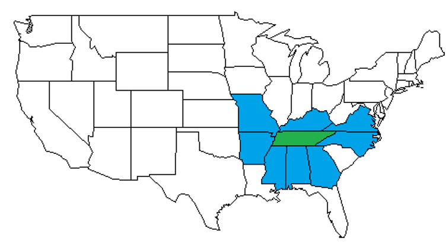{fig-align="center" width="366"}
::::

:::: {.column width="50%"}
**Distance-based**

::: {style="font-size: 0.7em;"}
Assume that regions which are a within a certain distance of each other area neighbours.

-   What distance do you choose? How do you decide that?

-   Where do you measure from? (e.g., nearest border or a central point).
:::

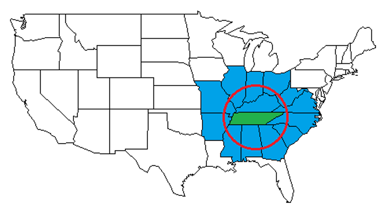{fig-align="center" width="362"}
::::
:::::::

## Neighbourhood matrix

::: incremental
-   Once we have identified a set of neighbours we construct a **neighbourhood matrix** (or proximity matrix), which defines how each of our $m$ regions relate to each other.

-   Let $W$ denote an $m \times m$ matrix where the $(i,j)$th entry, $w_{ij}$ denotes the proximity between regions $B_i$ and $B_j$.

    ::: callout-note
    The values of this matrix can be discrete (which regions are neighbours) or continuous (how far apart are the regions).
    
    The `spdep` package in R can be used on an `sf` spatial polygon  object to define $W$ using the `poly2nb()` and `nb2mat()` functions.
    :::
:::

## Binary Neighbourhood matrix

By far the most common approach is to use a binary neighbourhood matrix, $W$, denoted by

$$
\begin{aligned}
w_{ij} &= 1 \hspace{2mm} \mbox{ if areas} (B_i, B_j) \mbox{ are neighbours.}\\
w_{ij} &= 0 \hspace{2mm} \mbox{ otherwise.}
\end{aligned}
$$

::::: columns
::: {.column width="40%"}
-   Dependencies structures are described through this spatial weights matrix

-   Binary matrices are used for their simplicity
:::

::: {.column width="60%"}
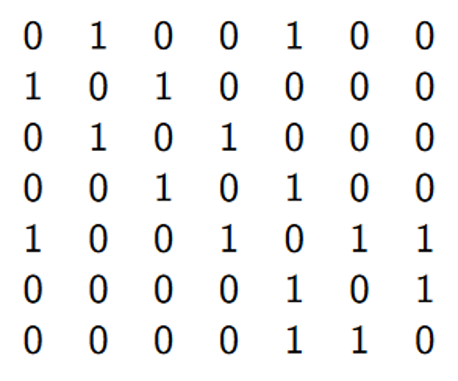{fig-align="center" width="293"}
:::
:::::

## How do we model this? {auto-animate="true"}

Imagine we have animal counts in each region. We can model them as Poisson

$$
y_i \sim \mathrm{Poisson}(e^{\eta_i})
$$ How do we model the linear predictor $\eta_i$?

::: {.fragment .fade-in}
-   We could model the number of animals in each region independently

$$
 \eta_i = \beta_0 + \mathbf{x}'\beta + u_i ~~~ u_i \overset{iid}{\sim} N(0,\sigma^2_i)
$$

-   regional differences are accounted for through a *random effect*
:::

## How do we model this? { auto-animate="true"}

Imagine we have animal counts in each region. We can model them as Poisson

$$
y_i \sim \mathrm{Poisson}(e^{\eta_i})
$$ How do we model the linear predictor $\eta_i$?

::: {.fragment .fade-in}
-   But... what if the distribution varies across space, i.e. is structured in space?
-   Do the covariates account for those structures?
-   If there’s an area where the animal is rare, we’ll get lots of zero counts
:::

## How do we model this? { auto-animate="true"}

Imagine we have animal counts in each region. We can model them as Poisson

$$
y_i \sim \mathrm{Poisson}(e^{\eta_i})
$$ How do we model the linear predictor $\eta_i$?

::: {.fragment .fade-in}
-   We could model some dependence across regions:
    -   *Nearby regions* should have similar counts

$$
\eta_i = \beta_0 + \mathbf{x}'\beta + u_i ~~~ u_i \overset{iid}{\sim} N(0,\Sigma)
$$

-   Now the random effect $u_i \sim N(0, \Sigma)$ is correlated.
:::

::: {.fragment .fade-in}
-   How do we do this?
:::

## Sparse Matrixes {auto-animate=true}

$$
\mathcal{u}\sim\mathcal{N}(0,\Sigma)
$$

1.  Force the *covariance* matrix $\Sigma$ to be sparse

2.  Force the *precision* matrix $\Sigma^{-1}$ to be sparse

## Sparse Matrixes {auto-animate=true}

$$
\mathcal{u}\sim\mathcal{N}(0,\Sigma)
$$

1.  Force the *covariance* matrix $\Sigma$ to be sparse

    -   $\Sigma_{ij} = \text{Cov}(u_i, u_j)$ : Covariance between $u_i$ and $u_j$
    -   $\Sigma_{ij} = 0$ $\longrightarrow$ $u_i$ and $u_j$ are *independent*
    -   A sparse covariance matrix implies that many elements of $\mathbf{u}$ are mutually independent.....is this desirable?

2.  Force the *precision* matrix $\mathbf{Q} = \Sigma^{-1}$ to be sparse

## Sparse Matrixes {auto-animate=true}

$$
\mathcal{u}\sim\mathcal{N}(0,\Sigma)
$$

1.  Force the *covariance* matrix $\Sigma$ to be sparse

    -   $\Sigma_{ij} = \text{Cov}(u_i, u_j)$ : Covariance between $u_i$ and $u_j$
    -   $\Sigma_{ij} = 0$ $\longrightarrow$ $u_i$ and $u_j$ are *independent*
    -   A sparse covariance matrix implies that many elements of $\mathbf{u}$ are mutually independent.....is this desirable?

2.  Force the *precision* matrix $\mathbf{Q} = \Sigma^{-1}$ to be sparse

    -   What does $Q_{ij}$ represents?
    -   What does a sparse precision matrix implies?
    
    
# Gaussian Markov Random Fields  {background-image="figures/areal_img.jpg"}


## Recall: The AR(1) proces

**Definition**

$$
\begin{aligned}
\mathbf{i=1}&:  x_1 \sim N\left(0, \frac{1}{1-\phi^2}\right)\\
\mathbf{i=2,\dots,T}&:  x_i  = \phi\  x_{i-1} +\epsilon_i,\ \epsilon_i\sim\mathcal{N}(0,1)
\end{aligned}
$$

-   Very common to model dependence in time
-   The *joint* distribution of $\mathbf{x}=x_1,x_2,\dots$ is Gaussian
-   How do covariance and precision matrices look?

## Covariance and Precision Matrix for AR1 {auto-animate="true" background-color="#FFFFFF"}

::: {style="height: 50px;"}
:::

::::: columns
::: {.column .smaller width="50%"}
**Covariance Matrix**


::::: {style="font-size: 0.7em;"}
$$
\Sigma = \frac{1}{1-\phi^2}  \begin{bmatrix}
1& \phi & \phi^2  & \dots& \phi^N \\
\phi & 1& \phi  & \dots& \phi^{N-1} \\
\phi^2 & \phi & 1 & \dots& \phi^{N-2} \\
\dots& \dots& \dots& \dots& \dots& \\
\phi^{N} & \phi^{N-1}& \phi^{N-2}  & \dots& 1\\
\end{bmatrix}
$$
::::: 

-   This is a *dense* matrix.

-   All elements of the $\mathbf{x}$ vector are *dependent*.
:::

::: {.column width="50%"}
```{r, echo = F, eval = T}
#| fig-width: 8
#| fig-height: 8
phi = 0.8
x = 0:15
cx = (1-phi^2)^(-1)*phi^x

data.frame(lag = x, cov = cx) %>%
  ggplot() + geom_point(aes(lag, cov)) +
  ggtitle(expression("Covariance between "~u[i]~u[i+h])) +
  xlab("h") + ylab("") + ylim(0,(1-phi^2)^(-1)) +
   theme(title = element_text(size = 18),
        axis.text.x = element_text(size = 16),
        axis.text.y = element_text(size = 16)) 
```
:::
:::::

## Covariance and Precision Matrix for AR1 {.smaller auto-animate="true"}

::: {style="height: 50px;"}
:::

**Precision Matrix**

$$
\mathbf{Q} = \Sigma^{-1} =  \begin{bmatrix}
1& -\phi & 0  & 0 &\dots& 0 \\
-\phi & 1 + \phi^2& -\phi  & 0 & \dots& 0 \\
0 & -\phi & 1-\phi^2 &-\phi &  \dots& 0 \\
0 & 0 & -\phi &1-\phi^2 & \dots & \dots \\
\dots& \dots& \dots& \dots& \dots& \dots& \\
0 &0 & 0 & \dots  & -\phi& 1\\
\end{bmatrix}
$$

-   This is a tridiagonal matrix, it is *sparse*

-   The tridiagonal form of $\mathbf{Q}$ can be exploited for quick calculations.

. . .

What is the key property of this example that causes $\mathbf{Q}$ to be sparse?


## Conditional independence {background-color="#FFFFFF"}

::::: {style="font-size: 0.85em;"}
The key lies in the **full conditionals**

$$
x_t|\mathbf{x}_{-t}\sim\mathcal{N}\left(\frac{\phi}{1-\phi^2}(x_{t-1}+x_{t+1}), \frac{1}{1+\phi^2}\right)
$$

::: fragment
{fig-align="center" width="709"}

:::{.incremental}
-   The circles represent the values of $x$ at individual time points

-   There is a line between them if they are conditionally dependent

-   Each timepoint is only **conditionally dependent** on the two closest neighbours

-   The nonzero pattern in the precision matrix is given by the neighborhood structure of the process
:::

:::
::::: 

## Conditional autoregressive models {.smaller background-color="#FFFFFF"}

:::::: columns
::: {.column width="50%"}
**Markov in Space:**

First order conditional autoregressive model or a CAR(1) model.

-   Every node is conditionally dependent on its four nearest neighbours

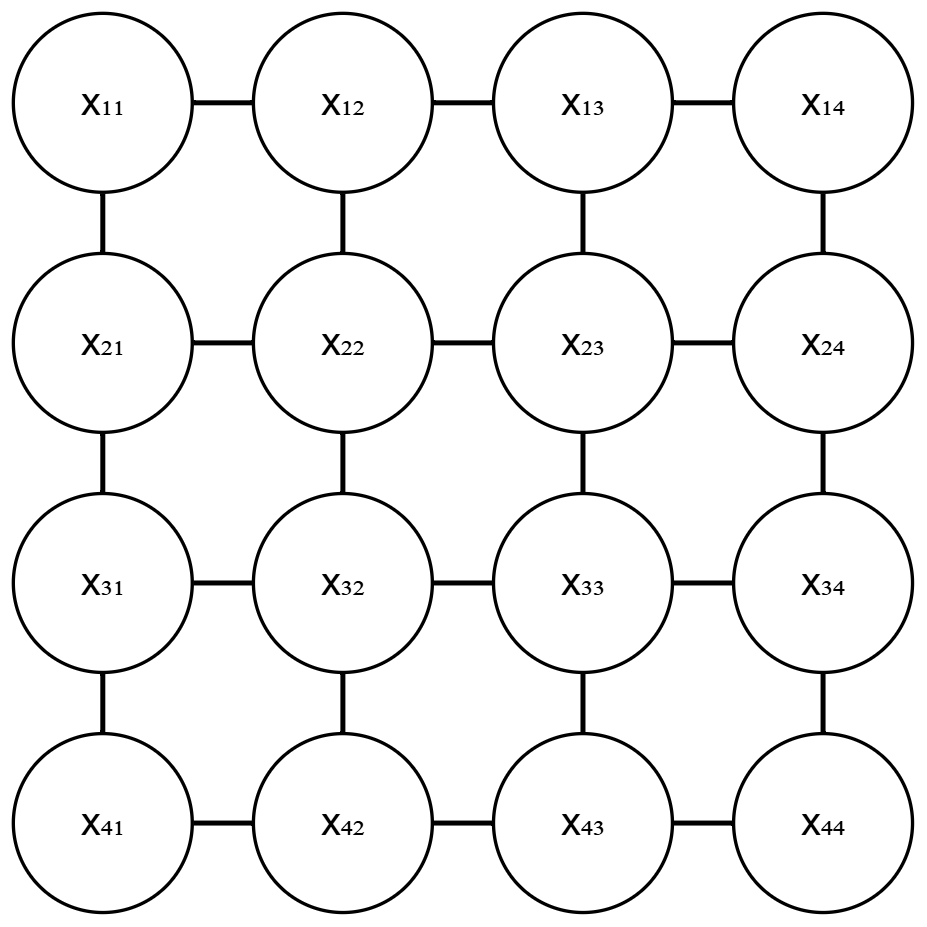{fig-align="center" width="293"}
:::

:::: {.column width="50%"}
::: incremental
-   Models based on neighbourhood have a name in statistics: they are **Markovian models**

-   Markovian models are specified entirely through "*neighbourhood structures*"

-   Recall our first Model:

    $$
    \begin{aligned}
    y_i &\sim \mathrm{Poisson}(e^{\eta_i}) \\
    \eta_i &= \beta_0 + \mathbf{x}'\beta + u_i ~~~ u_i \sim N(0,Q^{-1})
    \end{aligned}
    $$

-   This mean $u_i$ is independent of all the other parameters $\mathbf{u}_{-i}$, given the set of its neighbors.

-   for any pair of elements ($i,j$) in $\mathbf{u}$, $u_i\perp u_j|\mathbf{u}_{-ij}\Longleftrightarrow Q{ij} =0$

-   $Q{ij} \neq 0$ only if $j\in \{i,\mathcal{N}(i)\}$
:::
::::
::::::

## (Informal) definition of a GMRF

Gauss Markov random field (GMRF) is

::: incremental
-   a Gaussian distribution where the non-zero elements of the precision matrix are defined by a neighbourhood matrix (or graph structure)
-   each region conditionally has a Gaussian distribution with
-   mean equal to the average of the neighbours and
-   precision proportional to the number of neighbours
:::

GMRFs are key to the many inferential approaches:

::: incremental
-   computationally efficient
-   other data structures can be approximated by a GMRF in a clever way
:::

## Formal definition of a GMRF 

::::: {style="font-size: 0.85em;"}
Let $\mathbf{u}$ be a GMRF wrt $\mathcal{G} = (\mathcal{V},\mathcal{E})$).

$\mathcal{V}$ Vertices: $1,2,\ldots,n$. $\mathcal{E}$ Edges $\{i,j\}$

-   No edge between $i$ and $j$ if $u_i \perp u_j \mid \mathbf{u}_{ij}.$

-   An edge between $i$ and $j$ if $u_i \not\perp u_j \mid \mathbf{u}_{ij}.$

*Key point: A graph defines the sparsity structure of Q*

::::: 

::: {.callout-note icon="false"}
## Definition

A random variable $\mathbf{u}$ is said to be a GMRF wrt to the graph $\mathcal{G}$ with vertices $\{1, 2,\dots , n\}$ and edges $\mathcal{E}$ , with mean $\mu$ and precision matrix $\mathbf{Q}$ if its probability distribution is given by

$$
\mathbf{u} \sim N(\mu,Q^{-1})
$$ and

$Q_{ij} \neq 0\Longleftrightarrow \{i,j\}\in\mathcal{E} ~~\forall~~i\neq j$
:::


## Modelling spatial similarity {.smaller}

::: {style="height: 50px;"}
:::

An example of a GMRF is the the Besag model a.k.a. Intrinsic Conditional Autoregressive (ICAR) model. The conditional distribution for $u_i$ is

$$
u_i|\mathbf{u}_{-i},\tau_u, \sim N\left(\frac{1}{d_i}\sum_{j\sim i}u_j,\frac{1}{d_i\tau_u}\right)
$$

::: incremental
-   $\mathbf{u}_{-i} = (u_i,\ldots,u_{i-1},u_{i+1},\ldots,u_n)^T$

-   $\tau_u$ is the precision parameter (inverse variance).

-   $d_i$ is the number of neighbours

-   The mean of $u_i$ is equivalent to the the mean of the effects over all neighbours, and the precision is proportional to the number of neighbours (e.g., if an area has many neighbors then its variance will be smaller)
:::

## Modelling spatial similarity {.smaller}

::: {style="height: 50px;"}
:::

The joint distribution is given by:

$$
\mathbf{u}|\tau_u \sim N\left(0,\frac{1}{\tau_u}Q^{-1}\right),
$$

Where $Q$ denotes the precision matrix defined as

$$
Q_{i,j} = \begin{cases}
d_i, & i = j \\
-1, & i \sim j \\
0, &\text{otherwise}
\end{cases}
$$

This structure matrix directly defines the neighbourhood structure and is sparse.


## How does it looks? {auto-animate="true"}

Larynx cancer relative risk map

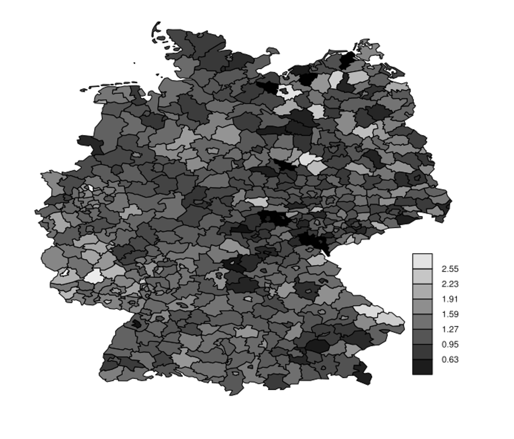{fig-align="center" width="423"}

## How does it looks? {auto-animate="true"}

Connecting all the neighbouring areas give the following graph

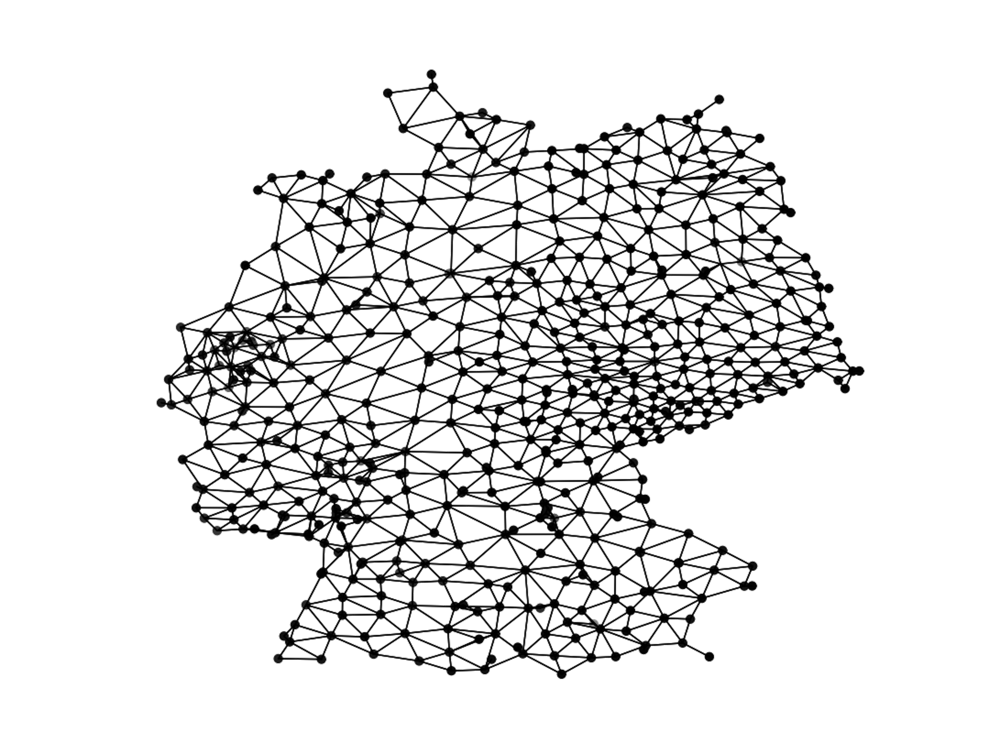{fig-align="center"}

## How does it looks? {auto-animate="true"}

-   Let us focus on one small part of the graph

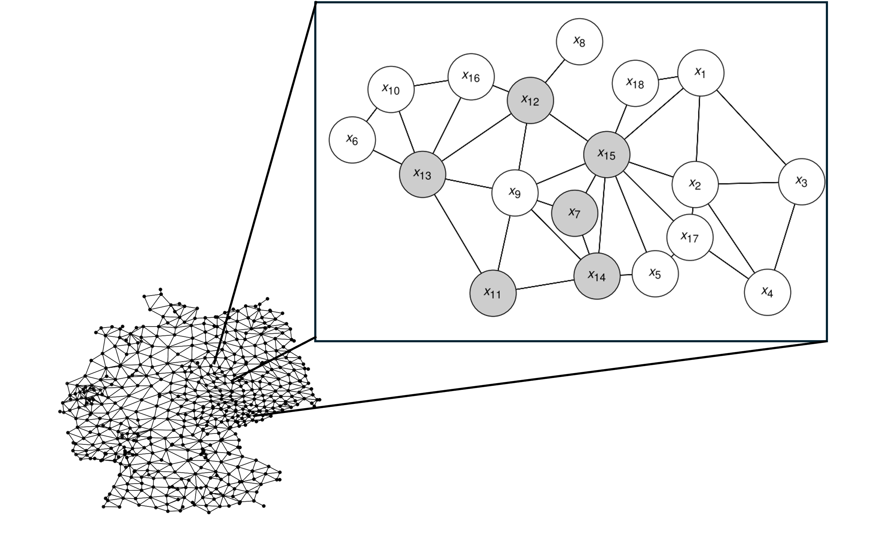{fig-align="center"}

## How does it looks? {.smaller auto-animate="true"}

-   We apply an ICAR model where each region conditionally has a Gaussian distribution with mean equal to the average of the neighbours and a precision proportional to the number of neighbour

    $$
    x_9\mid\mathbf{x}_{-9}\sim N\left(\frac{1}{6}(x_7+x_{11}+x_{12}+x_{13}+x_{14}+x_{15}),\frac{1}{6\tau}\right)
    $$

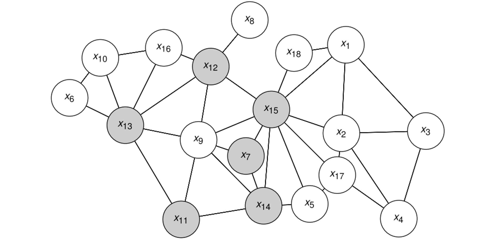{fig-align="center"}

## How does it looks? {auto-animate="true"}

The sub graph leads to a precision matrix with 21.6% non-zero elements.

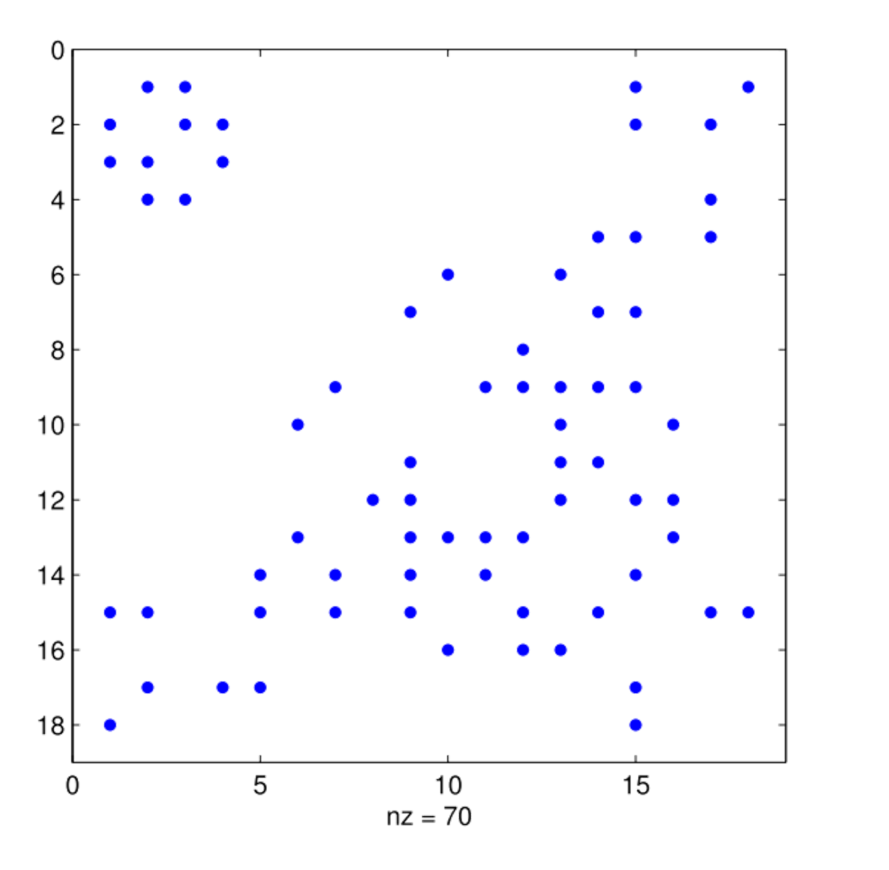{fig-align="center"}

## How does it looks like? {auto-animate="true"}

The full graph leads to a precision matrix with 0.1% non-zero elements.

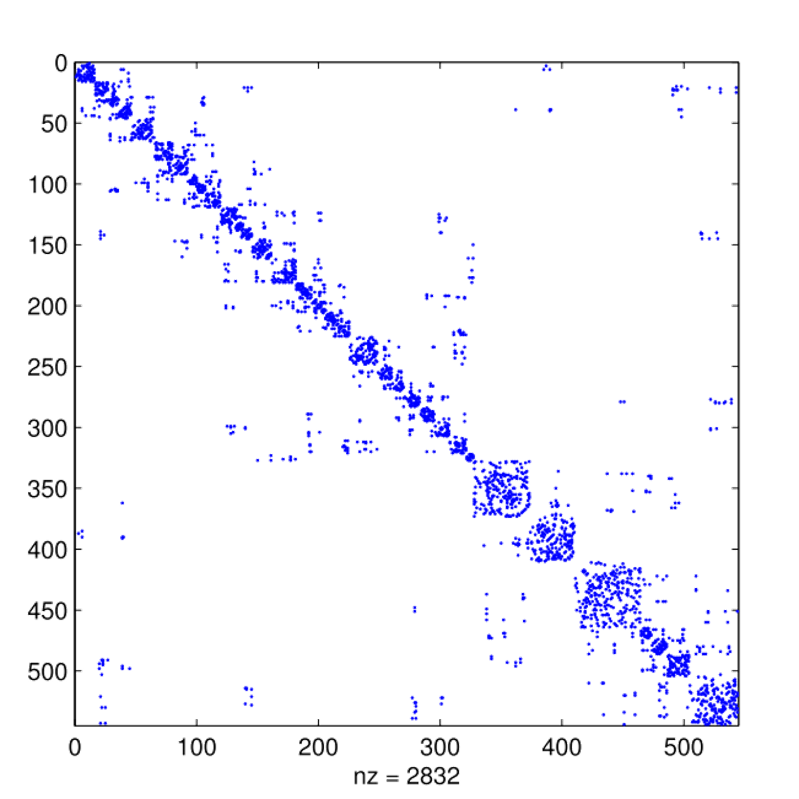{fig-align="center"}


## BYM model

::: {style="font-size: 0.95em;"}


The ICAR model accounts only for spatially structured variability and does not include a limiting case where no spatial structure is present.

::: incremental
-   We typically add an unstructured random effect $z_i|\tau_z \sim N(0,\tau_{z}^{-1})$

-   The resulting model $v_i = u_i + z_i$ is known as the Besag-York-Mollié model (BYM)

-   The structured spatial effect is controlled by $\tau_u$ which control the degree of smoothing:

    -   Higher $\tau_u$ values lead to stronger smoothing (less spatial variability).

    -   Lower $\tau_u$ values allow for greater local variation.

-   In the next example we will illustrate how to fit this model using `inlabru`.
:::

:::

<!-- ## Reminder: Latent Gaussian Models (LGMs) -->


<!-- -   A LGM consists of three elements: -->
<!--     1.  a likelihood model -->
<!--     2.  a latent Gaussian field (i.e., the latent components of our model) -->
<!--     3.  a vector of non-Gaussian hyperparameters -->
<!-- -   The characteristic property is that the latent part of the hierarchical model is Gaussian, $\mathbf{u}|\theta \sim N(0,Q^{-1})$, where the expected value is $0$ and the precision matrix is $Q$. -->

<!-- ## INLA strategy in short -->

<!-- **Assumption** -->

<!-- We are mainly interested in posterior marginals $p(u_i|\mathbf{y})$ and $p(\theta_j|\mathbf{y})$ -->

<!-- **Strategy** -->

<!-- -   We use numerical integration in a smart way -->
<!-- -   We approximate what we do not know analytically exploiting the Gaussian structure of $\mathbf{u}|y$. -->

#  Respiratory hospitalisations  in Glasgow  {background-image="figures/areal_img.jpg"}

## Respiratory hospitalisations in Glasgow

::: {style="font-size: 0.8em;"}
In this example we model the number of respiratory hospitalisations across Intermediate Zones (IZ) that make up the Greater Glasgow and Clyde health board in Scotland.
:::

:::::: columns
:::: {.column width="50%"}
::: {style="font-size: 0.8em;"}
In epidemiology, disease risk is assessed using Standardized Mortality Ratios (SMR):

$$ SMR_i = \dfrac{Y_i}{E_i} $$

-   A value $SMR > 1$ indicates a high risk area.
-   A value $SMR<1$ suggests a low risk area.
:::
::::

::: {.column width="50%"}
```{r}
#| echo: false
#| message: false
#| eval: true
#| out-width: 100%


library(dplyr)
library(INLA)
library(ggplot2)
library(patchwork)
library(inlabru)   
library(mapview)
library(sf)

# load some libraries to generate nice map plots
library(scico)
library(CARBayesdata)
data(pollutionhealthdata)
data(GGHB.IZ)
resp_cases <- merge(GGHB.IZ %>%
                      mutate(region_id = 1:dim(GGHB.IZ)[1]),
                             pollutionhealthdata, by = "IZ")%>%
  dplyr::filter(year == 2007) 

resp_cases <- resp_cases %>% 
  mutate(SMR = observed/expected )
library(spdep)
W.nb <- poly2nb(GGHB.IZ,queen = TRUE)
R <- nb2mat(W.nb, style = "B", zero.policy = TRUE)
diag = apply(R,1,sum)
Q = -R
diag(Q) = diag

mapviewOptions(basemaps = c("OpenStreetMap.DE","Esri.WorldImagery","OpenTopoMap"))

mapview(resp_cases,zcol = "SMR")

```
:::
::::::


##  Respiratory hospitalisation in Glasgow {.smaller}

Recall that a  LGM consists of three elements:

> -   **Stage 1:** We assume the responses are Poisson distributed: $$          
>     \begin{aligned}y_i|\eta_i & \sim \text{Poisson}(E_i\lambda_i)\\\text{log}(\lambda_i) = \color{#FF6B6B}{\boxed{\eta_i}} & = \color{#FF6B6B}{\boxed{\beta_0 + \beta_1 \mathrm{pm10} + u_i + z_i} }\end{aligned}
>     $$

> -   **Stage 2:** $\eta_i$ is a linear function of **four components**: an intercept, pm10 effect , a spatially structured effect $u$ and an unstructured iid random effect $z$:\
>     $$
>     \eta_i = \beta_0 +  \beta_1 \mathrm{pm10} + u_i + z_i
>     $$

> -   **Stage 3:** $\{\tau_{z},\tau_u\}$: Precision parameters for the random effects

The latent field is $\mathbf{u}= (\beta_0, \beta_1, u_1, u_2,\ldots, u_n,z_1,...)$, the hyperparameters are $\boldsymbol{\theta} = (\tau_u,\tau_z)$, and must be given a prior.

##  Respiratory hospitalisation in Glasgow {.smaller auto-animate="true" background-color="#FFFFFF"}

::::: columns
::: {.column width="50%"}
**The Model**

$$
\begin{aligned}
y_i|\eta_t & \sim \text{Poisson}(E_i\lambda_i)\\
\text{log}(\lambda_i) = \eta_i & = \color{#FF6B6B}{\boxed{\beta_0}} + \color{#FF6B6B}{\boxed{\beta_1 \mathrm{pm10}}} + \color{#FF6B6B}{\boxed{u_i}} + \color{#FF6B6B}{\boxed{z_i}}
\end{aligned}
$$

**The code**

```{r}
#| echo: true
#| eval: false
#| warning: false
#| message: false
#| code-line-numbers: "1-4"

# define model component
cmp = ~ Intercept(1) +  pm10(pm10, model = "linear") +
  ui(region_id, model = "besag", graph = Q) + 
  zi(region_id, model = "iid") 

# define model predictor
eta =  observed ~ Intercept + ui + vi + pm10

# build the observation model
lik = bru_obs(formula = eta, 
              family = "poisson",
              E = expected,
              data = resp_cases)

# fit the model
fit = bru(cmp, lik)


```
:::

::: {.column width="50%"}
**neighbourhood structure**

```{r}
#| echo: true
#| message: false
#| warning: false
#| eval: false
library(spdep)
W.nb <- poly2nb(GGHB.IZ,queen = TRUE)
```

```{r}
#| fig-width: 8
#| fig-height: 10
#| echo: false
plot(st_geometry(GGHB.IZ), border = "lightgray")
plot.nb(W.nb, st_geometry(GGHB.IZ), add = TRUE)
```
:::
:::::

## Respiratory hospitalisation in Glasgow {.smaller auto-animate="true" background-color="#FFFFFF"}

::::: columns
::: {.column width="50%"}
**The Model**

$$
\begin{aligned}
y_i|\eta_t & \sim \text{Poisson}(E_i\lambda_i)\\
\text{log}(\lambda_i) =  \color{#FF6B6B}{\boxed{\eta_i}} & = \color{#FF6B6B}{\boxed{\beta_0 + \beta_1 \mathrm{pm10} + u_i + z_i}}
\end{aligned}
$$

**The code**

```{r}
#| echo: true
#| eval: false
#| warning: false
#| message: false
#| code-line-numbers: "6-7"

# define model component
cmp = ~ Intercept(1) + pm10(pm10, model = "linear") 
  ui(region_id, model = "besag", graph = Q) + 
  vi(region_id, model = "iid") 

# define model predictor
eta =  observed ~ Intercept + ui + vi + pm10

# build the observation model
lik = bru_obs(formula = eta, 
              family = "poisson",
              E = expected,
              data = resp_cases)

# fit the model
fit = bru(cmp, lik)


```
:::

::: {.column width="50%"}
**neighbourhood structure**

```{r}
#| echo: true
#| message: false
#| warning: false
#| eval: false
library(spdep)
W.nb <- poly2nb(GGHB.IZ,queen = TRUE)
```

```{r}
#| fig-width: 8
#| fig-height: 10
#| echo: false
plot(st_geometry(GGHB.IZ), border = "lightgray")
plot.nb(W.nb, st_geometry(GGHB.IZ), add = TRUE)
```
:::
:::::

##  Respiratory hospitalisation in Glasgow {.smaller auto-animate="true" background-color="#FFFFFF"}

::::: columns
::: {.column width="50%"}
**The Model**

$$
\begin{aligned}
\color{#FF6B6B}{\boxed{y_i|\eta_t}} & \sim \color{#FF6B6B}{\boxed{\text{Poisson}(E_i\lambda_i)}}\\
\text{log}(\lambda_i) =  \eta_i & = \beta_0 + \beta_1 \mathrm{pm10} + u_i + z_i
\end{aligned}
$$

**The code**

```{r}
#| echo: true
#| eval: false
#| warning: false
#| message: false
#| code-line-numbers: "9-13"

# define model component
cmp = ~ Intercept(1) + pm10(pm10, model = "linear")
  ui(region_id, model = "besag", graph = Q) + 
  vi(region_id, model = "iid") 

# define model predictor
eta =  observed ~ Intercept + ui + vi + pm10

# build the observation model
lik = bru_obs(formula = eta, 
              family = "poisson",
              E = expected,
              data = resp_cases)

# fit the model
fit = bru(cmp, lik)


```
:::

::: {.column width="50%"}
**neighbourhood structure**

```{r}
#| echo: true
#| message: false
#| warning: false
#| eval: false
library(spdep)
W.nb <- poly2nb(GGHB.IZ,queen = TRUE)
```

```{r}
#| fig-width: 8
#| fig-height: 10
#| echo: false
plot(st_geometry(GGHB.IZ), border = "lightgray")
plot.nb(W.nb, st_geometry(GGHB.IZ), add = TRUE)
```
:::
:::::

##  Respiratory hospitalisation in Glasgow {.smaller auto-animate="true" background-color="#FFFFFF"}

::::: columns
::: {.column width="50%"}
**The Model**

$$
\begin{aligned}
y_i|\eta_t & \sim \text{Poisson}(E_i\lambda_i)\\
\text{log}(\lambda_i) =  \eta_i & = \beta_0 + \beta_1 \mathrm{pm10} + u_i + z_i
\end{aligned}
$$

**The code**

```{r}
#| echo: true
#| eval: false
#| warning: false
#| message: false
#| code-line-numbers: "15-16"

# define model component
cmp = ~ Intercept(1) + pm10(pm10, model = "linear")
  ui(region_id, model = "besag", graph = Q) + 
  vi(region_id, model = "iid") 

# define model predictor
eta =  observed ~ Intercept + ui + vi + pm10

# build the observation model
lik = bru_obs(formula = eta,  
              family = "poisson",
              E = expected,
              data = resp_cases)

# fit the model
fit = bru(cmp, lik)


```
:::

::: {.column width="50%"}
**neighbourhood structure**

```{r}
#| echo: true
#| message: false
#| warning: false
#| eval: false
library(spdep)
W.nb <- poly2nb(GGHB.IZ,queen = TRUE)
```

```{r}
#| fig-width: 8
#| fig-height: 10
#| echo: false
plot(st_geometry(GGHB.IZ), border = "lightgray")
plot.nb(W.nb, st_geometry(GGHB.IZ), add = TRUE)
```
:::
:::::

## Respiratory hospitalisation in Glasgow {.smaller background-color="#FFFFFF"}


```{r}
#| echo: false
cmp = ~ Intercept(1) +  pm10(pm10, model = "linear") +
  ui(region_id, model = "besag", graph = Q) + 
  vi(region_id, model = "iid")

formula = observed ~ Intercept + ui + vi + pm10  

lik = bru_obs(formula = formula, 
              family = "poisson",
              E = expected,
              data = resp_cases)

fit = bru(cmp, lik)
```

::::: columns
::: {.column width="35%"}
**Posterior summaries**

```{r}
#| echo: false
#| message: false
#| warning: false

library(gt)

rbind(fit$summary.fixed[,c(1,3,5)] ,
fit$summary.hyperpar[,c(1,3,5)] )%>%
  mutate(par = c(rownames(fit$summary.fixed),
                 rownames(fit$summary.hyperpar))) %>%
  gt(rowname_col = "par") %>% gt::fmt_number(decimals = 2)
```


:::

::: {.column width="65%"}
**Estimated relative risks**

```{r}
#| eval: false
#| echo: true
pred = predict(fit, resp_cases,
 ~data.frame(
 log_risk = Intercept + ui + vi + pm10,
 risk = exp(Intercept + ui + vi+  pm10)),
      n.samples = 1000)
```

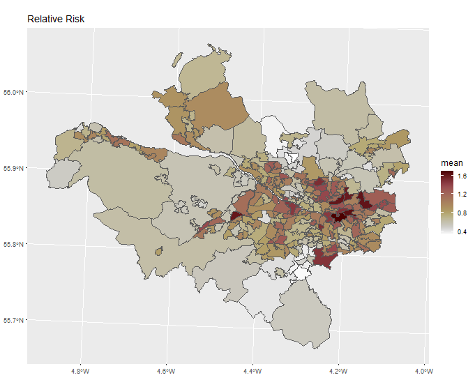{fig-align="center" width="450"}


:::
:::::


# Improved interpretability: BYM2 {background-image="figures/areal_img.jpg"}


## BYM2 Model 


::: {style="font-size: 0.85em;"}

In the original BYM, the spatially structured component must be scaled so that $\tau_u$ produces consistent smoothness across different neighborhood structures.

Simpson *et al*. ([2017](https://projecteuclid.org/journals/statistical-science/volume-32/issue-1/Penalising-Model-Component-Complexity--A-Principled-Practical-Approach-to/10.1214/16-STS576.full)) proposed a new parametrization of the BYM model that improves parameter interpretability.

$$
    \mathbf{b} = \dfrac{1}{\sqrt{\tau_b}} \left(\sqrt{1-\phi}v^*+\sqrt{\phi}u^*\right).
$$


:::{.incremental}

-   The precision $\tau_b>0$ controls the marginal variance contribution of the weighted sum $u^*$ and $v^*$.

-   The mixing parameter $0 \leq \phi \leq 1$ measures the proportion of the marginal variance explained by the structured effect $u^*$

    -   if $\phi =1$ the model captures only spatially structured variability

    -   if $\phi = 0$ it accounts solely for unstructured spatial noise.

:::

:::

:::{.notes}
The problem is that the data only ever inform the sum $u_i + v_i$ never the two pieces separately. 

- For a single area you have one observation (or one likelihood contribution) but two latent variables to split it into.

- Any observed $\eta_i = u_i + v_i$ can be explained by infinitely many combinations of $u_i$ and $v_i$ that add to the same value

- The two components are not individually identifiable from the likelihood — only their sum is.
:::

## BYM2 & PC priors {.smaller auto-animate=true}

The BYM2 model allows the specification of Penalized Complexity (PC) priors to control the amount of spatial smoothing and avoid overfitting.

-   PC priors shrink the model towards a simpler baseline unless the data provide strong evidence for a more complex structure.
-   To define the prior for the marginal precision $\tau_b$ and the mixing parameter $\phi$, we use the probability statements:

::: {.fragment .current-only data-fragment-index="1"}
$$
\begin{aligned}
P(1/\sqrt{\tau_b} > U) &= \alpha\\
P(\phi < U) &= \alpha
\end{aligned}
$$
:::

::: {.fragment .current-only data-fragment-index="2"}
$$
\begin{aligned}
P((1/\sqrt{\tau_b}) > 0.5/0.31) &\equiv  P(\sigma > 1.61) = 0.01\\
P(\phi < 0.5) &= 2/3 \approx 0.66
\end{aligned}
$$
:::

::: {.fragment .current-only data-fragment-index="2"}
**Interpretation:**

-   Prior on $\tau_b$: low probability of large values

-   Prior on $\phi$ assumes that the unstructured random effect accounts for more of the variability than the spatially structured effect.
:::


## BYM2 & PC priors {.smaller auto-animate=true}

The BYM2 model allows the specification of Penalized Complexity (PC) priors to control the amount of spatial smoothing and avoid overfitting.

-   PC priors shrink the model towards a simpler baseline unless the data provide strong evidence for a more complex structure.
-   To define the prior for the marginal precision $\tau_b$ and the mixing parameter $\phi$, we use the probability statements:


```{r}
#| eval: false
#| echo: true
# define model component
cmp = ~ Intercept(1) +  pm10(pm10, model = "linear") +
  b(region_id, model = "bym2", graph = Q,
               # priors
               hyper = list(theta1 = list("PCprior", c(1.61, 0.01)), # Pr(sd>1) = 0.01 
                            theta2 = list("PCprior", c(0.5, 0.66)))) # Pr(phi<0.5)=0.66
```

**Interpretation:**

-   Prior on $\tau_b$: low probability of large values

-   Prior on $\phi$ assumes that the unstructured random effect accounts for more of the variability than the spatially structured effect.


## Take-Home Message

- areal data are data on discretised space
- spatial relationships are represented through a neighbourhood structure
- GMRFs are computationally efficient representation these will also be relevant – and very useful – when it comes to approximating spatial structures in continuous space


# References {.smaller data-title-offset="true"}

[@goicoa2018spatio @lee2022bayesian @orozco2021scalable @riebler2016 @seaton2024spatio @simpson2017 vicente2020bayesian ]{style="display:none"}

::: {#refs}
:::

```{=html}
<script>
document.querySelectorAll('#refs [id^="ref-"]').forEach(function(entry) {
  var key = entry.id;                       // e.g. "ref-besag1991"
  var a = document.createElement('a');
  a.href = '../references.html#' + key;
  a.target = '_blank';
  a.style.textDecoration = 'none';
  a.style.color = 'inherit';
  while (entry.firstChild) a.appendChild(entry.firstChild);
  entry.appendChild(a);
});
</script>
```


