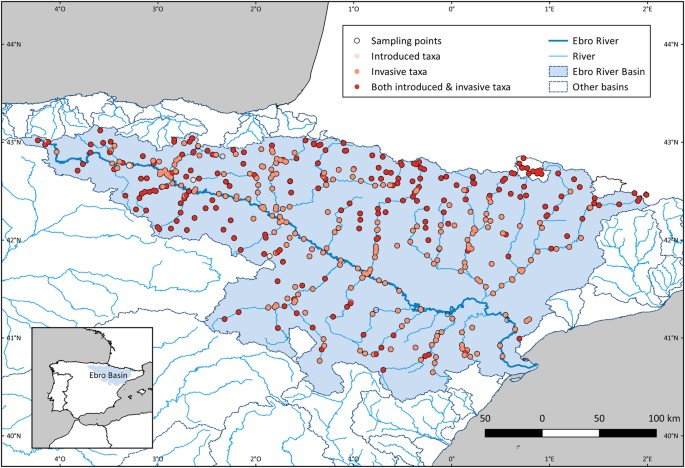
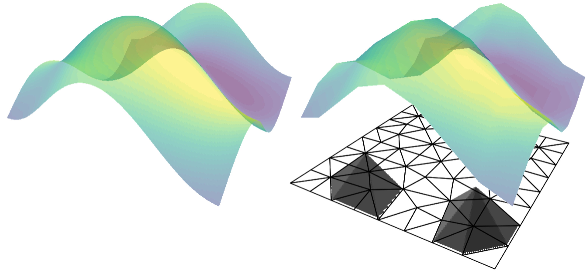
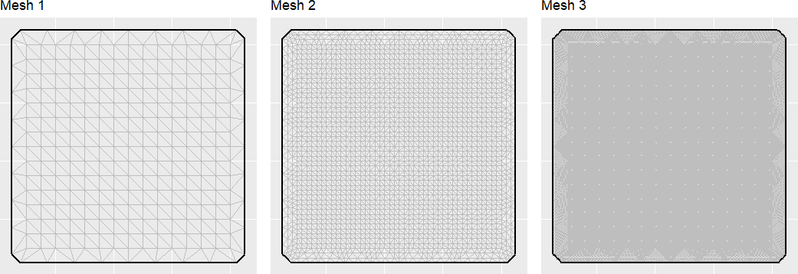
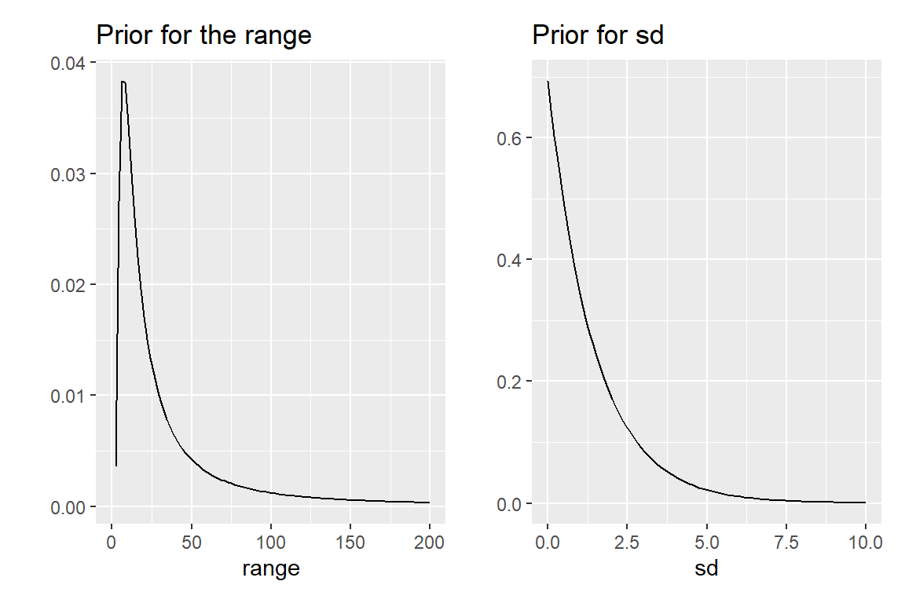

```{r setup}
# #| include: false

knitr::opts_chunk$set(echo = FALSE,
                      message=FALSE,
                      warning=FALSE,
                      strip.white=TRUE,
                      prompt=FALSE,
                      fig.align="center",
                       out.width = "60%")

library(knitr)    # For knitting document and include_graphics function
library(ggplot2)  # For plotting
library(png)
library(tidyverse)
library(INLA)
library(BAS)
library(patchwork)
library(inlabru)
library(fmesher)
library(sf)
library(scico)
``` 

# Geostatistical modelling {background-image="figures/geostats_img.jpg"}


## Geostatistical data 


::: {style="font-size: 0.85em;"}

In many ecological and environmental settings, measurements are taken from fixed sampling units, aiming to quantify spatial variation and interpolate values at unobserved sites.

:::::: columns
:::: {.column width="60%"}
::: incremental
-   Geostatistical data are the most common form of spatial data found in environmental and ecological settings.
-   We regularly take measurements of an environmental variable of interest at a set of fixed locations.
-   This could be data from samples taken across a region (eg., water depth in a lake) or from monitoring stations as part of a network (e.g., air pollution).
-   In each of these cases, our goal is to estimate the value of our variable across the entire space.
:::
::::

::: {.column width="40%"}
{fig-align="center" width="475"}
:::
::::::

:::

## Understanding our region

::: incremental
-   Let $D$ be our two-dimensional region of interest.
-   In principle, there are infinitely many locations within $D$, each of which can be represented by mathematical coordinates (e.g. latitude and longitude).
-   We can identify any individual location as $\mathbf{s}_i = (x_i, y_i)$, where $x_i$ and $y_i$ are their coordinates.
-   We can treat our variable of interest as a random variable, $Z$ which can be observed at any location as $Z(\mathbf{s}_i)$.
:::

## Geostatistical process

-   A geostatistical process can therefore be written as: $$\{Z(\mathbf{s}); \mathbf{s} \in D\}$$
-   In practice, data are observed at a finite number of locations, $m$, and can be denoted as: $$z = \{z(\mathbf{s}_1), \ldots z(\mathbf{s}_m) \}$$
-   We have observed our data at $m$ locations, but often want to predict this process at a set of unknown locations.
-   For example, what is the value of $z(\mathbf{s}_0)$, where $\mathbf{s}_0$ is an unobserved site?

## Spatial autocorrelation

-   The key challenge in modelling geostatistical data is understanding **correlation**.
-   Typically observations close together in space will be more similar than those which are further apart.
-   Spatial correlation is usually driven by some unmeasured confounding variable(s) - for example, air pollution is spatially correlated because nearby areas tend to experience similar traffic levels.
-   It is important that we account for these correlations in our analysis - failing to do so will lead to poor inference.


# Spatial Modelling {background-image="figures/geostats_img.jpg"}

## What We Observed and What We Did Not


::: {style="font-size: 0.85em;"}

We treat the observed process of interest as being measured with error

$$
(\text{observed value})_i = (\text{true value at location } i) + (\text{error})_i
$$

alternatively

$$
y_i = Z(\mathbf{s}_i) + \varepsilon_i
$$

When geostatistical data are considered, we can often assume that there is a spatially continuous variable underlying the observations that can be modeled using a **random field**.

::: incremental
-   we have a process that is occurring everywhere in space $\rightarrow$ natural to try to model it using some sort of function (of space)

-   a **random field** is a random function that generates smooth surfaces

-   This is hard

-   We typically make our lives easier by making everything Gaussian
:::

:::

## Gaussian Random Fields {.smaller auto-animate="true"}

A **Gaussian random field** (GRF) is a collection of random variables, where observations occur in a continuous domain, and where every finite collection of random variables has a multivariate normal distribution

$$
\mathbf{z} = (z(\mathbf{s}_1),\ldots,z(\mathbf{s}_m)) \sim N(\mu(\mathbf{s}_1),\ldots,\mu(\mathbf{s}_m),\Sigma),
$$

where $\Sigma_{ij} = \mathrm{Cov}(z(\mathbf{s}_i),z(\mathbf{s}_j))$ is a dense $m \times m$ matrix.

::: incremental
-   This is actually quite tricky: $\Sigma$ will need to depend on the set of observation sites and has to behave well (be "*positive definite*")
-   Use a covariance function $C_z(\cdot,\cdot)$ that depends on the distance ($\Sigma_{ij} = C_z(\mathbf{s}_i,\mathbf{s}_j)$) between two points and that
    -   has no negative variances
    -   is symmetric
    -   is decreasing, with maximum at distance = 0
-   $C_z(\mathbf{s}_i, \mathbf{s}_j)$ measures the strength of the linear dependence between $Z(\mathbf{s}_i)$ and $Z(\mathbf{s}_j)$.
-   $C_z(\mathbf{s}_i, \mathbf{s}_j) = \mathrm{Var}(Z(\mathbf{s}_i))$ for $i = j$.
:::

## Stationary and isotropy 

::: {style="font-size: 0.85em;"}

We will assume our *Gaussian process* can be described as weakly stationary if the following criteria are met:

$E[{Z(\mathbf{s})}] = \mu_z(\mathbf{s}) = \mu_z$ - a finite constant which does not depend on $\mathbf{s}$.

$\text{Cov}(Z(\mathbf{s}_i),Z(\mathbf{s}_j)) = C_z(\mathbf{s}_i-\mathbf{s}_j)$ - a finite constant which can depend on distance $(\mathbf{s}_i-\mathbf{s}_j)$.

:::{.incremental}
-   Condition 1 states that our mean function must be constant in space, with no overall spatial trend.

-   Condition 2 states that for any two locations, their covariance depends only on how far apart they are (their spatial lag, $h$), not their absolute position.
:::

:::{.fragment}
Our process is said to be **isotropic** if the covariance function is directionally invariant. This means that the covariance only depends on the euclidean distance $(||\mathbf{s}_i-\mathbf{s}_j||)$ and not the direction.
:::

:::

## Building the model 


::: {style="font-size: 0.85em;"}

The first step in defining a model for a random field in a hierarchical framework is to identify a probability distribution for the observations available at $m$ sampled spatial locations and represented by the vector $\mathbf{y} = y_1,\ldots,y_m$.

For example, if we assume our observations follow a Gaussian distribution then

$$
\begin{aligned}
Y_i &\sim N(\mu_i,\tau_e^{-1})\\
\eta_i &=\mu_i = \beta_0 + \ldots + Z(\mathbf{s}_i)
\end{aligned}
$$

:::{.incremental}
-   $\tau_e^{-1} = \sigma^2_e$ represents the variance of the zero-mean measurement error

-   The response mean $\mu_i$ which coincides with the linear predictor $\eta_i$ is defined based on:

    -   the intercept $\beta_0$ and any additional covariates

    -   the realization of the latent (*unobservable*) GF $Z(\mathbf{s}) \sim \mathrm{MVN}(0,\Sigma)$ which accounts for the spatial correlation through $\Sigma = C_z(\cdot,\cdot)$.
    
:::

:::

## The Matérn Field

::: {style="font-size: 0.85em;"}
A commonly used covariance function is the Matérn covariance function. The covariance of two points which are a distance $h$ apart is:

$$
    \Sigma =C_{\nu}(h) = \sigma^2 \frac{2^{1-\nu}}{\Gamma(\nu)} \left( \frac{\sqrt{2\nu} h}{\rho} \right)^{\nu} K_{\nu} \left( \frac{\sqrt{2\nu} h}{\rho} \right)
$$

-   $\Gamma(\cdot)$ is the gamma function

-   $K_{\nu}(\cdot)$ is the modified Bessel function of the second kind.

-   Parameters $\sigma^2$, $\rho$ and $\nu$ are non-negative values of the covariance function.

    -   $\sigma^2$ is the *spatially structured* variance component

    -   $\rho$ is the range of the spatial process

    -   $\nu$ controls smoothness of the spatial process.
    
:::

## Big *n* problem!

<br>

The disadvantage of the modelling approach involving the spatial covariance function is known as "big *n* problem" and concerns the computational costs required for algebra operations with dense covariance matrices (such as $\Sigma$).

<br>

In particular dense matrix operations scale cubically with the matrix size, given by the number of locations where the process is observed. A computationally effective alternative is given by the stochastic partial differential equation (SPDE) approach

## The SPDE approach


a different approach to GRF models:

:::{.incremental}
-  forget about the covariance function!

-  express spatial structure through an SPDE (stochastic partial differential equation):

    -  a simple differential equation describes change in time

    -  a partial differential equation describes change in space (in more than 1 direction!)

    -  a stochastic partial differential equation makes this random,i.e. not deterministic
    
-  need to approximate spatial structures in a clever way.
:::

# The SPDE approach {background-image="figures/INLADiagram.png"}

## The  stochastic partial differential equation

We define a (Matérn) GRF as the solution of a stochastic partial differential equation (SPDE)

$$
(\kappa^2-\Delta)^{\alpha/2}Z(t) = W(t)
$$


:::{.fragment}
What is this?
:::


:::{.fragment}
-   $W(t)$ is random noise
-   $\omega(t)$ is the smooth process we want
-   $(\kappa^2-\Delta)^{\alpha/2}$ is an operator that "smooths" the white noise.
-   $\kappa$ and $\alpha$ are parameters
:::


## Recall the 1-D SPDE {.smaller auto-animate="true" background-color="#FFFFFF"}

:::::: columns
:::: {.column width="40%"}
Imagine a guitar string stretched from left to right.

-   Now imagine someone randomly taps along it at many locations:

    ::: incremental
    -   Each tap is independent
    -   Some taps are strong, some weak
    -   There is no coordination between taps
    -   A tap at one location tells you nothing about a tap nearby
    :::

::: fragment
*This is pure randomness.* But a real string does not behave like this
:::
::::

::: {.column width="60%"}
```{r}
#| echo: false
#| fig-width: 10
#| fig-height: 10

set.seed(2026)
# ----- Parameters -----
N      <- 650        # number of grid points
x_min  <- 0
x_max  <- 10
x      <- seq(x_min, x_max, length.out = N)
h      <- x[2] - x[1]   # grid spacing

W <- rnorm(N, mean = 0, sd = 1)  # white noise on the grid

p1 = data.frame(x =x,
           W = W)

ggplot(p1,aes(x=x,y=W))+geom_line(col="grey60")+geom_hline(yintercept = 0) + coord_cartesian(ylim = c(-1, 1)) + labs(x="t")

```
:::
::::::

::: notes
No smoothness

Sharp up/down jumps

No gentle waves

No continuity in behavior

That's because nothing connects one tap to the next.
:::

## Recall the 1-D SPDE {.smaller auto-animate="true" background-color="#FFFFFF"}

:::::: columns
:::: {.column width="40%"}
Imagine a guitar string stretched from left to right.

-   The rope has tension and stiffness
    -   the tension spreads each tap to nearby points
    -   Sharp jumps are softened. $(\kappa^2-\Delta)^{\color{red}{\alpha}/2}Z(t) = W(t)$

::: fragment
-   $\Delta$ measures the local curvature
-   $\kappa$ controls how far randomness propagates
-   stronger tension (large $\kappa$) = stronger pull

$$(\color{red}{\kappa^2}-\Delta)Z(t) = W(t), ~~~\text{for } \alpha=2$$
:::
::::

::: {.column width="60%"}
```{r}
#| echo: false
#| fig-width: 10
#| fig-height: 10

set.seed(2026)
N      <- 650        # number of grid points
x_min  <- 0
x_max  <- 10
x      <- seq(x_min, x_max, length.out = N)
h      <- x[2] - x[1]   # grid spacing

# SPDE parameters to try
kappa_vals <- c(0.5, 1.0, 2.0)   # smaller kappa -> longer range (looser rope)
alpha_vals <- c(2, 4)            # alpha = 2 (one smoothing), alpha = 4 (smoother)

# ----- Build 1D second-difference matrix D2 -----
# D2 * u approx = u_{i-1} - 2 u_i + u_{i+1}
D2 <- matrix(0, nrow = N, ncol = N)
diag(D2) <- -2
for(i in 1:(N-1)){
  D2[i, i+1] <- 1
  D2[i+1, i] <- 1
}
# (Neumann-like) boundary handling: keep D2[1,1] = -1? We'll keep simple Dirichlet-style here:
# (current code uses the simple interior stencil and leaves boundaries with fewer neighbors)

I_N <- diag(1, N)

# ----- Helper: build discrete operator A = (kappa^2 I - d2/dx2) -----
build_A <- function(kappa) {
  # discrete second derivative is D2 / h^2
  A <- (kappa^2) * I_N - (D2 / (h^2))
  # small regularization for numeric stability (optional)
  A <- A + 1e-10 * I_N
  return(A)
}

# ----- Helper: solve (A^m) u = W  for integer m >= 1 (alpha = 2*m) -----
solve_alpha <- function(A, W, m = 1) {
  # Solve A^m u = W by sequential solves: A v_1 = W, A v_2 = v_1, ..., u = v_m
  v <- W
  for(j in 1:m) {
    v <- solve(A, v)
  }
  return(v)
}

# ----- Generate one white-noise realization -----
W <- rnorm(N, mean = 0, sd = 1)  # white noise on the grid

# alpha=2m

u_fix1 <- solve_alpha(build_A(0.5), W, m = 2)  # alpha=2 -> m=1
u_fix2 <- solve_alpha(build_A(1), W, m = 2)  # alpha=2 -> m=1
u_fix3 <- solve_alpha(build_A(2), W, m = 2)  # alpha=2 -> m=1

p1 = data.frame(x =x,
           W = W,
           u1  = u_fix1,
           u2  = u_fix2,
           u3  = u_fix3
           ) %>%
  ggplot() + geom_line(aes(x,W), alpha = 0.2) + geom_line(aes(x,u1, color = "k = 0.5")) +
  geom_line(aes(x,u2, color = "k = 1")) +
  geom_line(aes(x,u3, color = "k = 2")) + xlab("") + ylab("") + ggtitle("alpha = 2") + coord_cartesian(ylim = c(-1, 1))+scale_color_discrete(name="") +
  theme(
    legend.text  = element_text(size = 18),   # label text size
    legend.key.size = unit(2, "cm"),         # size of the colour swatches
    legend.title = element_text(size = 18)     # title (empty here, but sets size if you add one)
  )

p1 + labs(x="t")

```
:::
::::::

::: notes
Measure the bending at $z_i$ by taking the with respect the average of the neighbours (i.e. $z_i - (z_{i-1}+z_i/2) = z_{i-1} + 2z_i +z_{i+1}$).

-   if $= 0 \rightarrow$ straight

-   if the diff is large $\rightarrow$ sharply bent

-   the sign tells you which way it bends

The curvature need to divide by the spacing $h$ between points (assuming equal spacing), i.e., $(z_{i-1} + 2z_i +z_{i+1}) \times h^{-2}$.

In a continuous space we measured this by taking the second derivative, i.e. the Laplacian operator

As $h\to 0$ we measure the rate of change of slope, i.e. curvature as:

$$(z_{i-1} + 2z_i +z_{i+1}) \times h^{-2}  \to \frac{\partial z}{\partial t^2} = \Delta z$$ Where $z(x)$ is the displacement of the string at position $t$.

Tension ($\kappa$): resists large displacement If a tap pushes part of the string far up or down:

-   tension pulls it back
-   stronger tension = stronger pull

$$
\begin{aligned}
(\color{red}{\kappa^2}-\Delta)Z(t) &= W(t) \\
\color{red}{\kappa^2}Z(t) - \Delta Z(t) &= W(t)\\
\text{if } Z(t) \text{ is large then }& \color{tomato}{\kappa^2 Z(t)} \text{ becomes large too} \\
\text{large pull}-\text{back bending}&=\text{random tap}
\end{aligned}
$$ In this case, To balance the equation, $Z(t)$ must be smaller.
:::

## Recall the 1-D SPDE {.smaller auto-animate="true" background-color="#FFFFFF"}

:::::: columns
:::: {.column width="40%"}
Imagine a guitar string stretched from left to right.

-   The rope has tension and stiffness
    -   the tension spreads each tap to nearby points
    -   Sharp jumps are softened.

::: fragment
-   Stiffness = controls how smooth the field becomes ($\alpha$)
-   Larger $\alpha$ smoother the process will be

$$
(\kappa^2-\Delta)^{\color{red}{\alpha}/2}Z(t) = W(t)
$$
:::
::::

::: {.column width="60%"}
```{r}
#| echo: false
#| fig-width: 10
#| fig-height: 10

set.seed(2026)

# Grid
N      <- 650
x_min  <- 0
x_max  <- 10
x      <- seq(x_min, x_max, length.out = N)
h      <- x[2] - x[1]

# Build D2
D2 <- matrix(0, nrow = N, ncol = N)
diag(D2) <- -2
for(i in 1:(N-1)){
  D2[i, i+1] <- 1
  D2[i+1, i] <- 1
}
I_N <- diag(1, N)

# White noise
W <- rnorm(N, mean = 0, sd = 1)

# Fix kappa
kappa_fixed <- 0.5

# alpha = 2  -> m = 1
u_alpha2 <- solve_alpha(build_A(kappa_fixed), W, m = 1)

# alpha = 4  -> m = 2
u_alpha4 <- solve_alpha(build_A(kappa_fixed), W, m = 2)

# Plot
library(ggplot2)
library(dplyr)

df <- data.frame(
  x = x,
  W = W,
  alpha2 = u_alpha2,
  alpha4 = u_alpha4
)

p <- df %>%
  ggplot() +
  geom_line(aes(x, W), alpha = 0.2) +
  geom_line(aes(x, alpha2, color = "alpha = 2")) +
  geom_line(aes(x, alpha4, color = "alpha = 4")) +
  labs(
    x = "t",
    y = "W"
  ) +
  coord_cartesian(ylim = c(-1, 1)) +
  scale_color_discrete(name = "")+
  theme(
    legend.text  = element_text(size = 18),   # label text size
    legend.key.size = unit(2, "cm"),         # size of the colour swatches
    legend.title = element_text(size = 18)     # title (empty here, but sets size if you add one)
  )

p


```
:::
::::::

::: notes
Lastly $\alpha$ controls how *smooth* the final shape. E.g.,

$$
W(t) = \begin{cases}
(\kappa^2-\Delta)Z(t) & \text{if } \alpha= 2 \text{ i.e., string resists curvature once}\\
(\kappa^2-\Delta)^2Z(t) & \text{if } \alpha= 4 \text{ i.e., string resists curvature twice}
\end{cases}
$$

Take the white noise $W(t)$ and smooth it once by the operator $(\kappa^2 - \Delta)^{-1}$ so the operator filters the white noise once

-   it reduces sharp spikes

-   but still leaves some visible bumps

At $\alpha=2$ we smooth the result again.. Each pass removes high-frequency components (sharp bumps)
:::

## Solving the SPDE {.smaller background-color="#FFFFFF" auto-animate="true"}

Ok...but we still need to solve the SPDE to find $Z(t)$!

. . .

Now we need to discretize the domain into T points (we cannot compute on the continuous!)

. . .

::::: columns
::: {.column width="50%"}
We represent our solution as

$$
Z(t) = \sum_{i = 1}^T\psi_i(t)w_i
$$

Where

-   $\psi_i(t)$ are (known) basis functions for nodes $i=1,\ldots,T$

    -   $\psi_i(t_i)= 1$

    <!-- -->

    -   $\psi_i(t_j) = 0 ~~\forall~~i \neq j$

    <!-- -->

    -   Linear between neighboring nodes
:::

::: {.column width="50%"}
```{r}
#| out-width: 70%

locs = c(-5,10,15,25,40,50,60)
mesh1d = fm_mesh_1d(locs, degree = 1, boundary = "neumann")
p1 = ggplot() +
  geom_fm(data = mesh1d, xlim = c(-10, 70)) +
  geom_point(data = data.frame(x = locs, y = 0), aes(x,y)) +
  geom_text(data = data.frame(x = locs + 0.5, y = -0.1), aes(x,y,label = 1:7))

p1

eval = fm_evaluator(mesh1d)
w = round(runif(7), 3)

 p1 + geom_line(data = data.frame(x = eval$x,
                           y = fm_evaluate(eval, w)),
                aes(x,y), size = 2) + ggtitle(paste("w=",paste(round(w,2), collapse = ', ')))

```
:::
:::::

::: notes
-   "solving the SPDE" means Find a random function $Z(t)$ such that the equality $(\kappa^2-\Delta)^{\alpha/2}Z(t) = W(t)$ holds in distribution.
-   in other words find $Z(s)$ such that when the operator $(\kappa^2-\Delta)^{\alpha/2}$ is applied to it, it produces white noise
-   OR, The Matérn field is the Gaussian field $Z(s)$ produced by smoothing white noise $W(t)$ through the inverse operator $(\kappa^2-\Delta)^{\alpha/2}$.
-   The Matérn field is infinite-dimensional so we approximate it using a finite basis expansion
    -   we want a simple local basis
    -   each basis only affects neighbors
    -   so computations become sparse
-   Each weight $w_i$ is basically the value of the field at node $i$
-   The basis functions are:
    -   Height = 1 at node
    -   Zero at neighboring nodes
    -   Linear in between
-   A hat function is not the field. It is a *building block* for the field.
-   the field between nodes is interpolated linearly so the vector of weights fully defines the approximate field.
-   Since the SPDE is linear and the white noise is Gaussian, the solution is Gaussian
:::

## Solving the SPDE {.smaller background-color="#FFFFFF" auto-animate="true"}

Ok...but we still need to solve the SPDE to find $Z(t)$!

Now we need to discretize the domain into T points (we cannot compute on the continuous!)

::::: columns
::: {.column width="50%"}
We represent our solution as

$$
Z(t) = \sum_{i = 1}^T\psi_i(t)w_i
$$

Where

-   $\psi_i(t)$ are (known) basis functions for nodes $i=1,\ldots,T$

-   $w_i$ are (unknown) weights

    -   the field value $Z(s)$ is a **linear interpolation** between the two neighboring weights
:::

::: {.column width="50%"}
```{r}
#| out-width: 70%

locs = c(-5,10,15,25,40,50,60)
mesh1d = fm_mesh_1d(locs, degree = 1, boundary = "neumann")
p1 = ggplot() +
  geom_fm(data = mesh1d, xlim = c(-10, 70)) +
  geom_point(data = data.frame(x = locs, y = 0), aes(x,y)) +
  geom_text(data = data.frame(x = locs + 0.5, y = -0.1), aes(x,y,label = 1:7))

p1

eval = fm_evaluator(mesh1d)
w = round(runif(7), 3)

 p1 + geom_line(data = data.frame(x = eval$x,
                           y = fm_evaluate(eval, w)),
                aes(x,y), size = 2) + ggtitle(paste("w=",paste(round(w,2), collapse = ', ')))

```
:::
:::::

::: notes
-   "solving the SPDE" means Find a random function $Z(t)$ such that the equality $(\kappa^2-\Delta)^{\alpha/2}Z(t) = W(t)$ holds in distribution.
-   in other words find $Z(s)$ such that when the operator $(\kappa^2-\Delta)^{\alpha/2}$ is applied to it, it produces white noise
-   OR, The Matérn field is the Gaussian field $Z(s)$ produced by smoothing white noise $W(t)$ through the inverse operator $(\kappa^2-\Delta)^{\alpha/2}$.
-   The Matérn field is infinite-dimensional so we approximate it using a finite basis expansion
    -   we want a simple local basis
    -   each basis only affects neighbors
    -   so computations become sparse
-   Each weight $w_i$ is basically the value of the field at node $i$
-   The basis functions are:
    -   Height = 1 at node
    -   Zero at neighboring nodes
    -   Linear in between
-   A hat function is not the field. It is a *building block* for the field.
-   the field between nodes is interpolated linearly so the vector of weights fully defines the approximate field.
-   Since the SPDE is linear and the white noise is Gaussian, the solution is Gaussian
:::

## Solving the SPDE {.smaller background-color="#FFFFFF" auto-animate="true"}

Ok...but we still need to solve the SPDE to find $Z(t)$!

Now we need to discretize the domain into T points (we cannot compute on the continuous!)

::::: columns
::: {.column width="50%"}
We represent our solution as

$$
Z(t) = \sum_{i = 1}^T\psi_i(t)w_i
$$

Where

-   $\psi_i(t)$ are (known) basis functions for nodes $i=1,\ldots,T$

-   $w_i$ are (unknown) weights

-   This solution is then approximated using a finite combination of piece-wise linear basis functions.

-   The solution is completely defined by a Gaussian vector of weights with zero mean and a sparse precision matrix.
:::

::: {.column width="50%"}
```{r}
#| out-width: 70%

locs = c(-5,10,15,25,40,50,60)
mesh1d = fm_mesh_1d(locs, degree = 1, boundary = "neumann")
p1 = ggplot() +
  geom_fm(data = mesh1d, xlim = c(-10, 70)) +
  geom_point(data = data.frame(x = locs, y = 0), aes(x,y)) +
  geom_text(data = data.frame(x = locs + 0.5, y = -0.1), aes(x,y,label = 1:7))

p1

eval = fm_evaluator(mesh1d)
w = round(runif(7), 3)

 p1 + geom_line(data = data.frame(x = eval$x,
                           y = fm_evaluate(eval, w)),
                aes(x,y), size = 2) + ggtitle(paste("w=",paste(round(w,2), collapse = ', ')))

```
:::
:::::

## The SPDE approach on 2D {.smaller auto-animate="true"}

Now we approximate the GRF using a triangulated mesh.

The SPDE approach represents the continuous spatial process as a continuously indexed Gaussian Markov Random Field (GMRF)

-   We construct an appropriate lower-resolution approximation of the surface by sampling it in a set of well designed points and constructing a piece-wise linear interpolant.

{fig-align="center" width="520"}

## The SPDE approach on 2D {.smaller auto-animate="true"}

Now we approximate the GRF using a triangulated mesh.

The SPDE approach represents the continuous spatial process as a continuously indexed Gaussian Markov Random Field (GMRF)

-   We construct an appropriate lower-resolution approximation of the surface by sampling it in a set of well designed points and constructing a piece-wise linear interpolant.

-   Note that $\nu = \alpha - d/2$. For $\alpha=2 \Rightarrow \nu= 1$ since $d=2$ we have that:

::: {.callout-note icon="false"}
$$
\begin{aligned}
Z(s) &= \sum_{i = 1}^K\psi_i(s)w_i \\
\mathbf{w} &\sim N(\mathbf{0},Q^{-1}) \leftarrow \text{GMRF}\\
Q^{-1} &= \tau^2(\kappa^4 \mathbf{C} + 2\kappa^2 \mathbf{G}+\mathbf{G}\mathbf{C}^{-1}\mathbf{G})
\end{aligned}
$$

-   $\mathbf{C}$ is diagonal with entries $C_{ii} =\int \psi_i(s)\mathrm{d}s$ and measures how much of the domain each basis function covers.

-   $G_{ij} = \int \nabla \psi_i(s) \nabla \psi_j(s) \mathrm{d}s$ reflects the connectivity of the mesh nodes.

-   because each basis function overlaps only with nearby ones, the resulting precision matrix is sparse, meaning each coefficient depends directly only on its neighbors
:::

::: notes
we approximate a continuous string/field using local "hat2 shapes;

-   C just measures how much space each hat covers (mass/area),
-   G measures how strongly neighboring hats resist bending
:::

## In summary {.smaller}

-   The continuous Matérn GRF is the solution of a SPDE and is represented as

$$
Z(s) = \sum_{i = 1}^K\psi_i(s)w_i
$$

-   The weights vector $\mathbf{w} = (w_1,\dots,w_K)$ is Gaussian with a **sparse** precision matrix $\longrightarrow$ Computational convenience

-   The field has two parameters

    -   The range $\rho$
    -   The marginal variance $\sigma^2$

-   These parameters are linked to the parameters of the SPDE

-   We need to assign prior to them

## Penalized Complexity (PC) priors

Penalized Complexity (PC) priors proposed by Simpson et al. ([2017](https://projecteuclid.org/journals/statistical-science/volume-32/issue-1/Penalising-Model-Component-Complexity--A-Principled-Practical-Approach-to/10.1214/16-STS576.full)) allow us to control the amount of spatial smoothing and avoid overfitting.

-   PC priors shrink the model towards a simpler baseline unless the data provide strong evidence for a more complex structure.
-   To define the prior for the marginal precision $\sigma^{-2}$ and the range parameter $\rho$, we use the probability statements:
    -   Define the prior for the range $\text{Prob}(\rho<\rho_0) = p_{\rho}$
    -   Define the prior for the range $\text{Prob}(\sigma>\sigma_0) = p_{\sigma}$

## Learning about the SPDE approach {.smaller}

::: {style="height: 50px;"}
:::

-   D. Miller, R.  Glennie, R. and A. Seaton. (2020). Understanding the Stochastic Partial Differential Equation Approach to Smoothing. *Journal of Agricultural, Biological and Environmental Statistics*, 25(1), 1-16.

-   F. Lindgren, H. Rue, and J. Lindström. An explicit link between Gaussian fields and Gaussian Markov random fields: The SPDE approach (with discussion). In: *Journal of the Royal Statistical Society, Series B* 73.4 (2011), pp. 423–498.

-   H. Bakka, H. Rue, G. A. Fuglstad, A. Riebler, D. Bolin, J. Illian, E. Krainski, D. Simpson, and F. Lindgren. Spatial modelling with R-INLA: A review. In: *WIREs Computational Statistics* 10:e1443.6 (2018). (Invited extended review). DOI: 10.1002/wics.1443.

-   E. T. Krainski, V. Gómez-Rubio, H. Bakka, A. Lenzi, D. Castro-Camilio, D. Simpson, F. Lindgren, and H. Rue. *Advanced Spatial Modeling with Stochastic Partial Differential Equations using R and INLA*. Github version \url{www.r-inla.org/spde-book}. CRC press, Dec. 20


# Modelling Pacific Cod Distribution {background-image="figures/cod.jpg"}

## Modelling Pacific Cod Distribution 


In the next example, we will explore data on the Pacific Cod (*Gadus macrocephalus*) from a trawl survey in Queen Charlotte Sound.

-   The dataset contains the presence/absence of Pacific cod in the area swept for a given survey in 2003 as well as depth covariate information.

```{r}
#| echo: false
#| message: false
#| eval: true
#| out-width: 100%

library(sdmTMB)

pcod_df = sdmTMB::pcod %>% filter(year==2003)
qcs_grid = sdmTMB::qcs_grid
pcod_sf =   st_as_sf(pcod_df, coords = c("lon","lat"), crs = 4326)
pcod_sf = st_transform(pcod_sf,
                       crs = "+proj=utm +zone=9 +datum=WGS84 +no_defs +type=crs +units=km" )
library(terra)
depth_r <- rast(qcs_grid, type = "xyz")
crs(depth_r) <- crs(pcod_sf)
library(tidyterra)
ggplot()+ 
  geom_spatraster(data=depth_r$depth)+
      geom_sf(data=pcod_sf,aes(color=factor(present))) +
    scale_color_manual(name="Locations where Pacific Cod \nwere caught",
                     values = c("black","orange"),
                     labels= c("Absence","Presence"))+
  scale_fill_scico(name = "Depth",
                   palette = "nuuk",
                   na.value = "transparent" ) + xlab("") + ylab("")
par(mfrow=c(1,1))
```


## The Model {background-color="#FFFFFF" auto-animate="true"}

-   **Stage 1** Model for the response $$
    y(s)|\eta(s)\sim\text{Binomial}(p(s))
    $$

-   **Stage 2** Latent field model $$
    \eta(s) = \mathrm{logit}(p(s)) = \beta_0 + \beta_1 \,\log \text{depth}(s)+ Z(s)
    $$

-   **Stage 3** Hyperparameters

## The Model {background-color="#FFFFFF" auto-animate="true"}

-   **Stage 1** Model for the response $$
    y(s)|\eta(s)\sim\text{Binomial}(p(s))
    $$

-   **Stage 2** Latent field model $$
    \eta(s) = \mathrm{logit}(p(s)) = \beta_0 +\beta_1 \,\log \text{depth}(s) + Z(s)
    $$

    -   A global intercept $\beta_0$
    -   A covariate effect $\beta_1$
    -   A Gaussian field $Z(s)$

-   **Stage 3** Hyperparameters

## The Model {background-color="#FFFFFF" auto-animate="true"}

-   **Stage 1** Model for the response $$
    y(s)|\eta(s)\sim\text{Binomial}(p(s))
    $$

-   **Stage 2** Latent field model $$
    \eta(s) = \mathrm{logit}(p(s)) = \beta_0 + \beta_1 \,\log \text{depth}(s) + Z(s)
    $$

-   **Stage 3** Hyperparameters

    -   Range and sd in the Gaussian field $\sigma_{\omega}, \tau_{\omega}$


## Step 1: Define the SPDE representation: The mesh

First, we need to create the mesh used to approximate the random field.

```{r}
library(fmesher)
mesh = fm_mesh_2d(loc = pcod_sf,           # Build the mesh
                  cutoff = 2,
                  max.edge = c(7,20),     # The largest allowed triangle edge length.
                  offset = c(5,50))       # The automatic extension distance

```

```{r}
#| echo: false
ggplot() + gg(mesh) +
  geom_sf(data= pcod_sf, aes(color = factor(present))) + 
  xlab("") + ylab("")
```

-   `max.edge` for maximum triangle edge lengths
-   `offset` for inner and outer extensions (to prevent *edge effects*)
-   `cutoff` to avoid overly small triangles in clustered areas

## Step 1: Define the SPDE representation: The mesh

::: incremental
-   All random field models need to be discretised for practical calculations.

-   The SPDE models were developed to provide a consistent model definition across a range of discretisations.

-   We use finite element methods with local, piecewise linear basis functions defined on a triangulation of a region of space containing the domain of interest.

-   Deviation from stationarity is generated near the boundary of the region.

-   The choice of region and choice of triangulation affects the numerical accuracy.
:::

## Step 1: Define the SPDE representation: The mesh {background-color="#FFFFFF"}

-   If the mesh is too fine $\rightarrow$ heavy computation

-   If the mesh is to coarse $\rightarrow$ not accurate enough

{fig-align="center"}

## Step 1: Define the SPDE representation: The mesh

**Some guidelines**

-   Create triangulation meshes with `fm_mesh_2d()`:

-   edge length should be around a third to a tenth of the spatial range

-   Move undesired boundary effects away from the domain of interest by extending to a smooth external boundary:

-   Use a coarser resolution in the extension to reduce computational cost (`max.edge=c(inner, outer)`), i.e., add extra, larger triangles around the border

## Step 1: Define the SPDE representation: The mesh

-   Use a fine resolution (subject to available computational resources) for the domain of interest (inner correlation range) and avoid small edges ,i.e., filter out small input point clusters (0 $<$ \`cutoff $<$ inner)

-   Coastlines and similar can be added to the domain specification in `fm_mesh_2d()` through the `boundary` argument.

-   simplify the border

## Step 1: Define the SPDE representation: The SPDE {.smaller}

We use the `inla.spde2.pcmatern` to define the SPDE model using PC priors through the following probability statements


:::: {.columns}

::: {.column width="40%"}

```{r}
spde_model =  inla.spde2.pcmatern(mesh,
                                  prior.sigma = c(1, 0.5),
                                  prior.range = c(100, 0.5))
```

:::

::: {.column width="60%"}

-   $P(\rho < 100) = 0.5$

-   $P(\sigma > 1) = 0.5$

:::

::::

{fig-align="center" width="425"}


## Step 2: Define the model components {.smaller auto-animate="true"}

::::: columns
::: {.column width="55%"}
**The Model**

$$
\begin{aligned}
y(s)|\eta(s) & \sim\text{Binom}(1, p(s))\\
\eta(s) &  = \color{#FF6B6B}{\boxed{\beta_0}} + \color{#FF6B6B}{\boxed{  \beta_1 \,\log \text{depth}(s) }} + \color{#FF6B6B}{\boxed{ Z(s)}}\\
\end{aligned}
$$

:::{.fragment}
-  `depth` is a column in our `sf` data
-  `geometry` column allow us to use spatial objects as input
:::

:::

::: {.column width="45%"}
```{r}
#| echo: true
pcod_sf %>% select(depth, present) %>% print(n = 3)
```
:::


:::::

**The code**

```{r}
#| echo: true
#| eval: true
#| warning: false
#| message: false
#| code-line-numbers: "1-3"

# define model component
cmp = ~ -1 + Intercept(1) +  depth_eff(log(depth), model='linear') + 
  space(geometry, model = spde_model)

# define model predictor
eta = present ~ Intercept + depth_eff + space

# build the observation model
lik = bru_obs(formula = eta,
              data = pcod_sf,
              family = "binomial")

# fit the model
fit = bru(cmp, lik)
```


## Step 2: Define the model components {.smaller auto-animate="true"}


::::: columns
::: {.column width="55%"}
**The Model**
$$
\begin{aligned}
y(s)|\eta(s) & \sim\text{Binom}(1, p(s))\\
\eta(s) &  = \beta_0 + \beta_1 \,\log \color{#FF6B6B}{\boxed{\text{depth}(s) } } +  Z(s)\\
\end{aligned}
$$
:::

::: {.column width="45%"}
- here `depth_r` is a raster and `depth` a layer (be careful with NA's).
-  `.data.` is a keyword referring to whatever data object is passed to `bru_obs()` or `bru()`
-  `eval_spatial()` extracts the value of the spatial covariate at the locations in the data
:::
:::::

::: {style="margin-top: -2.5em;"}
**Spatial covariates**
:::

:::: columns
::: {.column width="50%"}
```r
~ my_sp_effect(
  main = a_spatial_object,
  model = "linear"
)
```
:::

::: {.column width="50%"}
```r
~ my_sp_effect(
  main = eval_spatial(a_spatial_object, .data.),
  model = "linear"
)
```
:::
::::

**The code**

```{r}
#| echo: true
#| eval: false
#| warning: false
#| message: false
#| code-line-numbers: "1-3"

# define model component
cmp = ~ -1 + Intercept(1) +  depth_eff(log(depth_r$depth), model='linear') + 
  space(geometry, model = spde_model)

# define model predictor
eta = present ~ Intercept + depth_eff + space

# build the observation model
lik = bru_obs(formula = eta,
              data = pcod_sf,
              family = "binomial")

# fit the model
fit = bru(cmp, lik)
```


## Step 3: Define the linear predictor {.smaller auto-animate="true"}

::::: columns
::: {.column width="55%"}
**The Model**
$$
\begin{aligned}
y(s)|\eta(s) & \sim\text{Binom}(1, p(s))\\
\color{#FF6B6B}{\boxed{\eta(s)}} &  = \color{#FF6B6B}{\boxed{\beta_0 +  \beta_1 \,\log \text{depth}(s) +  Z(s)}}\\
\end{aligned}
$$
:::

::: {.column width="45%"}
```{r}
#| echo: true
pcod_sf %>% select(depth, present) %>% print(n = 3)
```
:::
:::::

**The code**

```{r}
#| echo: true
#| eval: false
#| warning: false
#| message: false
#| code-line-numbers: "5-6"

# define model component
cmp = ~ -1 + Intercept(1) +  depth_eff(log(depth), model='linear') + 
  space(geometry, model = spde_model)

# define model predictor
eta = present ~ Intercept + depth_eff + space

# build the observation model
lik = bru_obs(formula = eta,
              data = pcod_sf,
              family = "binomial")

# fit the model
fit = bru(cmp, lik)
```

## Step 4: Define the observational model {.smaller auto-animate="true"}

::::: columns
::: {.column width="55%"}
**The Model**

$$
\begin{aligned}
\color{#FF6B6B}{\boxed{y(s)|\eta(s)}} & \sim \color{#FF6B6B}{\boxed{\text{Binom}(1, p(s))}}\\
\eta(s) &  = \beta_0 +  \beta_1 \,\log \text{depth}(s) +  Z(s)\\
\end{aligned}
$$

:::

::: {.column width="45%"}
```{r}
#| echo: true
pcod_sf %>% select(depth, present) %>% print(n = 3)
```
:::
:::::

**The code**

```{r}
#| echo: true
#| eval: false
#| warning: false
#| message: false
#| code-line-numbers: "8-11|13-14"

# define model component
cmp = ~ -1 + Intercept(1) +  depth_eff(log(depth), model='linear') + 
  space(geometry, model = spde_model)

# define model predictor
eta = present ~ Intercept + depth_eff + space

# build the observation model
lik = bru_obs(formula = eta,
              data = pcod_sf,
              family = "binomial")

# fit the model
fit = bru(cmp, lik)
```


## Step 5: Collect Results {.smaller auto-animate="true"}

We can plot the posterior density of the model components via `plot(model, "model component")` and also look at the correlation/covariance function as follows:

```{r}
#| echo: true
#| code-fold: true


Inter_post <- plot(fit, "Intercept")
depth_post <- plot(fit, "depth_eff")
corplot <- plot(spde.posterior(fit, "space", what = "matern.correlation"))
covplot <- plot(spde.posterior(fit, "space", what = "matern.covariance"))

Inter_post + depth_post + corplot + covplot + plot_layout(ncol=2)
```

# Spatial predictions {background-image="figures/geostats_img.jpg"}

## How do we predict at unsampled locations? 

In geostatistical applications, the main interest resides in the spatial prediction of the spatial latent field or of the response variable in new locations

::: incremental
-   Suppose we observe a spatial process ${Z(s): s \in \mathcal{D}}$ at locations $s_1,\dots,s_n$.

-   Our goal: **predict the variable of interest at an unobserved location** $s_0 \in \mathcal{D}$.

    > given the data $y = (y_1,\dots,y_n)$, what can we say about $Z(s_0)$?

-   Rather than a single guess, we want a **full uncertainty-aware prediction**.

-   In a Bayesian setting, prediction is a **probabilistic task**.
:::


## Posterior predictive density 

::: {style="font-size: 0.85em;"}
The key lies in the **posterior predictive distribution**

$$
  \pi(\tilde{Y} \mid y)
  = \int \pi(\tilde{Y} \mid \Theta, y)\, \pi(\Theta \mid y)\, d\Theta,
$$ where $\Theta$ denotes *all* latent components and hyperparameters.

::: incremental
-   $\pi(\tilde{Y} \mid \Theta, y)$ depends on the task:
    -   extrapolation(e.g. forecasting): $\pi(Y_{n+1} \mid \Theta, y_n)$,
    -   **interporlation**: $\pi(Y_i \mid y_{i-1}, y_{i+1}, \Theta)$,
-   Spatial prediction fits naturally into this framework:
    -   $\tilde{Y}$ may represent $Z(s_0)$, $\eta_0$, or the response at $y(s_0)$,
    -   conditioning reflects the assumed spatial dependence.
-   INLA approximates $\pi(\Theta \mid y)$ efficiently, enabling **full uncertainty propagation** when predicting over $s_0 \in \mathcal{D}$.

:::

:::


## Posterior predictive density { .smaller auto-animate="true" background-color="#FFFFFF"}

::::: columns
::: {.column width="40%"}

1. Define a grid of points where we want to predict. `fm_pixel()` creates a regular grid of points covering the mesh (*we will see in the practical how your the raster can be used instead*)

2. Append the values of the covariate(s) (if any) at the prediction locations

2. `inlabru` will create a projector matrix $A$ linking the latent Gaussian field to the prediction locations via the `predict` function.

3. We can do predictions for $Z(s), \eta(s), g^{-1}(\eta(s))$

:::

::: {.column width="60%"}

```{r}
#| echo: true
#| 
pxl = fm_pixels(mesh)

# 2. extract raster values at the point locations
vals <- terra::extract(depth_r$depth, pxl, ID = FALSE)

# 3. bind the extracted values onto the sf object
pred_data <- cbind(pxl, vals) %>%  filter(!is.na(depth))


preds = predict(fit, pred_data, 
      ~data.frame(spde = space,
                  eta = Intercept + 
                        depth_eff +
                        space,
                  p_s = plogis(Intercept + 
                               depth_eff +
                               space)))


```

:::

:::::


:::{.notes}
-   A projector matrix $A$ linking the latent Gaussian field to the prediction locations.

-   This ensures that the spatial effects and covariates at new locations are properly included in the model.

-   Linear predictors are computed at these new locations
:::


## Posterior predictive density {.smaller auto-animate="true" background-color="#FFFFFF"}

Outputs include posterior means, variances, and credible intervals.


```{r}
#| echo: true
#| output-location: column-fragment
#| fig-height: 15
#| fig-width: 10

spde_pred <- ggplot() +
   gg(preds$spde, aes(fill = q0.5),
      geom = "tile") + 
   scale_fill_scico(name= "median SPDE" ) 

eta_pred <- ggplot() +
   gg(preds$eta, aes(fill = sd),
      geom = "tile") + 
   scale_fill_scico(name=expression(eta~"sd"),
                    palette = "lapaz") 

p_pred <- ggplot() +
   gg(preds$p_s, aes(fill = mean),
      geom = "tile") + 
   scale_fill_scico(palette = "roma") 

spde_pred +  eta_pred + p_pred + plot_layout(ncol=1)

```


<!-- # Spatial confounding {background-image="figures/geostats_img.jpg"} -->


## Take-Home Message

-  Gaussian random fields provide components that reflect spatial structure in continuous space

-   the SPDE approach allows us to approximate these efficiently and flexibly

-   the models are still GMRFs ⇝ computationally efficient representation

-   pc-priors are also relevant for spatial models, e.g. to avoid overfitting

# References {.smaller data-title-offset="true"}

[@bakka2019non @cameletti2013spatio @bryce2022unified  @fichera2023spatial  @lamouroux2025addressing @lindgren2010explicit @lindgren2022spde @miller2020understanding @moraga2021bayesian @simpson2017 ]{style="display:none"}

::: {#refs}
:::

```{=html}
<script>
document.querySelectorAll('#refs [id^="ref-"]').forEach(function(entry) {
  var key = entry.id;                       // e.g. "ref-besag1991"
  var a = document.createElement('a');
  a.href = '../references.html#' + key;
  a.target = '_blank';
  a.style.textDecoration = 'none';
  a.style.color = 'inherit';
  while (entry.firstChild) a.appendChild(entry.firstChild);
  entry.appendChild(a);
});
</script>
```


<!-- # Advance topics  {background-image="figures/geostats_img.jpg"} -->

<!-- Aggregating a continuously indexed random field to areal units -->

<!-- Spatial 2+0 -->


