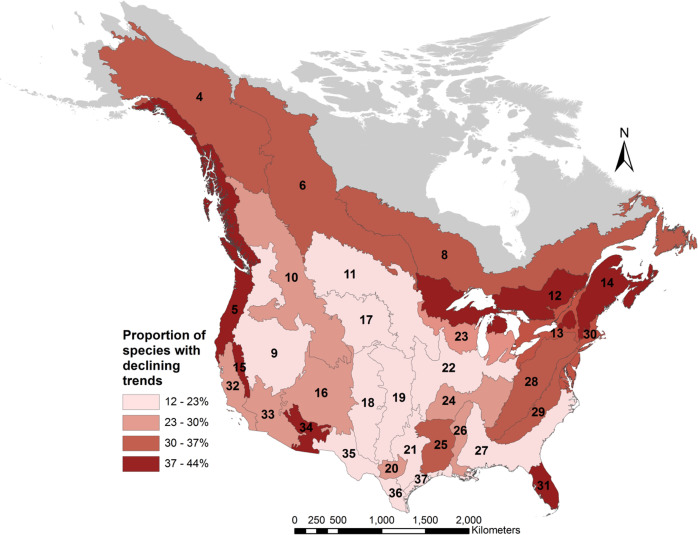
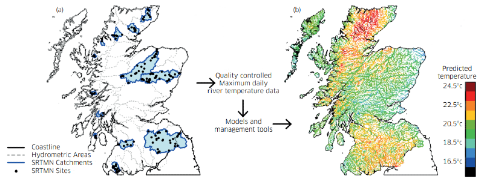
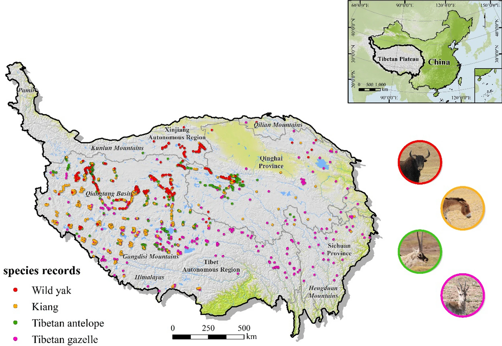
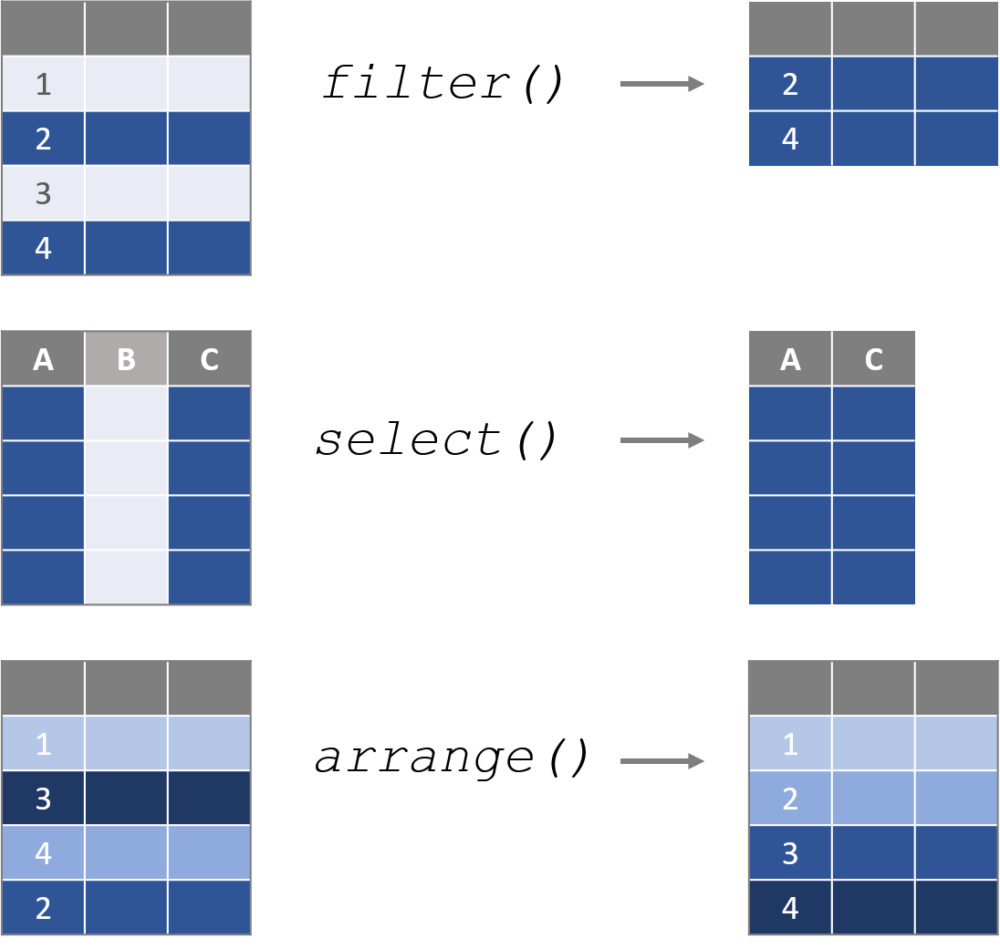
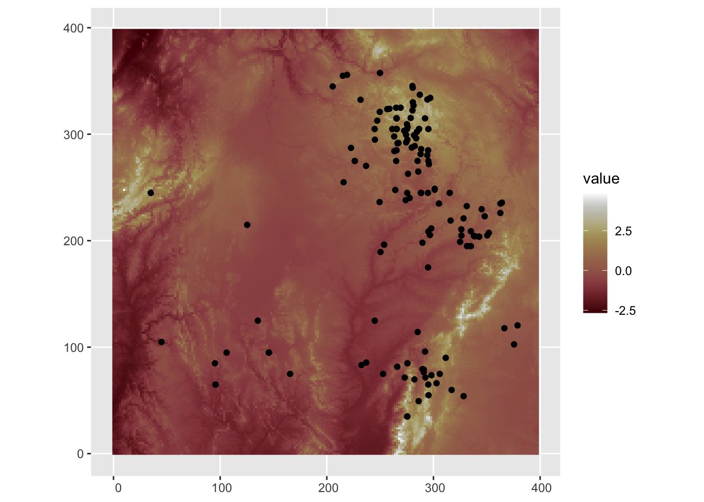
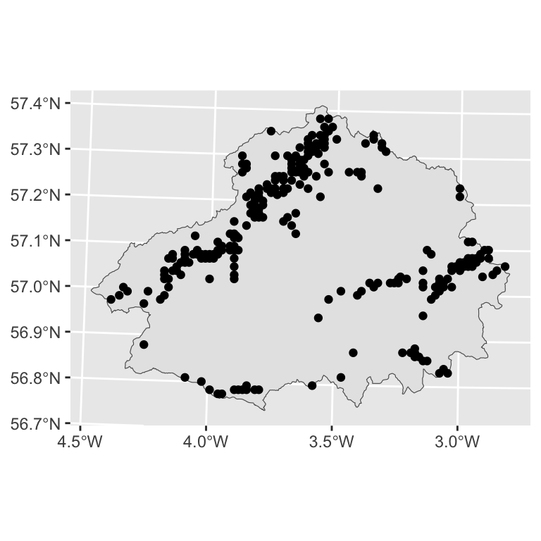

<!-- TODO: -->

<!-- 1. _latent suffix -->

<!-- 2. how inla treats missing values -->

```{r setup}
# #| include: false

knitr::opts_chunk$set(echo = FALSE,
                      message=FALSE,
                      warning=FALSE,
                      strip.white=TRUE,
                      prompt=FALSE,
                      fig.align="center",
                       out.width = "60%")

library(knitr)    # For knitting document and include_graphics function
library(ggplot2)  # For plotting
library(png)
library(tidyverse)
library(INLA)
library(BAS)
library(patchwork)
library(inlabru)

```

<!-- ##  {background-image="figures/river.png"} -->

<!-- ::: {style="height: 50px;"} -->

<!-- ::: -->

<!-- ::: {.blockquote style="color: #FFFFFF; background-color:rgb(38, 38, 38,0.9); font-size: 1.25em; padding: 20px; border-radius: 5px;"} -->

<!-- > Space is inherent to all ecological processes, influencing dynamics such as migration, dispersal, and species interactions. A primary goal in ecology is to understand how these processes shape species distributions and dynamics across space. -->

<!-- ::: -->

# Spatial data

## Spatial modelling: why necessary?

-   Many natural processes take place in space

-   Spatial data are data which have any form of geographical information attached to them.

-   The emergence of modelling frameworks for spatial data in areas such as epidemiology, ecology and environmental sciences has been facilitated by the rise of new technologies.

{fig-align="center"}

## Spatial modelling: why necessary?

Large amounts of data collected in space:

::: fragment
increased resolution $\rightarrow$ large, complex datasets
:::

::: fragment
$\rightarrow$ complex spatial models required

**challenges**:
:::

::: incremental
-   often inaccessible to practitioners (literature aimed at statisticians)
-   methodology not always linked to applications
-   models may be too simple to reflect real-life data
-   difficult to apply without expertise in spatial stats and computational statistics
:::

::: fragment
We will see that `inlabru` can help...
:::

## Spatial modelling: why necessary?

::::: {style="font-size: 0.85em;"}
Tobler’s first law of geography states that:

> *Everything is related to everything else, but near things are more related than distant things"*

Standard models assume independent observations

-   Spatial data are often not independent

-   Two nearby observations are similar $\rightarrow$ not providing independent info

::: fragment
$\rightarrow$ spuriously tight confidence intervals

$\rightarrow$ wrong inference and wrong conclusions
:::

::: fragment
Spatial models include special components to explicitly model dependence.
:::
:::::

## Spatial dependence

::: {style="font-size: 0.85em;"}
-   Inference and prediction are essential in statistics, but spatial dependency can complicate statistical analysis.

-   Understanding how spatial dependence structures impact our analyses is crucial to address many practical problems.

-   Spatial dependence may be caused by:

    ::: incremental
    1.  **Endogenous processes** inherent to the system\
        (e.g., localized dispersal leading to organism clustering or social and grouping behaviors)
    2.  **Exogenous factors** such as spatially dependent environmental gradients driving the process of interest
    3.  **Modelling mis-specifications**, including the omission of key covariates or incorrect functional assumptions
    :::
:::

## Spatial dependence

Dependence relationships need to represented in the model –- which observation is related to which other observations?

::: incremental
-   usually represented by a matrix
-   some matrix operations (e.g. inversion) are computationally expensive
-   in the past: often MCMC ⇝ very slow
-   INLA (and hence `inlabru`) much faster..
:::

## Spatial modelling

The overall goal of any piece of spatial analysis is to understand the spatial patterns in our data. This could involve:

::: incremental
-   Estimating differences in mean, variance, or some other summary statistic across space.

-   Predicting the value at some unobserved location.

-   Identifying hotspots with high (or low) values compared to the rest of the region.
:::

::: fragment
aims also vary with different types of spatial data...
:::

# Spatial data structures

## Types of spatial data

**Discrete space:**

-   Data on a spatial grid (areal data)

**Continuous space:**

-   Geostatistical (geo-referenced) data

-   Spatial point pattern data

The components of the models we will cover are used to reflect spatial dependence structures in discrete and continuous space.

## Spatial data structures {.smaller auto-animate="true" background-color="#FFFFFF"}

We can distinguish three types of spatial data structures

:::::: columns
::: {.column width="33.33%"}
**Areal data**

{fig-align="center" width="442"}
:::

::: {.column width="33.33%"}
**Geostatistical data**

{fig-align="center" width="605"}
:::

::: {.column width="33.33%"}
**Point pattern data**

{fig-align="center" width="421"}
:::
::::::

## Spatial data structures {.smaller auto-animate="true" background-color="#FFFFFF"}

We can distinguish three types of spatial data structures

:::::: columns
::: {.column width="60%"}
**Areal data**

In areal data our measurements are summarised across a set of **discrete**, non-overlapping spatial units.

{fig-align="center" width="442"}
:::

::: {.column width="20%"}
**Geostatistical data**

{fig-align="center" width="605"}
:::

::: {.column width="20%"}
**Point pattern data**

{fig-align="center" width="421"}
:::
::::::

## Spatial data structures {.smaller auto-animate="true" background-color="#FFFFFF"}

We can distinguish three types of spatial data structures

:::::: columns
::: {.column width="20%"}
**Areal data**

{fig-align="center" width="442"}
:::

::: {.column width="60%"}
**Geostatistical data**

In geostatistical data, measurements of a **continuous** process are taken at a set of fixed locations.

{fig-align="center" width="605"}
:::

::: {.column width="20%"}
**Point pattern data**

{fig-align="center" width="421"}
:::
::::::

## Spatial data structures {.smaller auto-animate="true" background-color="#FFFFFF"}

We can distinguish three types of spatial data structures

:::::: columns
::: {.column width="20%"}
**Areal data**

{fig-align="center" width="442"}
:::

::: {.column width="20%"}
**Geostatistical data**

{fig-align="center" width="605"}
:::

::: {.column width="60%"}
**Point pattern data**

In point pattern data we record the locations where events occur (e.g. trees in a forest, earthquakes) and the coordinates of such occurrences are our data.

{fig-align="center" width="421"}
:::
::::::

<!-- ## Spatial Scales -->

<!-- **Scales** describe the spatial and temporal dimensions at which the  process of interest occurs. The spatial scale is often described by: -->

<!-- ::: incremental -->

<!-- -   *grain* or spatial resolution: finest spatial unit of measurement for a given process -->

<!-- -   *extent*: total length or area of the study -->

<!-- ::: -->

<!-- ::: {.fragment .fade-in} -->

<!-- There is typically a trade-off between the grain and the extent, mainly due to practicality. -->

<!-- The scale at which an ecological or environmental process occur can have a major impact on the interpretation of our analysis. -->

<!-- ::: -->

<!-- ## Modifiable Areal Unit Problem -MAUP {.smaller auto-animate="true"} -->

<!-- -   The spatial scale of analysis is crucial in ecological and environmental studies, as it can significantly influence the patterns we observe and the conclusions we draw. -->

<!-- -   Changing the grain of the study (while holding the extent constant) can introduce bias and uncertainty in the observed ecological patterns. E.g, when aggregating individual level data -->

<!-- -   modifiable areal unit relates to the assumption that a relationships exists one level of aggregation does not necessarily hold at another level of aggregation -->

<!-- {fig-align="center"} -->

<!-- ## Modifiable Areal Unit Problem -MAUP {.smaller auto-animate="true"} -->

<!-- -   The spatial scale of analysis is crucial in ecological and environmental studies, as it can significantly influence the patterns we observe and the conclusions we draw. -->

<!-- -   Changing the grain of the study (while holding the extent constant) can introduce bias and uncertainty in the observed ecological patterns. E.g, when aggregating individual level data -->

<!-- -   modifiable areal unit relates to the assumption that a relationships exists one level of aggregation does not necessarily hold at another level of aggregation -->

<!-- {fig-align="center"} -->

<!-- ## Modifiable Areal Unit Problem -MAUP {.smaller auto-animate="true"} -->

<!-- -   The spatial scale of analysis is crucial in ecological and environmental studies, as it can significantly influence the patterns we observe and the conclusions we draw. -->

<!-- -   Changing the grain of the study (while holding the extent constant) can introduce bias and uncertainty in the observed ecological patterns. E.g, when aggregating individual level data -->

<!-- -   modifiable areal unit relates to the assumption that a relationships exists one level of aggregation does not necessarily hold at another level of aggregation -->

<!-- {fig-align="center"} -->

<!-- ## Ecological fallacy {.smaller} -->

<!-- -   The assumption that a relationships exists one level of aggregation does not necessarily hold at another level of aggregation. -->

<!-- -   In ecology this is known as *ecological fallacy*, which arises when incorrect inferences about individual sample units are made based on aggregated -->

<!-- -   When individual-level data is grouped, the variability within units is lost, which can mask finer-scale patterns or exaggerate certain trends -->

<!-- {fig-align="center"} -->

## Spatial Data and `inlabru` {.smaller}

`inlabru` provides support for `sf` (Pebesma, 2018) and `terra` (Hijmans, 2024) spatial data structures.

-   `sf` and `terra` objects can be passed as data and covariates directly to `bru_obs()` and `bru()` functions.

:::: fragment
In this course we will

::: incremental
-   Understand how `eval_spatial()` methods are used to extract information from spatial data objects.

-   Define model components based on spatial information provided in the geometry column of the `sf` data objects.

-   Learn about the `bru_mapper()` mapper system for specifying SPDE random effect.

-   Use Spatial objects for prediction using `predict()` and `generate()`.

-   Fit log-Gaussian Cox process using (i) `sf` points object to describe the locations of the observed points and (ii) `sf` polygon object to define the observation window
:::
::::

::: fragment
First, we will cover some of the basics of working `sf` and `terra` objects.
:::

# A very short overview of `sf` and `terra`

## Why these two packages?

Modern, efficient framework for working with spatial data.

Our spatial analysis begins with **how the data is stored**:

::: incremental
-   **`sf`** (Simple Features ) package → *vector* data. Discrete features with exact coordinates: **points** (a survey location), **lines** (a transect), **polygons** (a health board, a national park).

-   It can also be used to read vector data stored as a shapefiles.

-   **`terra`** → *raster* data. A continuous surface(s) split into a regular grid, each holding a value: elevation, sea depth, temperature.
:::

## `sf`: vector data as a data frame

The key idea: an `sf` object **is** a data frame — with one extra `geometry` column.

Three functions do most of the work:

-   `st_read()` — read a shapefile (`.shp`) from disk
-   `st_as_sf()` — turn a data frame of coordinates into spatial points
-   `st_transform()` — reproject to a different coordinate system

``` r
my_sf <- st_as_sf(my_df, coords = c("lon", "lat"), crs = 4326)
```

Plot it by adding `geom_sf()` layer to a `ggplot()` object.

## `sf`: vector data as a data frame

Most `Tidyverse`/`dplyr` verbs (e.g., `filter`, `mutate`,`summarise`, `%>%`) work with `sf` object, providing a seamless bridge between data manipulation and statistical analysis.

{fig-align="center" width="582"}

## Coordinate Reference System

::::: {style="font-size: 0.85em;"}
A **Coordinate Reference System** tells R *what your coordinates mean* — degrees of latitude/longitude, or metres on a projected grid. E.g.,

-   **EPSG:4326** — raw longitude/latitude (WGS84), in degrees
-   **UTM zones** (e.g. EPSG:32609, 27700) — projected, in **metres**, better for measuring distance and area

1.  Layers you overlay **must share the same CRS** — reproject using `st_transform()`
2.  Switching units from metres to kilometres makes areas and distances easier to read and interpret.

:::: fragment
::: callout-important
When your spatial data carry a CRS, `inlabru` uses it directly — so make sure every layer in your model shares a **consistent and appropriate CRS** before you fit. Mismatched coordinate systems are one of the most common sources of error.
:::
::::
:::::

## `terra`: raster data

:::::: {style="font-size: 0.8em;"}
Rasters are a convenient way to represents spatially continuous phenomena by dividing a region into a grid of equally-sized cells, each storing a value for the variable of interest

The `terra` package is a modern and powerful tool for efficiently working with raster data.

::: fragment
Some useful function are:

-   `rast()` — read a raster file (`.tif` or `.tiff`) **or** build one from an x-y-z data frame
-   `crs()` — assign or match a coordinate system
-   `crop()` — clip a raster to a region of interest
-   `ext()` - get the spatial extension
-   `extend()`- Enlarge the spatial extent of a raster
:::

::: fragment
``` r
raster_data <- rast(qcs_grid, type = "xyz")
crs(raster_data) <- crs(sf_object)   # match the vector layer
```
:::

::: fragment
To plot a raster in `ggplot`, the `tidyterra` package adds `geom_spatraster()` — so raster and `sf` layers stack on the same figure.
:::
::::::

## Discrete space: areal data {.smaller}

Many public health studies use data aggregated over groups rather than data on individuals - often this is for privacy reasons, but it may also be for convenience.

::::::: columns
::::: {.column width="40%"}
**Respiratory hospitalisations in Glasgow**

::: incremental
-   areal data on respiratory hospitalisations
-   271 Intermediate Zones (IZ) in Greater Glasgow and Clyde health board
-   covariates concern air pollution concentration (PM$_{10}$) and socio-economic deprivation in Scotland
:::

::: fragment
**Observed response(s)**: Measurement associated with or areal unit

**here**: spatial structure represented by Gaussian Markov random field (GMRF)
:::
:::::

::: {.column width="60%"}
```{r}
#| echo: false
#| message: false
#| warning: false
#| out-width: 100%
#| fig-align: center
#| label: fig-GGC
#| fig-cap: "Greater Glasgow and Clyde health board represented by 271 Intermediate Zones"

library(mapview)

library(CARBayesdata)

data(pollutionhealthdata)
data(GGHB.IZ)
mapviewOptions(basemaps = c("OpenStreetMap.DE","Esri.WorldImagery","OpenTopoMap"))

mapview(GGHB.IZ)

```
:::
:::::::

## the data we will use

::: {style="font-size: 0.7em;"}
In this example we model the numbers of hospitalisations due to respiratory disease in the Greater Glasgow and Clyde health board
:::

::::::: columns
::::: {.column width="40%"}
:::: {style="font-size: 0.7em;"}
In epidemiology, disease risk is assessed using Standardized Mortality Ratios (SMR):

$$ SMR_i = \dfrac{Y_i}{E_i} $$

-   A value $SMR > 1$ indicates a high risk area.
-   A value $SMR<1$ suggests a low risk area.

::: incremental
-   SMRs may be misleading in counties with small populations.
-   model-based approaches enable to incorporate covariates and borrow information from neighbouring counties to improve local estimates
:::
::::
:::::

::: {.column width="60%"}
```{r}
#| echo: false
#| message: false
#| warning: false
#| eval: true
#| fig-height: 10
#| fig-width: 8
#| fig-align: center

library(dplyr)
library(INLA)
library(ggplot2)
library(patchwork)
library(inlabru)   
library(mapview)
library(sf)
library(gt)
library(scico)
library(SpatialEpi)
library(viridis)
library(viridisLite)


resp_cases <- merge(GGHB.IZ, pollutionhealthdata, by = "IZ")
library(dplyr)
resp_cases <- resp_cases %>% 
  mutate(SMR = observed/expected, .by = year )

ggplot()+
  geom_sf(data=resp_cases%>%filter(year %in% c(2007,2011)),aes(fill=SMR))+
  facet_wrap(~year,ncol=1)+scale_fill_scico(palette = "roma")

```
:::
:::::::

## Continuous space: geostatistical data 

-   We are interested in a phenomenon that is continuous in space
-   The process of interest is measured at a finite set of locations
-   For example, air pollution influencing hospitalisation cases varies continuously in space and does not recognise areal unit boundaries.
-   Our goal is to estimate the value of our variable across the entire space and/or to model the relationship with covariates.

::: fragmet
**Observed response(s)**: measurements at given locations in continuous space

**here**: spatial structure represented by Gaussian random field; approximated by a continuously indexed Gauss Markov random field
:::

## the data we will use {background-color="#FFFFFF"}

Data on the Pacific Cod (*Gadus macrocephalus*) from a trawl survey in Queen Charlotte Sound.

-   Presence/Absence of Pacific cod in the area swept for a given survey in 2003 as well as depth covariate information.

```{r}
#| echo: false
#| message: false
#| eval: true
#| out-width: 100%

library(sdmTMB)

pcod_df = sdmTMB::pcod %>% filter(year==2003)
qcs_grid = sdmTMB::qcs_grid
pcod_sf =   st_as_sf(pcod_df, coords = c("lon","lat"), crs = 4326)
pcod_sf = st_transform(pcod_sf,
                       crs = "+proj=utm +zone=9 +datum=WGS84 +no_defs +type=crs +units=km" )
library(terra)
depth_r <- rast(qcs_grid, type = "xyz")
crs(depth_r) <- crs(pcod_sf)
library(tidyterra)
ggplot()+ 
  geom_spatraster(data=depth_r$depth)+
      geom_sf(data=pcod_sf,aes(color=factor(present))) +
    scale_color_manual(name="Locations where Pacific Cod \nwere caught",
                     values = c("black","orange"),
                     labels= c("Absence","Presence"))+
  scale_fill_scico(name = "Depth",
                   palette = "nuuk",
                   na.value = "transparent" ) + xlab("") + ylab("")
par(mfrow=c(1,1))
```

## Continuous space: spatial point patterns

-   Locations of objects/events in space (typically 2D)
-   Examples: tree locations, animal groups, earthquakes

**Observed response(s)**: x,y coordinates (sometimes also additional measurements,; "*marks*") modelled by a random variable, a spatial point process characterised by intensity $\lambda(s) \in \mathbb{R}$

**here**: intensity is a Gaussian random field; approximated by a continuously indexed Gauss Markov random field

## the data we will use {background-color="#FFFFFF"}

::::: columns
::: {.column width="40%"}
locations of forest fires in the Castilla-La Mancha region of Spain between 1998 and 2007



:::

::: {.column width="60%"}
citizen science records of the ringlet butterfly in Scotland’s Cairngorms National Park


:::
:::::

## Take Home message

-   all spatial models discussed are special cases of Latent Gaussian models

-   different spatial terms are needed for different spatial data structures

-   the SPDE approach unifies approximation as all data structures are spatially referenced in continuous space

-   `inlabru` fits these models efficiently 

::: fragment
In the next practical you will explore tools for visualization and wrangling spatial data objects.
:::


