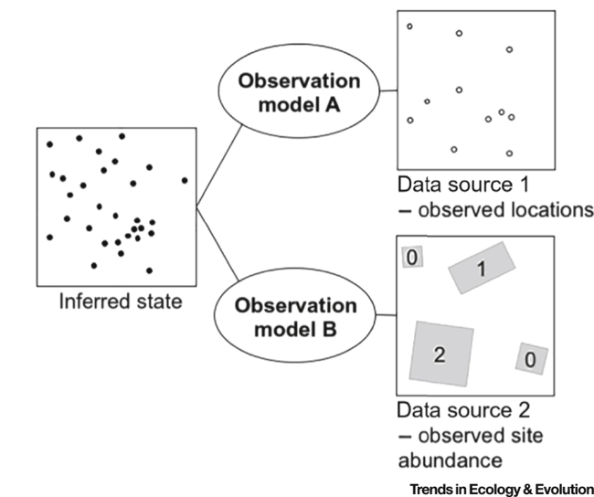
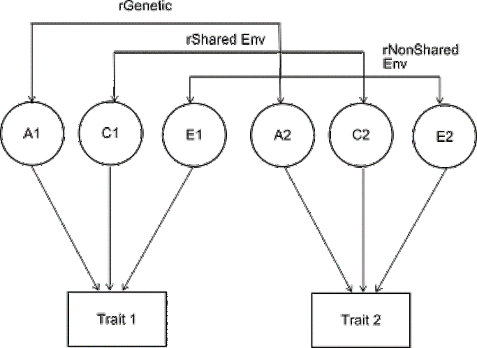

```{r setup}
#| include: false

knitr::opts_chunk$set(echo = TRUE,
                      message=FALSE,
                      warning=FALSE,
                      strip.white=TRUE,
                      prompt=FALSE,
                      fig.align="center",
                       out.width = "60%")

library(knitr)    # For knitting document and include_graphics function
library(ggplot2)  # For plotting
library(png)
library(tidyverse)
library(INLA)
library(BAS)
library(patchwork)
library(inlabru)
library(fmesher)
library(sf)
library(scico)
``` 

## More than one likelihood

there are many scenarios, where data on two or more phenomena have been collected within a shared spatial domain. E.g.,

::: incremental
- two surveys on the same environmental process using the same sampling approach

- two surveys on the same environmental using different sampling approaches

- a survey on several environmental processes

- marked point patterns
:::

::: fragment
$\vdots$
:::

::: fragment
these data sources can be analysed with models with more than one likelihood
:::

## joint models with `inlabru` {.smaller}

Complex models that require the use of several likelihoods can be implemented `inlabru`.


:::::: columns
:::: {.column width="50%"}
::: fragment
**integrated models/data fusion**

{fig-align="center"}
:::
::::

::: {.column width="50%"}

::: fragment
**models with a multivariate response**


{fig-align="center"}
:::

:::: 
::::::

::: fragment
Let's look at some case studies
:::


# Modelling Pacific Cod Biomass Density {background-image="figures/cod.jpg"}

## Example: Modelling Pacific Cod Biomass Density {background-color="#FFFFFF"}

In the next example, we will revisit the data on the Pacific Cod (*Gadus macrocephalus*) from a trawl survey in Queen Charlotte Sound.

-   The dataset the biomass density (kg/km$^2$) of Pacific cod in the area swept for a given survey in 2003 as well as depth covariate information.

```{r}
#| echo: false
#| message: false
#| eval: true
#| out-width: 100%

library(sdmTMB)

pcod_df = sdmTMB::pcod %>% filter(year==2003)
qcs_grid = sdmTMB::qcs_grid
pcod_sf =   st_as_sf(pcod_df, coords = c("lon","lat"), crs = 4326)
pcod_sf = st_transform(pcod_sf,
                       crs = "+proj=utm +zone=9 +datum=WGS84 +no_defs +type=crs +units=km" )
library(terra)
depth_r <- rast(qcs_grid, type = "xyz")
crs(depth_r) <- crs(pcod_sf)
library(tidyterra)
ggplot()+ 
  geom_spatraster(data=depth_r$depth)+
      geom_sf(data=pcod_sf,aes(color=factor(present))) +
    scale_color_manual(name="Locations where Pacific Cod \nwere caught",
                     values = c("black","orange"),
                     labels= c("Absence","Presence"))+
  scale_fill_scico(name = "Depth",
                   palette = "nuuk",
                   na.value = "transparent" ) + xlab("") + ylab("")
par(mfrow=c(1,1))

bru_options_set(control.compute = list(dic = TRUE,
                                       waic = TRUE,
                                       mlik = TRUE,
                                       cpo = TRUE))
```

## Exploratory plots {.smaller background-color="#FFFFFF" auto-animate="true"}

-  log biomass density has a large number of zero's because of locations where fish were not caught.

- quadratic relationship between depth and biomass density 

```{r}
#| echo: false
#| message: false
#| warning: false
#| fig-height: 19
#| fig-width: 16

ggplot(pcod_sf,aes(x=depth_scaled ,y=density))+geom_point() +
ggplot(pcod_sf,aes(x=log(density+0.000001)))+geom_histogram() + plot_layout(ncol=1)

```


## A multilikelihood Hurdle Geostatistical Model {.smaller auto-animate="true"}

-   [**Stage 1** Model for the response(s)]{style="color:#FF6B6B;"} $$
    \begin{aligned}
    y_i|\eta^{(1)}_i&\sim \text{Binomial}(1,\pi_i)\\
    \log(z_i)|\eta^{(2)}_i&\sim \text{Normal}(\mu_i,\tau_e^{-1})\\
    \end{aligned}
    $$

    -   We then define a likelihood for each outcome.

        -   $y_i =\begin{cases} 1 &\text{if fishes have been caught at location } \mathbf{s}_i  \\ 0 &\text{otherwise}\end{cases}$

        -   $z_i =\begin{cases} NA &\text{if no fish were  caught at location } \mathbf{s}_i  \\ \text{biomass density at location } \mathbf{s}_i &\text{otherwise}\end{cases}$

-   **Stage 2** Latent field model $$
    \begin{aligned}
    \eta^{(1)}_i &= \text{logit}(\pi_i) = X'\beta + \xi_i\\
    \eta^{(2)}_i &= \mu_i = X'\alpha + \omega_i
    \end{aligned}
    $$

-   **Stage 3** Hyperparameters

## A multilikelihood Hurdle Geostatistical Model {.smaller auto-animate="true"}

-   **Stage 1** Model for the response(s)\] $$
    \begin{aligned}
    y_i|\eta^{(1)}_i&\sim \text{Binomial}(1,\pi_i)\\
    \log(z_i)|\eta^{(2)}_i&\sim \text{Normal}(\mu_i,\tau_e^{-1})\\
    \end{aligned}
    $$
-   [**Stage 2** Latent field model]{style="color:#FF6B6B;"} $$
    \begin{aligned}
    \eta^{(1)}_i &= \text{logit}(\pi_i) = X'\beta + \xi_i\\
    \eta^{(2)}_i &= \mu_i = X'\alpha + \omega_i
    \end{aligned}
    $$
    -   $\{\alpha,\beta\}$ = Intercepts + covariate effects.
    -   $\{\xi,\omega\}$ = are the Gaussian fields with Matérn covariance (separate for each outcome).
-   **Stage 3** Hyperparameters

## A multilikelihood Hurdle Geostatistical Model {.smaller auto-animate="true"}

-   **Stage 1** Model for the response(s) $$
    \begin{aligned}
    y_i|\eta^{(1)}_i&\sim \text{Binomial}(1,\pi_i)\\
    \log(z_i)|\eta^{(2)}_i&\sim \text{Normal}(\mu_i,\tau_e^{-1})\\
    \end{aligned}
    $$

-   **Stage 2** Latent field model $$
    \begin{aligned}
    \eta^{(1)}_i &= \text{logit}(\pi_i) = X'\beta + \xi_i\\
    \eta^{(2)}_i &= \mu_i = X'\alpha + \omega_i
    \end{aligned}
    $$

-   [**Stage 3** Hyperparameters]{style="color:#FF6B6B;"}

    -   observational error  $\tau_e$
    -   Matérn field(s) parameters $\{\rho^{(1)},\rho^{(2)},\tau_{d}^{(1)},\tau_{d}^{(2)}\}$

## Step 1: The mesh and SPDE representation

```{r}
mesh = fm_mesh_2d(loc = pcod_sf,           # Build the mesh
                  cutoff = 2,
                  max.edge = c(10,20),     # The largest allowed triangle edge length.
                  offset = c(5,50))       # The automatic extension distance

spde_model =  inla.spde2.pcmatern(mesh,
                                   prior.sigma = c(1, 0.5),
                                   prior.range = c(100, 0.5))
```

```{r}
#| echo: false
#| 
ggplot() + gg(mesh) + geom_sf(data= pcod_sf, aes(color = factor(present)), size = 0.1) + xlab("") + ylab("")

```


```{r}
#| echo: false


# define model component
cmp <- ~
  Intercept_biomass(1) +
    depth_biomass(depth_scaled, model = "linear") +
    depth2_biomass(depth_scaled2, model = "linear") +
    space_biomass(geometry, model = spde_model) +
    Intercept_caught(1) +
    depth_caught(depth_scaled, model = "linear") +
    depth2_caught(depth_scaled2, model = "linear") +
    space_caught(geometry, model = spde_model) 

# define linear predictors
biomass_lik <- bru_obs(formula = density ~  Intercept_biomass + depth_biomass + depth2_biomass + space_biomass,
      family = "lognormal",
      data = pcod_sf  %>% filter(density>0))
  
presence_lik <- bru_obs(formula = present ~ Intercept_caught + depth_caught + depth2_caught + space_caught,
      family = "binomial",
      data = pcod_sf)

# fit the model
fit_hurdle <- bru( cmp,  biomass_lik,  presence_lik)
```

## Step 2: Define the model components {.smaller auto-animate=true}

**The Model**

::::: columns

::: {.column width="50%"}


$$
 \begin{aligned}
    y_i|\eta^{(1)}_i&\sim \text{Binomial}(1,\pi_i)\\
    \log(z_i)|\eta^{(2)}_i&\sim \text{Normal}(\mu_i,\tau_e^{-1})
    \end{aligned}
$$
    

:::

::: {.column width="50%"}

$$
\begin{aligned}
    \eta^{(1)}_i &= \text{logit}(\pi_i) = \color{#FF6B6B}{\boxed{\beta_0} } + \color{#FF6B6B}{\boxed{\beta_1}} \text{depth} + \color{#FF6B6B}{\boxed{\beta_2}} \text{depth}^2 + \color{#FF6B6B}{\boxed{\xi_i}}\\
    \eta^{(2)}_i &= \mu_i =\color{#FF6B6B}{\boxed{\alpha_0}} + \color{#FF6B6B}{\boxed{\alpha_1}}\text{depth} + \color{#FF6B6B}{\boxed{\alpha_2}} \text{depth}^2 + \color{#FF6B6B}{\boxed{\omega_i}}
\end{aligned}
$$


:::

::::: 

**The code**

```{r}
#| warning: false
#| message: false
#| eval: false
#| code-line-numbers: "1-10"

# define model component
cmp <- ~
  Intercept_biomass(1) +
    depth_biomass(depth_scaled, model = "linear") +
    depth2_biomass(depth_scaled2, model = "linear") +
    space_biomass(geometry, model = spde_model) +
    Intercept_caught(1) +
    depth_caught(depth_scaled, model = "linear") +
    depth2_caught(depth_scaled2, model = "linear") +
    space_caught(geometry, model = spde_model) 

# define linear predictors
biomass_lik <- bru_obs(formula = density ~  Intercept_biomass + depth_biomass + depth2_biomass + space_biomass,
      family = "lognormal",
      data = pcod_sf  %>% filter(density>0))
  
presence_lik <- bru_obs(formula = present ~ Intercept_caught + depth_caught + depth2_caught + space_caught,
      family = "binomial",
      data = pcod_sf)

# fit the model
fit_hurdle <- bru( cmp,  biomass_lik,  presence_lik)

```


## Step 2: Define the linear predictors {.smaller }

**The Model**

::::: columns

::: {.column width="50%"}


$$
 \begin{aligned}
    y_i|\eta^{(1)}_i&\sim \text{Binomial}(1,\pi_i)\\
    \log(z_i)|\eta^{(2)}_i&\sim \text{Normal}(\mu_i,\tau_e^{-1})
    \end{aligned}
$$
    

:::

::: {.column width="50%"}

$$
\begin{aligned}
    \color{#FF6B6B}{\boxed{\eta^{(1)}_i}} &= \text{logit}(\pi_i) = \color{#FF6B6B}{\boxed{\beta_0 + \beta_1 \text{depth} + \beta_2 \text{depth}^2 + \xi_i}}\\
    \color{#FF6B6B}{\boxed{\eta^{(2)}_i}} &= \mu_i =\color{#FF6B6B}{\boxed{\alpha_0 + \alpha_1\text{depth} + \alpha_2 \text{depth}^2 + \omega_i}}
\end{aligned}
$$


:::

::::: 

**The code**

```{r}
#| echo: true
#| eval: false
#| warning: false
#| message: false
#| code-line-numbers: "12,13,17"

# define model component
cmp <- ~
  Intercept_biomass(1) +
    depth_biomass(depth_scaled, model = "linear") +
    depth2_biomass(depth_scaled2, model = "linear") +
    space_biomass(geometry, model = spde_model) +
    Intercept_caught(1) +
    depth_caught(depth_scaled, model = "linear") +
    depth2_caught(depth_scaled2, model = "linear") +
    space_caught(geometry, model = spde_model) 

# define linear predictors
biomass_lik <- bru_obs(formula = density ~  Intercept_biomass + depth_biomass + depth2_biomass + space_biomass,
      family = "lognormal",
      data = pcod_sf  %>% filter(density>0))
  
presence_lik <- bru_obs(formula = present ~ Intercept_caught + depth_caught + depth2_caught + space_caught,
      family = "binomial",
      data = pcod_sf)

# fit the model
fit_hurdle <- bru( cmp,  biomass_lik,  presence_lik)


```


## Step 2: Define the likelihoods {.smaller auto-animate=true}

**The Model**

::::: columns

::: {.column width="50%"}


$$
\begin{aligned}
    y_i|\eta^{(1)}_i&\sim \color{#FF6B6B}{\boxed{\text{Binomial}(1,\pi_i)}}\\
    \log(z_i)|\eta^{(2)}_i&\sim \color{#FF6B6B}{\boxed{\text{Normal}(\mu_i,\tau_e^{-1})}}
\end{aligned}
$$
    

:::

::: {.column width="50%"}


$$
\begin{aligned}
    \eta^{(1)}_i &= \text{logit}(\pi_i) =\beta_0 + \beta_1 \text{depth} + \beta_2 \text{depth}^2 + \xi_i\\
    \eta^{(2)}_i &= \mu_i =\alpha_0 + \alpha_1\text{depth} + \alpha_2 \text{depth}^2 + \omega_i
\end{aligned}
$$


:::

::::: 

**The code**

```{r}
#| echo: true
#| eval: false
#| warning: false
#| message: false
#| code-line-numbers: "14,18|15,19|21-22"

# define model component
cmp <- ~
  Intercept_biomass(1) +
    depth_biomass(depth_scaled, model = "linear") +
    depth2_biomass(depth_scaled2, model = "linear") +
    space_biomass(geometry, model = spde_model) +
    Intercept_caught(1) +
    depth_caught(depth_scaled, model = "linear") +
    depth2_caught(depth_scaled2, model = "linear") +
    space_caught(geometry, model = spde_model) 

# define linear predictors
biomass_lik <- bru_obs(formula = density ~  Intercept_biomass + depth_biomass + depth2_biomass + space_biomass,
      family = "lognormal",
      data = pcod_sf  %>% filter(density>0))
  
presence_lik <- bru_obs(formula = present ~ Intercept_caught + depth_caught + depth2_caught + space_caught,
      family = "binomial",
      data = pcod_sf)

# fit the model
fit_hurdle <- bru( cmp,  biomass_lik,  presence_lik)


```


## Extract the Results  {.smaller}

We can combine the output from `tidy` with libraries such as `gt` or `kable` to produce nice html tables:

:::::: columns
::: {.column width="50%"}

```{r}
#| code-fold: true
#| message: false
#| warning: false
library(gt)
bind_rows(
  tidy(fit_hurdle),
  tidy(fit_hurdle,"hyperpar")) %>%
  gt() %>% 
  fmt_number(decimals=2)
```

:::

::: {.column width="50%"}
::: {style="height: 50px;"}

::: incremental

-   $\alpha_0$ is the baseline catching probability on the logit scale
-   $\beta_0$ is the predicted log(biomass density at the average depth (since these have been scaled)
-   Coefficients $\alpha_1,\alpha_2$ refer to the change in the log-odds of catching fish as we increase 1 depth unit and unit$^2$ respectively.
-   Coefficients $\beta_1, \beta_2$ indicate that the log-biomass decreases with depth.
-   $\rho^{[1]},\rho^{[2]}$, suggest spatial correlation decays at `r round(fit_hurdle$summary.hyperpar[2,1],2)` and `r round(fit_hurdle$summary.hyperpar[4,1],2)` Km respectively (the extension of the study is approx 46,000 km$^2$)
-   unstructured variability is given by $\tau^{-1}_e$ while ,$\{\tau_{\delta,1}^{-1},\tau^{-1}_{d,2}\}$ represent the spatially structured variability.
:::

:::

:::

::::::


## Shared Parameters {.smaller}

Note that in the hurdle model we just fitted there is no direct link between the parameters of the two likelihoods parts.

::: incremental
-   the two likelihoods could share some of the components; for example the Matérn field could be used for both predictors.

-   What does the previous results suggest in terms of the estimated covariance parameters for the two fields? is it sensible to share the same component between the two parts?

-   We will fit a model that estimates this field jointly and compare it with our previous models
:::

::: fragment
The new model being fitted is now:

$$
\begin{aligned}
y_i|\eta^{(1)}_i&\sim \text{Binomial}(1,\pi_i)\\
\eta^{(1)}_i &= \text{logit}(\pi_i) = X'\beta + \color{green}{\lambda}\,\color{red}{\xi_i}\\
\log(z_i)|\eta^{(2)}_i&\sim \text{Normal}(\mu_i,\tau_e^{-1})\\
\eta^{(2)}_i &= \mu_i = X'\alpha +   \color{red}{\xi_i}
\end{aligned}
$$
:::

:::{.fragment}

$\lambda$ is a scaling parameter that lets the shared latent effect enter each likelihood with a different magnitude

:::


## Using the `copy` feature {.smaller}

**The Model**

::::: columns

::: {.column width="50%"}


$$
 \begin{aligned}
    y_i|\eta^{(1)}_i&\sim \text{Binomial}(1,\pi_i)\\
    \log(z_i)|\eta^{(2)}_i&\sim \text{Normal}(\mu_i,\tau_e^{-1})
    \end{aligned}
$$
    

:::

::: {.column width="50%"}

$$
\begin{aligned}
    \eta^{(1)}_i &= \text{logit}(\pi_i) = \beta_0 + \beta_1\text{depth} + \beta_2 \text{depth}^2 + \color{green}{\lambda}\, \color{#FF6B6B}{\xi_i}\\
    \eta^{(2)}_i &= \mu_i =\alpha_0 + \alpha_1\text{depth} + \alpha_2 \text{depth}^2 + \color{#FF6B6B}{\xi_i}
\end{aligned}
$$


:::

::::: 

**The code**

```{r}
#| echo: true
#| eval: true
#| warning: false
#| message: false
#| code-line-numbers: "1-10|9,10"

# define model component
cmp_joint <- ~
  Intercept_biomass(1) +
    depth_biomass(depth_scaled, model = "linear") +
    depth2_biomass(depth_scaled2, model = "linear") +
    Intercept_caught(1) +
    depth_caught(depth_scaled, model = "linear") +
    depth2_caught(depth_scaled2, model = "linear") +
    space(geometry, model = spde_model) +
    space_copy(geometry, copy = "space", fixed = FALSE)

# define linear predictors
biomass_lik <- bru_obs(formula = density ~  Intercept_biomass + depth_biomass + depth2_biomass + space,
      family = "lognormal",
      data = pcod_sf  %>% filter(density>0))

presence_lik <- bru_obs(formula = present ~ Intercept_caught + depth_caught + depth2_caught + space_copy,
  family = "binomial",
  data = pcod_sf,
)

# fit the model
fit_hurdle <- bru( cmp_joint,  biomass_lik,  presence_lik)

```


::: {.fragment .fade-in style="position: absolute; top: 0; left: 0; width: 100%; height: 80%; background: rgb(179, 128, 11,0.9); color: white; display: flex; align-items: center; justify-content: center; z-index: 10;"}

- The `copy = "space"` argument points to the shared field

- Both linear predictors draw on one common spatial structure:

    - the *biomass predictor* uses `space` directly
    - the *caught predictor* uses a scaled version of it through the copy feature.

- The copied field enters the second predictor as $\lambda \times$ `space`, rather than as an exact duplicate.

- Setting `fixed = FALSE` treats $\lambda$ as an unknown to be inferred from the data

:::


## Using the `copy` feature {.smaller}

**The Model**

::::: columns

::: {.column width="50%"}


$$
 \begin{aligned}
    y_i|\eta^{(1)}_i&\sim \text{Binomial}(1,\pi_i)\\
    \log(z_i)|\eta^{(2)}_i&\sim \text{Normal}(\mu_i,\tau_e^{-1})
    \end{aligned}
$$
    

:::

::: {.column width="50%"}

$$
\begin{aligned}
    \eta^{(1)}_i &= \text{logit}(\pi_i) = \beta_0 + \beta_1\text{depth} + \beta_2 \text{depth}^2 + \color{green}{\lambda}\, \color{#FF6B6B}{\xi_i}\\
    \eta^{(2)}_i &= \mu_i =\alpha_0 + \alpha_1\text{depth} + \alpha_2 \text{depth}^2 + \color{#FF6B6B}{\xi_i}
\end{aligned}
$$


:::

::::: 

**The code**

```{r}
#| echo: true
#| eval: true
#| warning: false
#| message: false
#| code-line-numbers: "13,17|23-24"

# define model component
cmp_joint <- ~
  Intercept_biomass(1) +
    depth_biomass(depth_scaled, model = "linear") +
    depth2_biomass(depth_scaled2, model = "linear") +
    Intercept_caught(1) +
    depth_caught(depth_scaled, model = "linear") +
    depth2_caught(depth_scaled2, model = "linear") +
    space(geometry, model = spde_model) +
    space_copy(geometry, copy = "space", fixed = FALSE)

# define linear predictors
biomass_lik <- bru_obs(formula = density ~  Intercept_biomass + depth_biomass + depth2_biomass + space,
      family = "lognormal",
      data = pcod_sf  %>% filter(density>0))

presence_lik <- bru_obs(formula = present ~ Intercept_caught + depth_caught + depth2_caught + space_copy,
  family = "binomial",
  data = pcod_sf,
)

# fit the model
fit_hurdle_shared <- bru( cmp_joint,  biomass_lik,  presence_lik)

```


## Model comparison 

Here we use the `glance` function to compare our models:

```{r}
#| echo: true

bind_rows(
  glance(fit_hurdle_shared) %>% mutate(model = "Shared Field"),
  glance(fit_hurdle) %>%mutate(model = "Separate Fields")
) %>%
  select(model, dic, waic, marginal_loglik, nobs) %>%
   gt() %>% 
  fmt_number(decimals=2)
```

:::{.fragment}

 In the practical we will cover how to predict log biomass density quantities and catching probabilities across the region of interest

:::

# Modelling the great Lakes {background-image="figures/lakes.jpg"}


## Models with a multivariate response

Here we will revisit the great Lakes dataset  which contains the water level heights for the lakes Erie, Michigan/Huron and St Clair from 1918 to 2009.

```{r}
#| echo: false
#| warning: true
#| message: false 


library(DAAG)
library(scico)
data("greatLakes")

greatLakes.df = data.frame(as.matrix(greatLakes),
                           year = time(greatLakes)) %>%
  pivot_longer(cols = c("Erie","michHuron","Ontario","StClair"),
               names_to = "Lakes",
               values_to = "height" ) %>% filter(Lakes != "Ontario") %>%
  mutate(year_id = year-1917 )

ggplot(greatLakes.df,aes(year,height,colour=Lakes)) + geom_point() + geom_line() + facet_wrap(~Lakes,scales="free") 

```


## Models with a multivariate response {.smaller auto-animate="true"}

-   **Stage 1** Model for the response(s)$$
    \begin{aligned}
 y_{i1}\mid \mu_1,\tau_1 &\sim N(\mu_{1i},\tau_1) \text { for } i \text{ in } 1,\ldots,n_1\\
 y_{i2}\mid \mu_2,\tau_2 &\sim N(\mu_{2i},\tau_2) \text { for } i \text{ in } 1,\ldots,n_2\\
  y_{i3}\mid \mu_3,\tau_3 &\sim N(\mu_{3i},\tau_3) \text { for } i \text{ in } 1,\ldots,n_3
    \end{aligned}
    $$

-   **Stage 2** Latent field model $$
    \begin{aligned}
    \mu_{1i} &=  \beta_{01} + f_1(x) + g(x) \\
    \mu_{2i} &=  \beta_{02} + f_2(x) + \lambda\times g(x) \\
    \mu_{3i} &=  \beta_{03} + f_3(x) + \delta\times g(x) 
    \end{aligned}
    $$
    

:::{.fragment}

Here $y_{i1} \perp y_{i2} \mid g(x)$, basically cross-dependence between the three series flows thru $g(x)$ via a Matérn GP estimated jointly with $\{\lambda,\delta\}$ acting as scaling weights (e.g., as $\lambda \to 0 \, y_{i1}$  and $y_{i2}$ become marginally independent)

:::


:::{.fragment}
-   **Stage 3** Hyperparameters

    - $\{\tau_j,\rho^{(j)}_{\text{GP}},\tau^{(j)}_{\text{GP}},\lambda,\delta \} \, j \, \in\{ 1,2,3\}$


:::


## Step 1: The mesh and SPDE representation on 1D

Data from 1918 to 2009, i.e. $T = 92$ years.

```{r}


greatLakes.df= greatLakes.df %>%
  mutate(year_id = year-1917 )

library(fmesher)
mesh1D <- fm_mesh_1d(seq(1,92,5), degree = 2, boundary = "cyclic")
# Use PC-priors for the Matérn 
spde1D <- inla.spde2.pcmatern(mesh1D,
                                prior.range = c(30, 0.95), # P(range < 30) = 0.95
                                prior.sigma = c(1, 0.5)    # P(sigma > 1) = 0.5
)

```


```{r}
#| echo: false

ggplot() +
  geom_fm(data = mesh1D)
```


## Step 2: Define the model components {.smaller auto-animate=true}

::: {style="font-size: 0.85em;"}

**The Model**

::::: columns

::: {.column width="50%"}


$$
\begin{aligned}
 y_{i1}\mid \mu_1,\tau_1 &\sim N(\mu_{1i},\tau_1) \text { for } i \text{ in } 1,\ldots,n_1\\
 y_{i2}\mid \mu_2,\tau_2 &\sim N(\mu_{2i},\tau_2) \text { for } i \text{ in } 1,\ldots,n_2\\
  y_{i3}\mid \mu_3,\tau_3 &\sim N(\mu_{3i},\tau_3) \text { for } i \text{ in } 1,\ldots,n_3\\
\end{aligned}
$$
    

:::

::: {.column width="50%"}

$$
\begin{aligned}
\mu_{1i} &=  \color{#FF6B6B}{\boxed{\beta_{01}}} + \color{#FF6B6B}{\boxed{f_1(x)}} + \color{#FF6B6B}{\boxed{g(x)}} \\
\mu_{2i} &=  \color{#FF6B6B}{\boxed{\beta_{02}}} + \color{#FF6B6B}{\boxed{f_2(x)}} + \color{#FF6B6B}{\boxed{\lambda\times g(x)}} \\
\mu_{3i} &=  \color{#FF6B6B}{\boxed{\beta_{03}}} + \color{#FF6B6B}{\boxed{f_3(x)}} + \color{#FF6B6B}{\boxed{\delta\times g(x)}}
\end{aligned}
$$


:::

::::: 

**The code**

```{r}
#| echo: true
#| eval: true
#| warning: false
#| message: false
#| code-line-numbers: "1-10"

# define model component
cmp = ~ -1 + beta0_erie(1) + beta0_mich(1) +  beta0_clair(1) +
  GP_erie(year_id, model = spde1D) +
  GP_mich(year_id, model = spde1D) +
  GP_clair(year_id, model = spde1D) +
  GP_shared(year_id, model = spde1D) +
  GP_shared_copy1(year_id, copy = "GP_shared", fixed = FALSE,
                 hyper = list(beta = list(prior = "normal", param = c(0, 0.1)))) + # prior on lambda
  GP_shared_copy2(year_id, copy = "GP_shared", fixed = FALSE,
                 hyper = list(beta = list(prior = "normal", param = c(0, 0.1)))) # prior on delta

# define linear predictors
erie_lik <- bru_obs(formula = height  ~  beta0_erie + GP_erie + GP_shared,
      family = "lognormal",
      data = greatLakes.df  %>% filter(Lakes == "Erie"))
  
mich_lik <- bru_obs(formula = height  ~  beta0_mich + GP_mich + GP_shared_copy1,
      family = "lognormal",
      data = greatLakes.df  %>% filter(Lakes == "michHuron"))

clair_lik <- bru_obs(formula = height  ~  beta0_clair + GP_clair + GP_shared_copy2,
      family = "lognormal",
      data = greatLakes.df  %>% filter(Lakes == "StClair"))

# fit the model
fit_greatLakes <- bru( cmp,  erie_lik,  mich_lik,clair_lik)


```

:::


## Step 3: Define the linear predictors {.smaller auto-animate=true}


::: {style="font-size: 0.85em;"}

**The Model**

::::: columns

::: {.column width="50%"}


$$
\begin{aligned}
 y_{i1}\mid \mu_1,\tau_1 &\sim N(\mu_{1i},\tau_1) \text { for } i \text{ in } 1,\ldots,n_1\\
 y_{i2}\mid \mu_2,\tau_2 &\sim N(\mu_{2i},\tau_2) \text { for } i \text{ in } 1,\ldots,n_2\\
  y_{i3}\mid \mu_3,\tau_3 &\sim N(\mu_{3i},\tau_3) \text { for } i \text{ in } 1,\ldots,n_3\\
\end{aligned}
$$
    

:::

::: {.column width="50%"}

$$
\begin{aligned}
\mu_{1i} &=  \color{#FF6B6B}{\boxed{\beta_{01} + f_1(x) +g(x)}} \\
\mu_{2i} &=  \color{#FF6B6B}{\boxed{\beta_{02} + f_2(x) + \lambda\times g(x)}} \\
\mu_{3i} &=  \color{#FF6B6B}{\boxed{\beta_{03} + f_3(x) + delta\times g(x)}}
\end{aligned}
$$


:::

::::: 


**The code**

```{r}
#| echo: true
#| eval: false
#| warning: false
#| message: false
#| code-line-numbers: "12,13,17,21"

# define model component
cmp = ~ -1 + beta0_erie(1) + beta0_mich(1) +  beta0_clair(1) +
  GP_erie(year_id, model = spde1D) +
  GP_mich(year_id, model = spde1D) +
  GP_clair(year_id, model = spde1D) +
  GP_shared(year_id, model = spde1D) +
  GP_shared_copy1(year_id, copy = "GP_shared", fixed = FALSE,
                 hyper = list(beta = list(prior = "normal", param = c(0, 0.1)))) + # prior on lambda
  GP_shared_copy2(year_id, copy = "GP_shared", fixed = FALSE,
                 hyper = list(beta = list(prior = "normal", param = c(0, 0.1)))) # prior on delta

# define linear predictors
erie_lik <- bru_obs(formula = height  ~  beta0_erie + GP_erie + GP_shared,
      family = "lognormal",
      data = greatLakes.df  %>% filter(Lakes == "Erie"))
  
mich_lik <- bru_obs(formula = height  ~  beta0_mich + GP_mich + GP_shared_copy1,
      family = "lognormal",
      data = greatLakes.df  %>% filter(Lakes == "michHuron"))

clair_lik <- bru_obs(formula = height  ~  beta0_clair + GP_clair + GP_shared_copy2,
      family = "lognormal",
      data = greatLakes.df  %>% filter(Lakes == "StClair"))

# fit the model
fit_greatLakes <- bru( cmp,  erie_lik,  mich_lik,clair_lik)


```

:::

## Step 3: Define the likelihoods {.smaller auto-animate=true}

::: {style="font-size: 0.85em;"}


**The Model**

::::: columns

::: {.column width="50%"}


$$
\begin{aligned}
 y_{i1}\mid \mu_1,\tau_1 &\sim \color{#FF6B6B}{\boxed{N(\mu_{1i},\tau_1)}} \text { for } i \text{ in } 1,\ldots,n_1\\
 y_{i2}\mid \mu_2,\tau_2 &\sim \color{#FF6B6B}{\boxed{N(\mu_{2i},\tau_2)}} \text { for } i \text{ in } 1,\ldots,n_2\\
  y_{i3}\mid \mu_3,\tau_3 &\sim \color{#FF6B6B}{\boxed{N(\mu_{3i},\tau_3)}} \text { for } i \text{ in } 1,\ldots,n_3\\
\end{aligned}
$$
    

:::

::: {.column width="50%"}

$$
\begin{aligned}
\mu_{1i} &=  \beta_{01} + f_1(x) +g(x) \\
\mu_{2i} &=  \beta_{02} + f_2(x) + \lambda\times g(x) \\
\mu_{3i} &=  \beta_{03} + f_3(x) + delta\times g(x)
\end{aligned}
$$


:::

::::: 


**The code**

```{r}
#| echo: true
#| eval: false
#| warning: false
#| message: false
#| code-line-numbers: "14,18,22|15,19,23|25-26"

# define model component
cmp = ~ -1 + beta0_erie(1) + beta0_mich(1) +  beta0_clair(1) +
  GP_erie(year_id, model = spde1D) +
  GP_mich(year_id, model = spde1D) +
  GP_clair(year_id, model = spde1D) +
  GP_shared(year_id, model = spde1D) +
  GP_shared_copy1(year_id, copy = "GP_shared", fixed = FALSE,
                 hyper = list(beta = list(prior = "normal", param = c(0, 0.1)))) + # prior on lambda
  GP_shared_copy2(year_id, copy = "GP_shared", fixed = FALSE,
                 hyper = list(beta = list(prior = "normal", param = c(0, 0.1)))) # prior on delta

# define linear predictors
erie_lik <- bru_obs(formula = height  ~  beta0_erie + GP_erie + GP_shared,
      family = "lognormal",
      data = greatLakes.df  %>% filter(Lakes == "Erie"))
  
mich_lik <- bru_obs(formula = height  ~  beta0_mich + GP_mich + GP_shared_copy1,
      family = "lognormal",
      data = greatLakes.df  %>% filter(Lakes == "michHuron"))

clair_lik <- bru_obs(formula = height  ~  beta0_clair + GP_clair + GP_shared_copy2,
      family = "lognormal",
      data = greatLakes.df  %>% filter(Lakes == "StClair"))

# fit the model
fit_greatLakes <- bru( cmp,  erie_lik,  mich_lik,clair_lik)


```

:::

## Model predictions for each response {.smaller}

We can use the `predict()` method to predict height water levels for each lake as follows:


::::: columns

::: {.column width="50%"}


```{r}
pred.df <- data.frame(year_id = 1:92)

predErie.bru <- predict(fit_greatLakes,
                      pred.df,
                       height  ~  exp(beta0_erie + 
                                        GP_erie + 
                                        GP_shared ) ,
                      n.samples = 1000
)


predMich.bru <- predict(fit_greatLakes,
                      pred.df,
                       height  ~   exp(beta0_mich + 
                                         GP_mich + 
                                         GP_shared_copy1) ,
                      n.samples = 1000
)

predClair.bru <- predict(fit_greatLakes,
                      pred.df,
                       height  ~   exp(beta0_clair + 
                                         GP_clair +
                                         GP_shared_copy2),
                      n.samples = 1000
)


```

:::

::: {.column width="50%"}


```{r}
#| code-fold: true
#| fig-height: 12
#| fig-width: 8


ggplot(predErie.bru,aes(y=mean,x=year_id))+
  geom_ribbon(aes(year_id,ymin = q0.025, ymax= q0.975), alpha = 0.5,fill="tomato") +
  geom_line()+
  geom_point(data= greatLakes.df  %>% filter(Lakes == "Erie"),
             aes(x=year_id,y=height),
             alpha=0.25,col="grey40") +
  scale_x_continuous(  name = "Year",
    labels = function(t) t + 1918)+


ggplot(predClair.bru,aes(y=mean,x=year_id))+
  geom_ribbon(aes(year_id,ymin = q0.025, ymax= q0.975), alpha = 0.5,fill="tomato") +
  geom_line()+
  geom_point(data= greatLakes.df  %>% filter(Lakes == "StClair"),
             aes(x=year_id,y=height ),
             alpha=0.25,col="grey40") +
  scale_x_continuous(  name = "Year",
    labels = function(t) t + 1918)+
  
ggplot(predMich.bru,aes(y=mean,x=year_id))+
  geom_ribbon(aes(year_id,ymin = q0.025, ymax= q0.975), alpha = 0.5,fill="tomato") +
  geom_line()+
  geom_point(data= greatLakes.df  %>% filter(Lakes == "michHuron"),
             aes(x=year_id,y= height ),
             alpha=0.25,col="grey40") + plot_layout(ncol=1)

```


:::

::::: 


:::{.fragment}

In the next practical we will cover how we can expand this model in 2D and fit a coregionalization spatial model
:::


## Other Applications 

Joint Models are widely used in environmental and ecological studies. While we don't have time to cover all of these in this course here are few interest examples that have been implemented in `inlabru`


- **Marked point Processes**: [@laxton2023balancing] Model habitat availability (wetland locations) using a point process model and presence/absence as marks.

- **Integrated Species distribution**: [@martino2021integration] Combine dolphin sightings from multiple data streams to infer their distribution in the coast of Italy.

- **Data Fusion**: [@villejo2025data] Combine Observations from weather monitoring stations  with simulated outputs from a numerical weather forecast model while accounting for calibration biases and change-of-support.


# References {.smaller data-title-offset="true"}


::: {#refs}
:::


