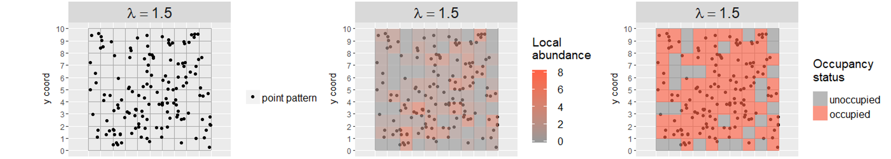
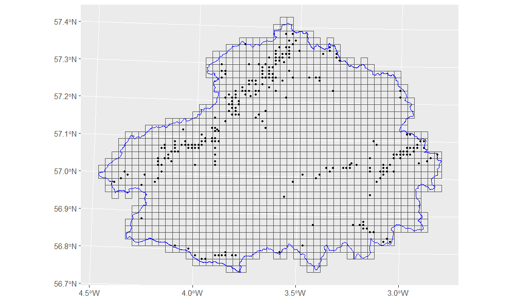

```{r setup}
# #| include: false

knitr::opts_chunk$set(echo = TRUE,
                      message=FALSE,
                      warning=FALSE,
                      strip.white=TRUE,
                      prompt=FALSE,
                      fig.align="center",
                       out.width = "60%")

library(knitr)    # For knitting document and include_graphics function
library(ggplot2)  # For plotting
library(png)
library(tidyverse)
library(INLA)
library(BAS)
library(patchwork)
library(inlabru)
library(fmesher)
library(sf)
library(scico)
``` 
# Spatial point processes {background-image="figures/spp_img.png"}


## Point process data

Many of the ecological and environmental processes of interest can be represented by a spatial point process or can be viewed as an aggregation of one.

{fig-align="center" width="600"}

-   Many contemporary data sources collect georeferenced information about the location where an event has occur (e.g., species occurrence, wildfire, flood events).
-   This point-based information provides valuable insights into ecosystem dynamics.

## Point patterns vs. geostatistical data

:::::: columns
::: {.column width="50%"}
**Point patterns:**

-  Data format: x,y coordinates
-  Optional: marks
-  Aim: model locations as random
:::
::: {.column width="50%"}
**Geostatistical data:**

-  Data format: x,y coordinates
-  Measurements mandatory
-  Aim: model continuous process at fixed locations
:::

:::::: 

:::{.fragment}
**models of spatial patterns**: modelling locations and properties (*"marks"*) of objects, events, individuals in space and time

**aim**: understanding mechanisms that generated the pattern
:::


## Defining a Point Process 

::: {style="font-size: 0.85em;"}
::: incremental
-   Consider a fixed geographical region $A$.

-   The set of locations at which events occur are denoted by $\mathbf{s} = (\mathbf{s}_1, \ldots, \mathbf{s}_n)$.

-   We let $N(A)$ be a random variable which represents the total number of events in every subset of region $A$.

-   Our primary interest is in measuring where events occur, so the **locations are our data**.

-   Let $\lambda$ the *intensity* or *point density*, i.e, the mean number of points per unit area

-   In some cases, the intensity will be constant over space (homogeneous), while in other cases it can vary by location (inhomogeneous).

-   If our intensity is homogeneous, we can define it as

    $$
    \lambda(s) = \frac{\mathbb{E}[N(A)]}{|A|} = \frac{\lambda |A|}{|A|} = \lambda.
    $$
:::
:::


## Complete spatial randomness {.smaller}

We can use the concept of intensity to help us define **complete spatial randomness (CSR)**.

-   For any spatial region $A$, CSR requires that:

::: incremental
1.  *Uniformity and Independent scattering* : Given the number of events $N(A) = n$ in a region, the $n$ events are independently and have an equal probability of occurring anywhere in the study area.

2.  *Poisson distribution of point counts*: The number of points in any set $A_i$ follows a Poisson distribution with mean $\lambda|A_i|$, that is $$N(A_i) \sim \text{Poisson}(\lambda \,|A_i|).$$
:::

<!--  1. **Independent scattering**: The number of points in $k$ disjoint sets are independent of each other. -->

::: fragment
-   If these conditions are satisfied, we can describe our process as a **homogeneous Poisson process**.
:::

::: notes
-   CSR describes a point pattern that is "completely random".

-   conditional on the number of points $N(A) = n$, the $n$ points are independently and uniformly distributed over $A$ i.e., each event has an equal probability of occurring anywhere in the study areaNOT that the Point form an uniform spatial patter

-   Thus, a realization of a HPP is a PP described by CSR.
:::

## Homogeneous Poisson Process {.smaller background-color="#FFFFFF"}

::: {style="height: 50px;"}
:::

:::{.incremental}
-   A simplest point process model is the homogeneous Poisson process (HPP).

-   The likelihood of a point pattern $\mathbf{y} = \left[ \mathbf{s}_1, \ldots, \mathbf{s}_n \right]^\intercal$ distributed as a HPP with intensity $\lambda$ and observation window $\Omega$ is

    $$
    p(\mathbf{y} | \lambda) \propto \lambda^n e^{ \left( - |\Omega| \lambda \right)} ,
    $$

    -   $|\Omega|$ is the size of the observation window.

    -   $\lambda$ is the expected number of points per unit area.

    -   $|\Omega|\lambda$ the total expected number of points in the observation window.

:::

::: {style="height: 50px;"}
:::

:::{.fragment}
-   A key property of a Poisson process is that the number of points within any subset $A_i$ of region $A$ is Poisson distributed with constant rate $|A_i|\lambda$.
:::

## Inhomogeneous Poisson process {.smaller auto-animate="true"}

Let $\mathbf{y} = s_1,\ldots,s_n$ the $n$ number of observed events/points in an observation window $\Omega$

For an IPP with an intensity $\lambda(s)$, the likelihood is given by:

$$
p(\mathbf{y} | \lambda) \propto \exp \left( -\int_\Omega \lambda(\mathbf{s}) \mathrm{d}\mathbf{s} \right) \prod_{i=1}^n \lambda(\mathbf{s}_i).
$$

::: incremental
-   If the case of an **HPP** the integral in the likelihood can easily be computed as $\int_\Omega \lambda(\mathbf{s}) \mathrm{d}\mathbf{s} =|\Omega|\lambda$

-   For an **HPP** with an intensity $\lambda$, the log-likelihood is given by: $$
    l(\beta;\mathbf{y}) = n\log(\lambda) -\lambda|\Omega|,
    $$

-   The maximum likelihood estimators is $\hat{\lambda} = n/|\Omega|$.

-   For **IPP**, the integral in the likelihood has to be approximateda as a weighted sum.
:::

<!-- ## The Grid approach -->

<!-- -  A common approach to approximate these models is by discretizing the study area into a regular grid -->

<!-- -  then calculate the number of events $N_{ij}$ observed in each grid cell $s_{ij}$. -->

<!-- {fig-align="center" width="452"} -->

<!-- ## The Grid approach {.smaller} -->

<!-- - The observed number of events $N_{ij}$ in grid cell $s_{ij}$ is modelled as $N_{ij}\sim \mathrm{Pois}(\Lambda_{ij})$ where $\Lambda_{ij} = \int_{ij}\lambda(s)ds$ -->

<!-- - the mean number of events in cell $s_{ij}$ is given by the integral of the intensity over the cell - approximated by -->

<!-- $$\int_{s_{ij}}\lambda(s)ds \approx |s_{ij}|\lambda_{ij}$$ -->

<!-- - It can be shown that as the size of the cells decreases to zero, this approximation method converges to the true process. -->

<!-- - Discretization of the domain can significantly impact results: -->

<!--     -  coarse lattice loses information about precise locations -->

<!--     -  a fine lattice increases computational costs -->

<!--     -  accounting for spatial dependece is difficult (e.g., Constructing a CAR model on an irregular lattice while maintaining resolution consistency is difficult) -->

<!-- - @simpson2016going proposed an alternative approached that can be extended to LGCPs -->

## Inhomogeneous Poisson process

This integral is approximated as $\int_\Omega \lambda(\mathbf{s}) \mathrm{d}\mathbf{s} \approx \sum_{j=1}^J w_j \lambda(\mathbf{s}_j)$

-   $w_j$ are the integration weights

-   $\mathbf{s}_j$ are the quadrature locations.

This serves two purposes:

1.  Approximating the integral

2.  re-writing the inhomogeneous Poisson process likelihood as a regular Poisson likelihood.

## Inhomogeneous Poisson process {.smaller}

The idea behind the trick to rewrite the approximate likelihood is to introduce a dummy vector $\mathbf{z}$ and an integration weights vector $\mathbf{w}$ of length $J + n$

::::: columns
::: {.column width="50%"}
$$\mathbf{z} = \left[\underbrace{0_1, \ldots,0_J}_\text{quadrature locations}, \underbrace{1_1, \ldots ,1_n}_{\text{data points}} \right]^\intercal$$
:::

::: {.column width="50%"}
$$\mathbf{w} = \left[ \underbrace{w_1, \ldots, w_J}_\text{quadrature locations}, \underbrace{0_1, \ldots, 0_n}_\text{data points} \right]^\intercal$$
:::
:::::

Then the approximate likelihood can be written as

$$
\begin{aligned}
p(\mathbf{z} | \lambda) &\propto \prod_{i=1}^{J + n} \eta_i^{z_i} \exp\left(-w_i \eta_i \right) \\
\eta_i &= \log\lambda(\mathbf{s}_i) = \mathbf{x}(s)'\beta
\end{aligned}
$$

-   This is similar to a product of Poisson distributions with means $\eta_i$, exposures $w_i$ and observations $z_i$

## Limitations with IPP

::: {style="height: 50px;"}
:::

::: incremental
-   IPP models assume that data points are conditionally independent given the covariates, meaning that any spatial variation is fully explained by environmental and sampling factors.
-   Unmeasured endogenous and exogenous factors can create spatial dependence.
-   Ignoring them can lead to bias in our conclusions.
:::

## The Log-Gaussian Cox Process {.smaller}

::: {style="height: 50px;"}
:::

-   Log-Gaussian Cox processes (LGCP) extend the IPP by allowing the intensity function to vary spatially according to a structured spatial random effect, i.e. the intensity is random

$$
\log~\lambda(s)= \mathbf{x}(s)'\beta + \xi(s)
$$

-   The events are then assumed to be independent given the covariates and $\xi(s)$ - a GRF with Matérn covariance.

::: fragment
How do we model $\xi(s)$ ?
:::

::: fragment

:::{.incremental}
-   We use an SPDE model!
-   The software `inlabru` has implemented some integration schemes that are especially well suited to integrating the intensity in models with an SPDE effect.
-   By default, `inlabru` uses the same points to define the SPDE approximation and to approximate the integral in the likelihood, but this can be changed.
:::

:::

::: aside
See for further reference: Simpson, Daniel, Janine B. Illian, Finn Lindgren, Sigrunn H. Sørbye, and Håvard Rue. 2016. "Going off grid: computationally efficient inference for log-Gaussian Cox processes." *Biometrika* 103 (1): 49–70.
:::

# Example: Forest fires {background-image="figures/wildfire.jpg"}

## Example: Forest fires in Castilla-La Mancha {.smaller}

-   In this example we model the location of forest fires in the Castilla-La Mancha region of Spain between 1998 and 2007.

-   We are now going to use the elevation as a covariate to explain the variability of the intensity $\lambda(s)$ over the domain of interest and a spatially structured SPDE model.

$$
\log\lambda(s) = \beta_0 + \beta_1 \text{elevation}(s) + \xi(s)
$$

```{r}
#| fig-align: center
#| fig-width: 6
#| fig-height: 6
#| message: false
#| warning: false
#| echo: false

library(spatstat)
library(tidyverse)
library(terra)
library(sf)
library(ggplot2)
library(tidyterra)
data("clmfires")
pp = st_as_sf(as.data.frame(clmfires) %>%
                mutate(x = x, 
                       y = y),
              coords = c("x","y"),
              crs = NA) %>%
  filter(cause == "lightning",
         year(date) == 2004)

poly = as.data.frame(clmfires$window$bdry[[1]]) %>%
  mutate(ID = 1)

region = poly %>% 
  st_as_sf(coords = c("x", "y"), crs = NA) %>% 
  dplyr::group_by(ID) %>% 
  summarise(geometry = st_combine(geometry)) %>%
  st_cast("POLYGON") 
  
elev_raster = rast(clmfires.extra[[2]]$elevation)
elev_raster = scale(elev_raster)


```


:::::: columns
::: {.column width="50%"}
```{r}
#| fig-align: center
#| fig-width: 6
#| fig-height: 6
#| message: false
#| warning: false
#| echo: false

ggplot() + geom_spatraster(data = elev_raster) +  geom_sf(data = region, col = "black", alpha = 0,linewidth =0.75) + geom_sf(data = pp) + scale_fill_scico(name= "Elevation")
```
:::

::: {.column width="50%"}
 
```{r}
pp  %>% print(n = 6)
```
:::
:::::: 


## Example: Forest fires in Castilla-La Mancha {.smaller background-color="#FFFFFF"}

:::::: columns
::: {.column width="50%"}
**The IPP Model** $$
\begin{aligned}
p(\mathbf{y} | \lambda)  & \propto \exp \left( -\int_\Omega \lambda(\mathbf{s}) \mathrm{d}\mathbf{s} \right) \prod_{i=1}^n \lambda(\mathbf{s}_i) \\
\eta(s) &  = \log ~\lambda(s) = \beta_0 +  \beta_1 \,x(s)
\end{aligned}
$$ **The code**

```{r}
#| echo: true
#| eval: false
#| warning: false
#| message: false

# define model component
cmp = ~ Intercept(1) + elev(elev_raster, model = "linear")

# define model predictor
eta  = geometry ~ Intercept +  elev

# build the observation model
lik = bru_obs("cp",
              formula = eta,
              data = pp,
              ips = ips)

# fit the model
fit = bru(cmp, lik)

```
:::

:::: {.column width="50%"}
::: panel-tabset
## Regular Grid

```{r}
#| echo: true
n.int = 1000
ips <- st_sample(region, size = n.int, type = "regular") # May not be exactly n.int points
ips <- new_fm_int(
  ips,
  weight = st_area(region) / length(ips),
  name = "geometry"
)


```

```{r}
#| echo: false
#| fig-width: 5
#| fig-height: 5
ggplot() + geom_sf(data = ips, aes(color = weight)) + geom_sf(data= region, alpha = 0)
```

## `fm_int`

```{r}
#| echo: true

# The mesh
mesh = fm_mesh_2d(boundary = region,
                  max.edge = c(5, 10),
                  cutoff = 4, crs = NA)

# build integration scheme
ips = fm_int(mesh,
             samplers = region)

```

```{r}
#| echo: false
#| fig-width: 5
#| fig-height: 5


ggplot() + geom_sf(data = ips, aes(color = weight),size=0.5) +
   scale_color_scico(palette = "roma") + gg(mesh)


```
:::
::::
::::::

## Example: Forest fires in Castilla-La Mancha {.smaller background-color="#FFFFFF"}

::::: columns
::: {.column width="50%"}
**The LGCP Model**

$$
\begin{aligned}
p(\mathbf{y} | \lambda)  & \propto \exp \left( -\int_\Omega \lambda(\mathbf{s}) \mathrm{d}\mathbf{s} \right) \prod_{i=1}^n \lambda(\mathbf{s}_i) \\
\eta(s) &  = \log(\lambda(s)) = \color{#FF6B6B}{\boxed{\beta_0}} + \color{#FF6B6B}{\boxed{ x(s)}} + \color{#FF6B6B}{\boxed{ \omega(s)}}\\
\end{aligned}
$$

**The code**

```{r}
#| echo: true
#| eval: false
#| warning: false
#| message: false
#| code-line-numbers: "1-3"

# define model component
cmp = ~ Intercept(1) + elev(elev_raster, model = "linear") +
  space(geometry, model = spde_model)


# define model predictor
eta  = geometry ~ Intercept +  elev + space


# build the observation model
lik = bru_obs("cp",
              formula = eta,
              data = pp,
              ips = ips)


# fit the model
fit = bru(cmp, lik)

```
:::

::: {.column width="50%"}
```{r}
#| echo: true

# The mesh
mesh = fm_mesh_2d(boundary = region,
                  max.edge = c(5, 10),
                  cutoff = 4, crs = NA)

# The SPDE model
spde_model =  inla.spde2.pcmatern(mesh,
                                  prior.sigma = c(1, 0.5),
                                  prior.range = c(100, 0.5))

# build integration scheme
ips = fm_int(mesh,
             samplers = region)

```

```{r}
#| echo: false
#| fig-width: 6
#| fig-height: 6


ggplot() + geom_sf(data = ips, aes(color = weight),size=0.5) +
   scale_color_scico(palette = "roma") + gg(mesh)


```
:::
:::::

## Example: Forest fires in Castilla-La Mancha {.smaller background-color="#FFFFFF"}

::::: columns
::: {.column width="50%"}
**The LGCP Model**

$$
\begin{aligned}
p(\mathbf{y} | \lambda)  & \propto \exp \left( -\int_\Omega \lambda(\mathbf{s}) \mathrm{d}\mathbf{s} \right) \prod_{i=1}^n \lambda(\mathbf{s}_i) \\
\color{#FF6B6B}{\boxed{\eta(s)}} &  = \log(\lambda(s)) = \color{#FF6B6B}{\boxed{\beta_0 +  x(s) + \omega(s)}}\\
\end{aligned}
$$

**The code**

```{r}
#| echo: true
#| eval: false
#| warning: false
#| message: false
#| code-line-numbers: "6-7"

# define model component
cmp = ~ Intercept(1) + elev(elev_raster, model = "linear") +
  space(geometry, model = spde_model)


# define model predictor
eta  = geometry ~ Intercept +  elev + space


# build the observation model
lik = bru_obs("cp",
              formula = eta,
              data = pp,
              ips = ips)


# fit the model
fit = bru(cmp, lik)

```
:::

::: {.column width="50%"}
```{r}
#| echo: true

# The mesh
mesh = fm_mesh_2d(boundary = region,
                  max.edge = c(5, 10),
                  cutoff = 4, crs = NA)

# The SPDE model
spde_model =  inla.spde2.pcmatern(mesh,
                                  prior.sigma = c(1, 0.5),
                                  prior.range = c(100, 0.5))

# build integration scheme
ips = fm_int(mesh,
             samplers = region)

```

```{r}
#| echo: false
#| fig-width: 6
#| fig-height: 6


ggplot() + geom_sf(data = ips, aes(color = weight),size=0.5) +
   scale_color_scico(palette = "roma") + gg(mesh)


```
:::
:::::

## Example: Forest fires in Castilla-La Mancha {.smaller background-color="#FFFFFF"}

::::: columns
::: {.column width="50%"}
**The LGCP Model**

$$
\begin{aligned}
\color{#FF6B6B}{\boxed{p(\mathbf{y} | \lambda)}}  & \propto \exp \left( -\int_\Omega \lambda(\mathbf{s}) \mathrm{d}\mathbf{s} \right) \prod_{i=1}^n \lambda(\mathbf{s}_i) \\
\eta(s) &  = \log(\lambda(s)) = \beta_0 +  x(s) + \omega(s)\\
\end{aligned}
$$

**The code**

```{r}
#| echo: true
#| eval: false
#| warning: false
#| message: false
#| code-line-numbers: "10-14"

# define model component
cmp = ~ Intercept(1) + elev(elev_raster, model = "linear") +
  space(geometry, model = spde_model)


# define model predictor
eta  = geometry ~ Intercept +  elev + space


# build the observation model
lik = bru_obs("cp",
              formula = eta,
              data = pp,
              ips = ips)


# fit the model
fit = bru(cmp, lik)

```
:::

::: {.column width="50%"}
```{r}
#| echo: true

# The mesh
mesh = fm_mesh_2d(boundary = region,
                  max.edge = c(5, 10),
                  cutoff = 4, crs = NA)

# The SPDE model
spde_model =  inla.spde2.pcmatern(mesh,
                                  prior.sigma = c(1, 0.5),
                                  prior.range = c(100, 0.5))

# build integration scheme
ips = fm_int(mesh,
             samplers = region)

```

```{r}
#| echo: false
#| fig-width: 6
#| fig-height: 6


ggplot() + geom_sf(data = ips, aes(color = weight),size=0.5) +
   scale_color_scico(palette = "roma") + gg(mesh)


```
:::
:::::

## Example: Forest fires in Castilla-La Mancha {.smaller background-color="#FFFFFF"}

::::: columns
::: {.column width="50%"}
**The LGCP Model**

$$
\begin{aligned}
p(\mathbf{y} | \lambda)  & \propto \exp \left( -\int_\Omega \lambda(\mathbf{s}) \mathrm{d}\mathbf{s} \right) \prod_{i=1}^n \lambda(\mathbf{s}_i) \\
\eta(s) &  = \log(\lambda(s)) = \beta_0 +  x(s) + \omega(s)\\
\end{aligned}
$$

**The code**

```{r}
#| echo: true
#| eval: false
#| warning: false
#| message: false
#| code-line-numbers: "17-18"

# define model component
cmp = ~ Intercept(1) + elev(elev_raster, model = "linear") +
  space(geometry, model = spde_model)


# define model predictor
eta  = geometry ~ Intercept +  elev + space


# build the observation model
lik = bru_obs("cp",
              formula = eta,
              data = pp,
              ips = ips)


# fit the model
fit = bru(cmp, lik)

```
:::

::: {.column width="50%"}
```{r}
#| echo: true

# The mesh
mesh = fm_mesh_2d(boundary = region,
                  max.edge = c(5, 10),
                  cutoff = 4, crs = NA)

# The SPDE model
spde_model =  inla.spde2.pcmatern(mesh,
                                  prior.sigma = c(1, 0.5),
                                  prior.range = c(100, 0.5))

# build integration scheme
ips = fm_int(mesh,
             samplers = region)

```

```{r}
#| echo: false
#| fig-width: 6
#| fig-height: 6


ggplot() + geom_sf(data = ips, aes(color = weight),size=0.5) +
   scale_color_scico(palette = "roma") + gg(mesh)


```
:::
:::::

## Example: Forest fires in Castilla-La Mancha {.smaller background-color="#FFFFFF"}

**Model Predictions**

We can use the `predict()` method to visualize the posterior mean intensity, log-intensity, std dev, and the SPDE.

```{r}
#| echo: false
#| message: false
#| warning: false
library(viridis)

#eval_spatial(elev_raster,pp) %>% is.na() %>% any()
#eval_spatial(elev_raster,ips) %>% is.na() %>% any()
#eval_spatial(elev_raster,ips[3525,]) %>% is.na() %>% which()

# ggplot()+tidyterra::geom_spatraster(data=elev_raster)+
#   geom_sf(data=ips[3525,])

# Extend raster ext by 5 % of the original raster
re <- extend(elev_raster, ext(elev_raster)*1.05)
# Convert to an sf spatial object
re_df <- re %>% stars::st_as_stars() %>%  st_as_sf(na.rm=F)
# fill in missing values using the original raster
re_df$lyr.1 <- bru_fill_missing(elev_raster,re_df,re_df$lyr.1)
# rasterize
elev_rast_p <- stars::st_rasterize(re_df) %>% rast()
# visualize

# ggplot()+tidyterra::geom_spatraster(data=elev_rast_p)+
#   geom_sf(data=ips[3525,])


# define model component
cmp = ~ Intercept(1) + elev(elev_rast_p, model = "linear") +
  space(geometry, model = spde_model)


# define model predictor
eta  = geometry ~ Intercept +  elev + space


# build the observation model
lik = bru_obs("cp",
              formula = eta,
              data = pp,
              ips = ips)

# fit the model
fit = bru(cmp, lik)

# Predictions
elev_crop <- terra::crop(x = elev_raster,y = region,mask=TRUE)

pxl1 = data.frame(crds(elev_crop),
                  as.data.frame(elev_crop$lyr.1)) %>%
       filter(!is.na(lyr.1)) %>%
st_as_sf(coords = c("x","y")) %>%
  dplyr::select(-lyr.1)


lgcp_pred <- predict(
  fit,
  pxl1,
  ~ data.frame(
    lambda = exp(Intercept + elev + space), # intensity
    loglambda = Intercept + elev +space,  #log-intensity
    GF = space # matern field
  )
)

ggplot() +
  gg(lgcp_pred$loglambda, geom = "tile") +
  scale_fill_viridis(name=expression(log(lambda)))+
  ggplot() +
  gg(lgcp_pred$loglambda, geom = "tile",aes(fill=sd)) +
  scale_fill_viridis(name=expression(stdev-log(lambda)),option = "B")+
  ggplot() +
  gg(lgcp_pred$lambda, geom = "tile") + scale_fill_viridis(name=expression(lambda))+
  ggplot() +
  gg(lgcp_pred$GF, geom = "tile") + scico::scale_fill_scico(name="Spatial effect")+
  plot_layout(ncol=2)


```

:::{.callout-note}
Note that the mean field is, by definition, smoother than any realization of the field. Instead we can draw simulations of the filed from the posterior distribution using the `generate()` function.
:::

##  Posterior quantities {.smaller}

We can estimate the total number of events over the whole region as follows:

$$
\mathbb{E}(N_\Omega) = \int_\Omega \exp(\lambda(s)) ds
$$

To do so, we simulate possible realizations of $N_\omega$ to include also the likelihood variability in our estimate using the `generate()` method

```{r}
N_fires = generate(fit, ips,
                      formula = ~ {
                        lambda = sum(weight * exp(elev + Intercept + space))
                        rpois(1, lambda)},
                    n.samples = 2000)

```

```{r}
#| echo: false
#| fig-width: 6
#| fig-height: 6

ggplot(data = data.frame(N = as.vector(N_fires))) +
  geom_histogram(aes(x = N),
                 colour = "blue",
                 alpha = 0.5,
                 bins = 20) +
  theme_minimal() +
  xlab(expression(Lambda))

```


## Summary of points

::: incremental
-   Point process are a stochastic processes that describe the locations where events occur

-   Unlike geostatistical data where the locations are fixed, here the locations have a stochastic nature *the locations are our data*!

-   IPP allows the intensity of the point process to vary across space through spatially varying covariates.

-   Numerical integration schemes are required to estimate the parameters of an IPP

-   LGCP are a double stochastic process that extend IPP models by allowing the intensity function to vary spatially according to a structured spatial random effect
:::


# References {.smaller data-title-offset="true"}

[@de2025spatio @laxton2023balancing @palmi2025bayesian @simpson2016going ]{style="display:none"}

::: {#refs}
:::

```{=html}
<script>
document.querySelectorAll('#refs [id^="ref-"]').forEach(function(entry) {
  var key = entry.id;                       // e.g. "ref-besag1991"
  var a = document.createElement('a');
  a.href = '../references.html#' + key;
  a.target = '_blank';
  a.style.textDecoration = 'none';
  a.style.color = 'inherit';
  while (entry.firstChild) a.appendChild(entry.firstChild);
  entry.appendChild(a);
});
</script>
```

